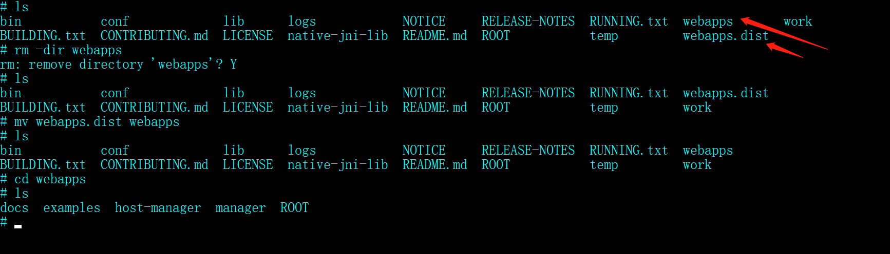

# Docker

## 常见操作

### 安装

之前Windows10 家庭版似乎不支持直接安装docker,但是现在可以了,exe无脑安装即可。

在Linux的安装请参考 [docker官方文档](https://docs.docker.com/engine/install/ubuntu/#install-using-the-repository) ，也是很简单的，按照步骤进行即可。

### 运行镜像

```bash
docker run -d -p 80:80 docker/getting-started
```

- `-d` - run the container in detached mode (in the background)
- `-p 80:80` - map port 80 of the host to port 80 in the container
- `docker/getting-started` - the image to use

可以合并简单的命令: ``-d -p = -dp``

```bash
docker run -dp 15672:15672 docker/rabbitmq
```

```bash
docker run --name postgres -e POSTGRES_PASSWORD=root -dp 5432:5432 postgres
```

### 导出镜像

```tex
docker save -o path  name
```

### 导入镜像

```tex
docker load -i path
```

### 修改名称

```text
docker tag id name:version
```

### 进入容器

```tex
docker exec -it id bash
```

### 重启容器

```json
docker exec -it 087  service nginx reload
```

### 常见容器的启动

#### MySQL

```
docker run --name mysql -e MYSQL_ROOT_PASSWORD=root -dp 3306:3306 mysql
```

#### Tomcat

```tex
docker run --name Tomcat  -dp 8080:8080  tomcat
```

### 文件复制

```text
docker cp C:\Users\wangz\Desktop\nowcoder.jar 577:/usr/local/tomcat/webapps
```

## 数据卷

容器与宿主机之间的一个映射

### 创建

```bash
docker volume create  name
```

### 查看

```bash
docker volume ls
```

```bash
docker volume inspect name
```

### 映射

```bash
docker run -dp 8080:8080 -v 宿主机目录:容器内路径 标识
```

```bash
/etc/nginx/conf.d  --- nginx 映射路径
```

```bash
/usr/local/tomcat/webapps/  --- tomcat映射路径 
docker run -dp 8080:8080 -v C:\Users\wangz\Documents\vscode\volume\tomcat:/usr/local/tomcat/webapps/ 
```

## 自定义镜像

> 新建 Dockerfile 文件

这个文件没有后缀名

> Dockerfile 文件中的内容

|  命令   |                 含义                  |
| :-----: | :-----------------------------------: |
|  copy   |  将相对路径目录下的内容复制到景象中   |
| workdir |               工作目录                |
|  from   |              依赖的环境               |
|   cmd   | 在工作目录下执行的命令,以最后一条为准 |

> 制作镜像

`docker built -t name:version .`

## Docker Compose

帮助我们批量的管理容器

## 遇到的问题

> 安装 Tomcat 后访问8080目录显示 404

我们需要将其中的webapps目录删掉,然后将 webapps.dist 重命名为 webapps.

这个问题在 docker  hub 的tomcat界面是有提到的, 只是第一次没有仔细看.

