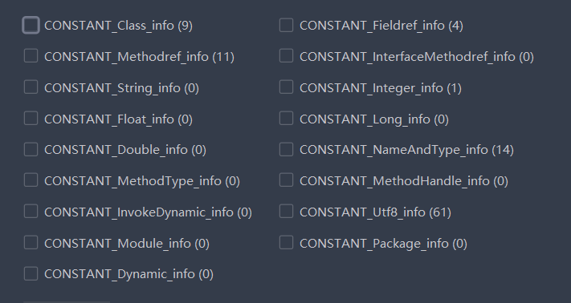

# Java虚拟机

## 内存区域划分

**内存划分只是一个划分的规范,具体的实现由不同的虚拟机自行决定**

### 程序计数器

程序计数器也是一块较小的内存区域, 保存了当前线程执行的字节码的行号.

每个线程都会有自己的程序计数器.

当线程执行Java方法时,PC的值是字节码指令的地址,如果执行的是本地方法,PC的值为 `undefined`

### 虚拟机栈

虚拟机栈也是线程私有的,栈帧是栈的基本单位. 每次执行一个方法,都会将一个栈帧压入栈中.

#### 栈帧

栈帧中包含下边几大部分:

> 局部变量表

​		保存了编译期可知的各种基本类型,引用类型. 引用类型可以是 `ReturnAddress`类型,指向了一条字节码指令的地址.

​		这些数据在局部变量表的 **槽** 中存储. 64位的 long 和 double 占用两个槽,其余占用一个槽. 具体槽与内存的对应由虚拟机来实现.

​		局部变量表的大小在编译期就确定,运行时不会改变.

> 操作数栈

​		操作数栈保存了字节码指令用到的操作数

> 动态连接

> 返回地址

​		是PC的值或者异常表

### 本地方法栈

本地方法栈的用途和虚拟机栈类似,只是执行的是本地方法. 

HotSpot 中本地方法栈和虚拟机栈合二为一

### 堆

堆是内存区域中最大的一块,存储了**几乎**所有的对象实例和数组. 堆是线程功共享的

### 方法区

方法区保存了类元信息,常量,静态变量,代码缓存等.是线程共享的.

### 直接内存

直接内存并不是Java虚拟机规范的一部分

## 对象

### 创建

对象创建的方式很多: new 克隆  序列化 反射, 以 new 为例:

当虚拟机遇到 new 指令时, 首先去常量池中查找一个**类的符号引用**,然后检查这个符号引用的类是否已经加载解析初始化,若已经初始化过,则分配内存. 有两种方法 :**空闲列表** 和 **指针碰撞** . 分配完成先初始化内存,置0值. 然后设置对象头, 接着调用 init 方法进行真正的初始化.

### 内存布局

对象的存储布局可以分为三部分: 对象头 实例数据 对齐填充

未开启指针压缩的64位虚拟机的对象头占 64位 , 保存了运行时的一些数据,Hashcode,GC年龄,锁状态. 这一部分被称为 **MarkWord** , 还保存了类型指针, 通过指针能够知道当前对象是哪个类的实例. 如果是数组,还会保存数组的length.

实例数据保存的就是有效的信息, 保存的形式是 : 尽量将相同大小的类型分配到一起,父类的属性会出现在子类之前.

对齐填充是为了是整个对象的大小是 8字节 的整数倍

### 对象定位

对一个对象的定位有两种方式:直接指针法和句柄法

直接指针就是占中的引用直接指向堆中的对象,优点是定位时快速直接

句柄法就是栈中的引用指向一个句柄池,句柄池中的reference指向真正的对象,优点是当堆中的对象移动时不需要修改栈的引用,修改句柄池中的引用即可.

Hotspot 主要使用句柄池的方法

### 对象存活分析

判断一个对象是否存活主要有两种方法: 引用计数法和可达性分析法

引用计数法会有循环引用问题,但是原理简单,判定效率高

可达性分析法需要从 GC ROOT 根开始查找,标记所有可达的对象,然后收集不可达的对象.

可以作为GCROOT根的对象有下边这些:

- 栈用引用的对象
- 方法区中类静态属性引用的对象
- 方法区常量引用的对象
- 所有被synchronized持有的对象
- .............

### 四种引用

JDK1.2 之后扩充了三种引用类型,至此共有四种引用类型,分别是强软弱虚引用.

强引用就是最传统的引用,类似 `Set<String> set = new HashSet<>();` 这种,被强引用引用的对象永远不会被回收

软引用要用`SoftReference<Integer> softReference = new SoftReference<>(1);`来包裹,被软引用引用的对象在内存不足将发生OOM时会被回收,但并不是发生GC就会被回收

弱引用用`WeakReference<Integer> weakReference = new WeakReference<>(1);`来实现,遇到GC就会被回收

虚引用引用的对象无法获取,唯一目的是为了在对象回收时收到一个系统通知

### 何时被回收

不可达的对象并不是立即就会被回收的. 当一个对象不可达时会进行第一次标记,再根据对象是否覆盖了 finalize 方法. 如果覆盖了这个方法,会先将对象放到执行 finalize 方法的队列里, 由一个优先级很低的线程调用执行 finalize 方法.但不一定执行且不一定执行完成.

**finalize方法已经不建议使用**

## 内存分配策略

程序计数器和栈中的内存分配和回收是在编译期即可确定的,因此不涉及复杂的分配,只有堆区和方法区的内存分配需要考虑.

> Eden优先

> 大对象直接进入老年代

> 长期存活的对象进入老年代

> GC分代年龄到达一定数值晋升到老年代

> Survivor中相同年龄的对象占空间的一半以上,年龄大于等于这个年龄的对象直接晋升

> 空间分配担保 判断是否进行一次Full GC


## 方法区的垃圾回收

Java虚拟机规范不要求对方法区进行垃圾回收,但大部分虚拟机都实现了方法区的垃圾回收.

回收什么? 主要是**废弃的常量**和**不再使用的类型**,对于常量来讲,回收的方法和堆中的对象是很类似的,通过可达性分析即可.判断类型不再使用比较麻烦,要满足下边几个条件:

- 类的实例都被回收
- 类加载器被回收  **这一点很难达成**
- class 对象没有任何的引用

## 垃圾收集算法

### 分代收集理论

这是建立在两个分代假说上的理论: 绝大多数对象都是朝生夕灭的;熬过越多次垃圾回收的对象就越难以消亡.

针对这两个假说,可以将内存分为不同区域,不同GC年龄的对象在不同的区域.

通过上边的两个假说可以得到一个新的假说 : 跨代际引用的对象是极少的, 因此我们没有必要完全扫描保存 难以消亡对象 的那块内存区域, 由此建立了一个 **记忆集** ,将这块内存区域(老年代) 分为若干区域, 标出那一块存在跨代引用,然后在GC的时候扫描这一块内存即可.

### 标记清除算法

先标记所有存活或者未存活的对象,然后将未存活的对象清除即可.

缺点 : 

- 空间碎片化
- 存在大量待收集的对象时效率太低

### 标记复制算法

将可用内存划分为两个区域,每次使用其中的一块,当这一块内存空间满了,就将存活的对象复制到另一块上.

缺点:

- 空间利用率太低
- 存活对象多时复制开销很大

优点

- 没有内存碎片
- 存活对象少时效率很高

### 标记整理算法

这是针对老年代对象提出的算法:

先进行标记,然后将存活的对象移动到内存的一端,将另一端的空间直接清理掉.

优点:

- 没有内存碎片

缺点:

- 移动对象开销很大

缺点很明显但是可以保证内存空间的连续,否则就会导致更麻烦的结果.

## 垃圾回收器

### Serial

最基础最经典历史最悠久的收集器

极其简单的实现,在进行垃圾收集时停止其他所有的线程(STW:Stop The World)

简单而高效,单线程且对内存要求极小

SerialOld

老年代的Serial

### ParNew

适用于新生代

多线程版本的Serial

### ParallelScavenge

适用于新生代,类似于ParNew,但是关注的点是吞吐量.

### Parallel Old

ParallelScavenge 的老年代版本

### CMS

**Concurrent Mark Sweep**

以获取最低的停顿时间为目的,整个过程分为四个步骤

> 初始标记

​		需要STW,标记GCROOT直接关联的对象,单线程

> 并发标记

​		不需要STW,可以和用户线程一起执行,多线程

> 重新标记

​		需要STW,目的是找到在并发表及阶段发生变化的对象,多线程

> 并发清除

​		不需要STW

在整个垃圾回收过程中,耗时最长的是并发标记和并发清除阶段,但是这两个阶段都是和用户线程并发执行的因此不会带来大的停顿

优点:

- 停顿时间少

缺点:

- 存在浮动垃圾
- 对CPU消耗高
- CPU核数少于4的机器上会出现程序执行突然变慢的情况
- 存在内存碎片
- 必须预留一定的内存
- 并发失败会启动 SerialOld

### GarbageFirst

G1 全功能的垃圾收集器, 着眼于宏观. 将堆空间分为若干个大小相等的独立区域(Region),每个区域都能扮演不同的角色,(Eden Survivor Humongous  ...), G1再根据不同的角色应用不同的策略进行收集.

**超过Region大小一半的对象会被存储到 Humongous 中 , 超大对象存储在多个连续的 Humongous中**

G1 会维护一个优先级列表,存储收集一个Region的时间和获得空间的大小, 优先处理回收收益最大的那些Region.

SATB (snapshot-at-the-beginning) 是一个算法,保证了在并发标记过程中新分配对象不会漏标

G1的回收大致分为以下几个步骤:

> 初始标记

​		需要STW,标记GCROOT直接关联的对象,单线程

> 并发标记

​		不需要STW,可以和用户线程一起执行,多线程

> 最终标记

​		需要STW,处理并发阶段结束后遗留的少量 SATB 记录,多线程

> 筛选回收

​		需要STW,对Region的回收价值和成本进行排序,根据用户的期望来制定回收计划,然后进行复制,多线程

G1 的优点很多, 不会产生内存碎片,但是执行的额外开销比较大.

### Shenandoah

[Shenandoah](https://wiki.openjdk.java.net/display/shenandoah/)

与 G1 很类似,但是又优于G1.  同样使用Region的思想,默认不使用分代收集,采用连接矩阵来记录跨 Region 的对象引用.

一次GC大概分为以下9个阶段:

1. **Init Mark** initiates the concurrent marking. It prepares the heap and application threads for concurrent mark, and then scans the root set. This is the **first pause** in the cycle, and the most dominant consumer is the root set scan. Therefore, its duration is dependent on the root set size.

   初始标记,与G1类似. 需要STW

   

2. **Concurrent Marking** walks over the heap, and traces reachable objects. This phase runs alongside the application, and its duration is dependent on the number of live objects and the structure of object graph in the heap. Since the application is free to allocate new data during this phase, the heap occupancy goes up during concurrent marking.

   并发标记,与G1完全相同

   

3. **Final Mark** finishes the concurrent marking by draining all pending marking/update queues and re-scanning the root set. It also initializes evacuation by figuring out the regions to be evacuated (collection set), pre-evacuating some roots, and generally prepares runtime for the next phase. Part of this work can be done concurrently during **Concurrent precleaning** phase. This is the **second pause** in the cycle, and the most dominant time consumers here are draining the queues and scanning the root set.

   最终标记 ,与G1完全相同

   

4. **Concurrent Cleanup** reclaims immediate garbage regions – that is, the regions where no live objects are present, as detected after the concurrent mark.

   并发整理: 整理那些没有任何存活对象的Region

   

5. **Concurrent Evacuation** copies the objects out of collection set to other regions. This is the major difference against other OpenJDK GCs. This phase is again running along with application, and so application is free to allocate. Its duration is dependent on the size of chosen collection set for the cycle.

   并发回收: 将存活的对象重新复制到另一些Region里,但是与其他收集器不同的是,这个阶段也是多线程的,因此就涉及到用户线程和回收线程互相干扰的情况. Shenandoah 使用称作 [**Brooks Pointer**](https://rkennke.wordpress.com/2013/10/23/shenandoah-gc-brooks-pointers/)的转发指针来解决这个问题. 

   

6. **Init Update Refs** initializes the update references phase. It does almost nothing except making sure all GC and applications threads have finished evacuation, and then preparing GC for next phase. This is the **third pause** in the cycle, the shortest of them all.

   初始引用更新: 在上个阶段结束后,堆中对象的地址可能变化了,因此需要重建这些引用. 这一阶段并不做太多工作,更像是等待所有的并发回收线程结束自己的任务然后在此等待.

   

7. **Concurrent Update References** walks over the heap, and updates the references to objects that were moved during concurrent evacuation. This is the major difference against other OpenJDK GCs. Its duration is dependent on number of objects in heap, but not the object graph structure, because it scans the heap linearly. This phase runs concurrently with the application.

   真正完成引用的更新,不需要STW

   

8. **Final Update Refs** finishes the update references phase by re-updating the existing root set. It also recycles the regions from the collection set, because now heap does not have references to (stale) objects to them. This is the **last pause** in the cycle, and its duration is dependent on the size of root set.

   最终更新: 更新 GCROOT的引用

   

9. **Concurrent Cleanup** reclaims the collection set regions, which now have no references to.

   并发清理: 所有的待回收的Region中不再有存活对象,清理即可

>Brooks Pointer

​		传统方式下,处理对象移动是在原来的地址上设置一个`陷阱`,然后程序访问到这个地址就会触发中断,由中断处理程序将访问转发到新的地址,但是这样会在内核态和用户态切换,开销很大.

​	Brooks Pointer 是在对象的布局最前边添加一个指针,在正常情况下,这个指针指向自己,当对象移动后,指针指向移动后的位置. 类似句柄池的访问.

### Z

ZGC 是一款基于Region内存布局的,不设分代的,使用了读屏障、染色指针、和 内存多重映射的,可并发的基于标记整理算法的,以低延迟为目标的垃圾收集器.

Region 大小可变

染色指针 : 将少量信息存储在指针上的技术

四个阶段:

> 并发标记

​		需要停顿一下,在指针上进行标记

> 并发预备重分配

​		根据特定的条件去查询出要回收哪些Region, 把这些 Region 组成一个重分配集

> 并发重分配

​		把重分配集中的存活对象复制一份,然后维护一个转发表. 由于有了染色指针,通过引用就能判断对象是否在转发表中. 如果访问的对象在转发表中有记录,则转发一下,然后修正记录.

> 并发重映射

​		这并不是很要紧的阶段,即使没有这个阶段,每次访问一个被移动的对象时也会更新映射.

## Class文件

class 文件中只有两种数据: 无符号整型和表

```C
ClassFile {
u4              magic;//魔数 cafe baby
u2              minor_version; // 次版本号
u2              major_version; // 主版本号
u2              constant_pool_count; // 常量池计数
cp_info         constant_pool[constant_pool_count-1]; // 常量池表
u2              access_flags; // 访问标志 类或者接口级别的层次的访问信息
u2              this_class;	//当前类
u2              super_class; // 父类
u2              interfaces_count; // 接口计数
u2              interfaces[interfaces_count]; // 接口表
u2              fields_count; // ...
field_info      fields[fields_count]; // ...
u2              methods_count; // ...
method_info     methods[methods_count]; // ...
u2              attributes_count; // ... 
attribute_info  attributes[attributes_count]; // ... 属性表,描述特定场景下的一些属性
}
```

#### 常量池表

截止 jdk15 常量共有 17种



#### 访问标识

标识当前 class 是类还是接口, 以及访问标识 public 等等

## 类加载机制

虚拟机把描述的类从class文件加载到内存,进行解析和初始化形成Java虚拟机可以使用的类型的过程称为初始化.

类的生命周期:


在这七个周期中, 加载 验证 准备 初始化 卸载 的顺序是固定的,解析则可以在初始化之后再进行.

有六种必须立即进行初始化的情况:

1. 遇到**New getstatic putstatic invokestatic** 字节码的时候。
2. 如果一个接口定义了**default**方法且它的实现类被初始化时,接口会被初始化.
3. JDK7之后 `java.lang.invoke.MethodHandle`实例的解析结果为**REF_getstatic  REF_putstatic REF_invokestatic REF_invokeSpecial**四种类型的方法句柄,且方法句柄对应的类没有初始化

4. 通过java.lang.reflect包中的方法对类进行**反射调用**的时候。

5. 当初始化一个类时，发现其**父类**还没有进行初始化，则需要先触发其父类初始化。

6. 当***虚拟机启动**时，用户需要指定一个要执行的包含 main 方法的主类，虚拟机会初始化这个主类。

~第三条看起来让人一脸懵逼~, 但是为了完整性我还是贴上来了

### 类加载器

类加载器是获取二进制字节流的一段代码,每一个类加载器都有一个唯一的限定名

### 加载

加载阶段虚拟机会通过类的全限定名获得二进制字节流,然后将其转换成**方法区的运行时数据结构**,最后生成 Java.lang.class对象作为访问入口.

### 验证

确保字节流中的信息严格符合Java字节码规范的要求,验证主要包含四个阶段:

1. 文件格式验证. 主要是为了...验证文件格式的正确性
2. 元数据验证. 主要是验证字节码信息的语义,比如是否重写了抽象方法
3. 字节码验证. 主要是通过数据流分析和控制流分析,保证运行逻辑的正确性
4. 符号引用验证. 检查当前类之外的各种信息是否匹配,相当于检查外部依赖.

### 准备

准备阶段会对类中的 **静态变量** 分配内存并设置 **初始值**的过程,这个初始值指的是 **0**值

`private static int a = 123;` 此时的a是0而不是123. 但如果一个静态变量被**final**修饰,那么就会直接初始化.

### 解析

解析是将常量池中的符号引用替换为直接引用的过程

### 初始化

虚拟机从此开始执行Java方法,但不是直接调用. 而是调用 `clinit`,一个由编译器生成的方法,其中包含了所有的赋值语句和static块. 顺序是代码在源代码中的先后顺序

### 双亲委派机制


## 字节码执行引擎

### 方法调用

分派 虚方法表 编译期确定 运行时确定

### invokeDynamic

Java诞生以来唯一引入的一条指令,目的在于解决原来的方法分派完全固化于虚拟机层面的问题.

引入之后,将方法分派交给用户

## 逃逸分析

Java 在编译期是很难进行逃逸分析的, 因为Java 存在类的动态加载机制, 编译期根本无法判断一个对象是否在外部有引用.

### 栈上分配

### 标量替换

### 同步消除

发现一个变量只在一个线程中存在. 这个变量相关的锁可以被消除