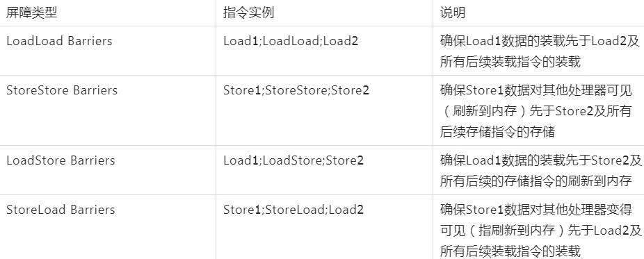
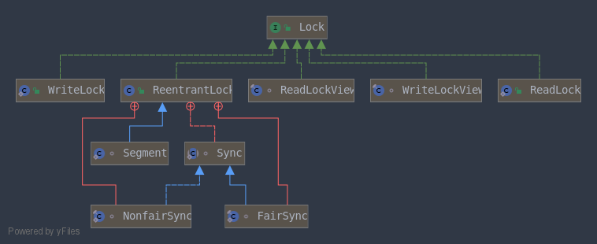
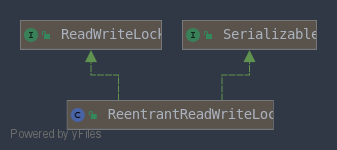
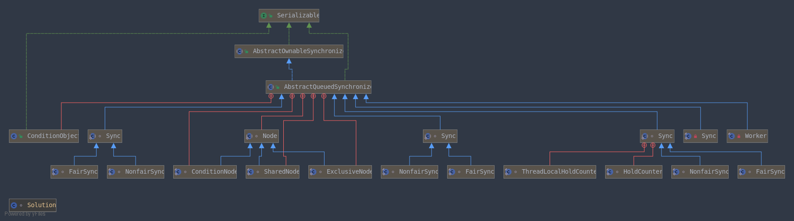
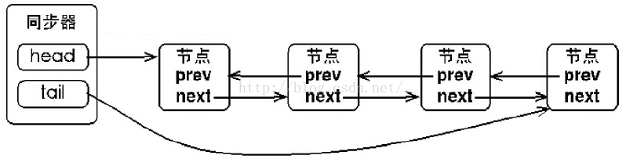
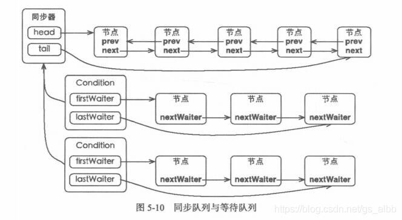
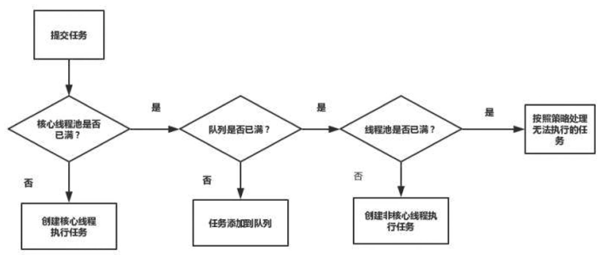

# 多线程

## 线程

线程是操作系统调度的最小单位,每个线程都有自己的计数器,栈和局部变量等属性.

## 多线程一定快吗

多线程会有`上下文的切换`,创建线程会有额外的开销.

不同类型的任务场景也会有不同的结果, CPU 密集型的任务 就不如 IO密集型任务的效率高

同时也受制于硬件,单核CPU使用多线程就不如多核CPU

因此结论就是 `不一定`

## 线程的状态

Java中的线程主要有六种状态


### New

当一个线程被 `new ` 出来的时候,就进入这种状态

```Java
Thread thread = new Thread(() -> System.out.println("hello"));
```

### Runnable

调用 Thread.start 方法后进入这个状态. 但实际上仍需等待CPU进行调度,获得时间片之后真正的运行

```Java
thread.start();
```

### Blocked

尝试获取锁时阻塞,获取到锁进入 Runnable 状态. 注意  **只有Synchronized获取锁会阻塞,Lock相关会进入Waiting状态**

### Waiting

调用 wait/join 方法后进入这个状态. 只能等待被唤醒.唤醒后进入 Runnable 状态

### Time_Wating

调用 wait(Time)/sleep/join(Time) 方法进入,在超时时间到或者被唤醒进入 Runnable 状态

### Terminated

终止

## Java内存模型

顺序一致性模型

JMM 屏蔽了不同的处理器的细节


	线程之间的通信模型有两种: 共享内存和消息传递. Java采用的是共享内存的方式. 线程之间的共享变量存储在共享内存中,每个线程拥有自己的私有内存(工作内存),私有内存里保存了共享变量的副本.

线程私有内存是一个抽象概念,并不是真正的物理内存.

## 线程间通信

### volatile

### synchronized

### 等待通知机制

### 管道输入/输出流

这是一种比较神奇的想法

```Java
import java.io.IOException;
import java.io.PipedReader;
import java.io.PipedWriter;

/**
 * @author wangz
 */
public class Solution {
    public static void main(String[] args) throws IOException {
        PipedWriter writer = new PipedWriter();
        PipedReader reader = new PipedReader();
        writer.connect(reader);

        Thread printThread = new Thread(new Print(reader), "PrintThread");
        Thread inputThread = new Thread(new Reader(writer), "InputThread");
        inputThread.start();
        printThread.start();


    }
}

class Print implements Runnable {
    PipedReader in;

    public Print(PipedReader in) {
        this.in = in;
    }

    @Override
    public void run() {
        int rec;
        while (true) {
            try {
                if (((rec = in.read()) == -1)) {
                    break;
                }
                System.out.print((char) rec);
            } catch (IOException e) {
                e.printStackTrace();
            }
        }
    }
}


class Reader implements Runnable {
    PipedWriter writer;

    public Reader(PipedWriter writer) {
        this.writer = writer;
    }

    @Override
    public void run() {

        int rec;

        while (true) {
            try {
                if (((rec = System.in.read()) == -1)) {
                    break;
                }
                writer.write(rec);

            } catch (IOException e) {
                e.printStackTrace();
            }
        }
    }
}
```

### Thread.Join

### ThreadLocal

用于线程之间变量的隔离

## volatile详解

volatile 是轻量级的 synchronized, 保证了共享变量在线程之间的可见性. 简而言之,被 volatile 修饰的变量,每次读会从内存读,每次写会强制刷新CPU的缓存

### CPU术语定义


### volatile 指令

​	当一个变量被声明为 volatile 时,汇编指令会多出一条 `lock addl $0x0 (%esp)`

​	lock 指令会锁住总线

​	这条指令会将当前处理器缓存行中的数据写回内存,同时使其他处理器缓存了该内存地址的数据无效. 之二是通过`缓存一致性协议`来实现的. 处理器可以嗅探其他处理器的缓存和系统内存, 使得数据总是一致的.

### 禁止指令重排

​	编译器处理器为了提高指令执行的效率,会在不影响指令执行结果的条件下进行指令重排序,改变指令执行的顺序.但是在多线程环境下,指令重排序有可能会导致``内存可见性``的问题. 因此编译器会在适当的位置插入特定类型的内存屏障来禁止指令重排.

四大内存屏障,其中 `StoreLoad`可以实现其他三个的所有功能,同时开销也比价昂贵



volatile 重排序规则:

	- 如果第二个指令是 volatile 写,第一个指令绝对不能重排序
	- 如果第一个指令是 volatile 读,第二个指令一定不能重排序
	- 当第一个操作是 volatile 写,第二个指令是 volatile 读的时候,不能重排序

JMM 内存屏障插入策略 : S=Store  L=Load

volatile 写 前 SS

volatile 写 后 SL

volatile 读 后 LL

volatile 读 后 SL

上边是最保守的策略,适用于任意的处理器.

**在X86处理器上,只会在volatile写后边插入 StoreLoad**

## synchronized详解

这里引用一张原理图,图源见水印:


​	synchronized 是通过进入和退出 `Monitor对象`来实现方法同步和代码块同步,但两者的实现有差异.对于代码块会在字节码中添加 monitorEnter 和 monitorExit 指令, 对于方法会声明为 ACC_Synchronized. 

​	本质上讲, synchronized 获得锁的方式就是向对象头中的特定区域放入自己的线程ID,成功则表示获取了锁,否则继续尝试.

### Java对象头

​	所有的Java对象都有Java对象头的存在,对象头中包括`MarkWord标记字` `classMetaData 类元信息` 等等,数组类型还包括数组长度.

​	与synchronized相关的锁信息主要存在于MarkWord中

​	MarkWord中的锁信息主要包含四种: 无锁 偏向锁 轻量级锁 重量级锁. 随着竞争的加剧,会实现`锁升级`的过程. 锁只能升级不能降级.

### 偏向锁

​	为什么会出现偏向锁? 因为实际运行中锁的竞争是很少的,而且总是由固定的线程去获得锁. 因此在某个线程第一次获取锁时,在对象头中记录线程ID, 将偏向锁的标志位置1. 这样在以后的访问中可以省略CAS操作.

​	形象的理解就是线程把自己的ID贴到对象头上声明这个对象已经被他独占了

> 偏向锁的撤销

​	当有线程尝试竞争锁时, Java虚拟机会继续执行到全局安全点, 然后暂停拥有偏向锁的线程.

​	 如果此时拥有偏向锁的线程不处于活动状态,则将锁状态置为无锁.

​	 如果线程仍然活动着,拥有偏向锁的栈会被执行,遍历偏向对象的锁记录,栈中的锁记录和对象头的MarkWord要么重新偏	向其他线程,要么恢复到无锁,要么标记对象不适合作为偏向锁.

​	最后唤醒暂停的线程

### 轻量级锁

只要出现线程的竞争时, 就会将偏向锁升级为轻量级锁(自旋锁). 多个线程尝试使用 CAS将自己ID放到MarkWord中.

### 重量级锁

当竞争轻量级锁的线程自旋超过 **10**次时,就会升级为重量级锁. 因为太多无意义的自旋会大量的消耗 CPU 资源. 但是当前的 JVM 有自适应自旋,不一定是 10 次.

重量级锁中有一个队列,按照队列来进行调度.

重量级锁会存在用户态和内核态的切换,开销比较大,但是不消耗 CPU

### 锁粗化

## CAS

比较并交换,在UnSafe类中有大量的相关方法,底层是通过处理器的 `CMPX-CHG`实现的

CAS的过程可以满足 volatile 的语义

### ABA问题

即有一个变量 A 被修改为了 B, 然后又被修改为了 A. 从外观上看是没有变化的,但实际上已经被修改过了.

解决这个问题的办法是使用版本号,每次修改版本号自增

## 锁

### 锁的内存语义

当线程释放锁时,JMM会将工作内存中的共享变量写回主内存中.

锁释放与 volatile 写有相同的内存语义

锁获取与 volatile 读有相同的内存语义

线程释放一个锁,实际上是线程向接下来要获取这个锁的线程发出了一个消息

线程获取一个锁,实际上是对之前消息的响应

释放与获取的过程实际上是两个线程通过主内存进行消息传递的过程

### Lock接口



Lock 接口的常用实现类只有 ReentrantLock ,虽然使用不如 synchronized 便捷,但是更加的灵活.

### 公平锁与非公平锁

公平锁的获取顺序遵循绝对时间,非公平锁则不然

公平锁追求绝对的公平,因此会有大量的上下文切换,因此Java中的默认实现是非公平锁.

### 读写锁



​	读写锁其实是两把锁,一把读锁和一把写锁. 在大部分情况下,读写锁的性能会比排它锁好.读写锁的读锁是不排他的,而写锁是排他的.

​	在获取写锁的时候,会判断读锁是否存在,如果存在读锁,必须等待所有的读操作完成后再获得写锁,且写锁获得后其余的读写均会被阻塞.

```Java
int c = getState();
int w = exclusiveCount(c);
if (c != 0) {
    // (Note: if c != 0 and w == 0 then shared count != 0)
    if (w == 0 || current != getExclusiveOwnerThread())
        return false;
```

​	在获取读锁的时候比较简单,如果当前线程拥有锁,重数加一即可. 如果当前线程并未持有锁且没有线程获得写锁,读状态加一. 如果有其他线程获得了写锁,则获取读锁的过程阻塞.

​	锁降级是指拥有写锁的线程尝试获得读锁时,先获得读锁,然后释放写锁的过程.

### LockSupport

​	LockSupport定义了一组静态的工具类来完成线程的阻塞和唤醒工作.

```Java
// 阻塞当前线程,调用 unpark 或者被中断才能从阻塞中返回
public static void park() {
    UNSAFE.park(false, 0L);
}
```

```Java
// 增加了阻塞对象
public static void park(Object blocker) {
    Thread t = Thread.currentThread();
    setBlocker(t, blocker);
    UNSAFE.park(false, 0L);
    setBlocker(t, null);
}
```

```Java
// 同时含有阻塞对象和阻塞时间
public static void parkNanos(Object blocker, long nanos) {
    if (nanos > 0) {
        Thread t = Thread.currentThread();
        setBlocker(t, blocker);
        UNSAFE.park(false, nanos);
        setBlocker(t, null);
    }
}
```

## AQS

抽象队列同步器 是一个**基础框架**,通过继承和重写一些方法可以实现自己的同步工具.



### 同步队列

每个同步器中都存在一个FIFO双向队列来管理同步状态. 当当前线程获取锁失败时,会将当前线程以及一些信息包装成一个节点,然后将其加入同步队列,同时阻塞当前线程. 当锁被释放时,唤醒队列的首节点,让其尝试获取锁.



```Java
abstract static class Node {
    volatile Node prev;       // initially attached via casTail
    volatile Node next;       // visibly nonnull when signallable
    Thread waiter;            // visibly nonnull when enqueued
    volatile int status;      // written by owner, atomic bit ops by others
    Node nextWaiter;		 // 在共享模式下才有意义的属性
}
```

### 等待队列



### 获取锁

以 ReentrantLock 为例: 首先会尝试CAS直接获取锁,如果成功则结束,否则转去 acquire 方法,

```Java
final void lock() {
    if (compareAndSetState(0, 1))
        setExclusiveOwnerThread(Thread.currentThread());
    else
        acquire(1);
}
```

acquire 方法是定义在 AQS 中的模板方法

```Java
public final void acquire(int arg) {
    if (!tryAcquire(arg) &&  acquireQueued(addWaiter(Node.EXCLUSIVE), arg))
        selfInterrupt();
}
```

第一个 tryAcquire 方法最终会调用下边这个方法

```Java
final boolean nonfairTryAcquire(int acquires) {
    final Thread current = Thread.currentThread();
    int c = getState();
    // 再次检查当前锁的状态,无锁就获得
    if (c == 0) {
        if (compareAndSetState(0, acquires)) {
            setExclusiveOwnerThread(current);
            return true;
        }
    }
    // 如果当前线程已经持有了这把锁,再获取一次,重数+1. 重数的上限是Integer的最大值
    else if (current == getExclusiveOwnerThread()) {
        int nextc = c + acquires;
        if (nextc < 0) // overflow
            throw new Error("Maximum lock count exceeded");
        setState(nextc);
        return true;
    }
    // 未获取到,返回 false
    return false;
}
```

当获取失败后就会执行这个方法 `acquireQueued(addWaiter(Node.EXCLUSIVE), arg))`,但是正式执行之前将当前线程包装成了一个节点采用CAS放到队列的尾巴

```Java
private Node addWaiter(Node mode) {
    Node node = new Node(Thread.currentThread(), mode);
    // Try the fast path of enq; backup to full enq on failure
    Node pred = tail;
    if (pred != null) {
        node.prev = pred;
        if (compareAndSetTail(pred, node)) {
            pred.next = node;
            return node;
        }
    }
    enq(node);
    return node;
}
```

包装完成之后就进入 acquireQueued 方法,如果当前节点的前驱结点是头结点,尝试一次CAS获取锁,若失败,则进行等待.

```Java
final boolean acquireQueued(final Node node, int arg) {
    boolean failed = true;
    try {
        boolean interrupted = false;
        // 自旋
        for (;;) {
            final Node p = node.predecessor();
            if (p == head && tryAcquire(arg)) {
                setHead(node);
                p.next = null; // help GC
                failed = false;
                return interrupted;
            }
            if (shouldParkAfterFailedAcquire(p, node) && parkAndCheckInterrupt())
                interrupted = true;
        }
    } finally {
        if (failed)
            cancelAcquire(node);
    }
}
```

### 释放锁

```Java
public final boolean release(int arg) {
    if (tryRelease(arg)) {
        Node h = head;
        if (h != null && h.waitStatus != 0)
            //锁释放完后唤醒当前节点的后继节点
            unparkSuccessor(h);
        return true;
    }
    return false;
}
```

```Java
protected final boolean tryRelease(int releases) {
	// 因为是可重入锁,因此每加一次锁就要释放一次锁,不能多也不能少.
    int c = getState() - releases;
    if (Thread.currentThread() != getExclusiveOwnerThread())
        throw new IllegalMonitorStateException();
    boolean free = false;
    if (c == 0) {
        free = true;
        setExclusiveOwnerThread(null);
    }
    setState(c);
    return free;
}
```

### 非独占

AQS 支持独占式获取与非独占式获取锁,但是核心都是相同的.

## Condition接口

所有的对象都有`wait notify` 方法,这些方法可以和 synchronized 进行配合使用.

Condition 接口提供了类似的功能, 与 lock 进行搭配使用, 但是 Condition 比对象提供的通知方法更为强大

使用 Condition 实现一个生产者/消费者模式

```Java
import java.util.concurrent.locks.Condition;
import java.util.concurrent.locks.Lock;
import java.util.concurrent.locks.ReentrantLock;

class Factory {
    int goods = 0;
    Lock lock = new ReentrantLock();
    Condition condition = lock.newCondition();

    public static void main(String[] args) {
        Factory factory = new Factory();
        new Thread(() -> {
            try {
                while (true) {
                    factory.provider();
                }
            } catch (InterruptedException e) {
                e.printStackTrace();
            }
        }).start();


        new Thread(() -> {
            try {
                while (true) {
                    factory.consumer();
                }
            } catch (InterruptedException e) {
                e.printStackTrace();
            }
        }).start();
    }

    public void provider() throws InterruptedException {
        lock.lock();
        while (goods > 10) {
            condition.await();
        }
        goods += 100;
        System.out.println(goods);
        condition.signal();
        lock.unlock();
    }

    public void consumer() throws InterruptedException {
        lock.lock();
        while (goods <= 0) {
            condition.await();
        }
        goods -= 10;
        System.out.println(goods);
        condition.signal();
        lock.unlock();
    }
}
```

### 等待队列

每个AQS的内部聚合了一个 ConditionObject, 每个 ConditionObject 内部有有两个节点指针,分别是` Node firstWaiter` 和 `Node lastWaiter`.

在新增节点的时候,只需要改变尾节点的指向即可.

由于AQS的内部还有一个同步队列, 当调用 await 方法时, 是将同步队列的首节点加到等待队列的尾节点

当调用 signal 方法时,是将等待队列中等待时间最长的节点加入到同步队列中,然后使用LockSupport将其唤醒,让其参与竞争

## ForkJoinTask

ForkJoin是一个用于并行执行任务的框架,将大任务切割成小任务分而治之.

一个小 Demo

```Java
import java.util.concurrent.ExecutionException;
import java.util.concurrent.ForkJoinPool;
import java.util.concurrent.ForkJoinTask;
import java.util.concurrent.RecursiveTask;

class Task extends RecursiveTask<Integer> {
    int threshold = 2;
    int start, end;

    public Task(int start, int end) {
        this.start = start;
        this.end = end;
    }

    public static void main(String[] args) throws ExecutionException, InterruptedException {
        ForkJoinPool pool = new ForkJoinPool();

        Task task = new Task(1, 40000);

        ForkJoinTask<Integer> submit = pool.submit(task);

        System.out.println(submit.get());
    }

    @Override
    protected Integer compute() {
        int sum = 0;
        boolean canCompute = (end - start) <= threshold;
        if (canCompute) {
            for (int i = start; i <= end; i++) {
                sum += i;
            }
        } else {
            int mid = (start + end) / 2;
            Task a = new Task(start, mid);
            Task b = new Task(mid + 1, end);
            a.fork();
            b.fork();

            sum = a.join() + b.join();
        }
        return sum;
    }
}
```

## 原子类

Java 一共提供了 13 个原子类,但是可以分为四种.

## 并发工具类

### CountDownLatch

允许一个线程或者多个线程等待其他线程完成操作. 可以用 Join 方法来实现,但是 CountDownLatch 提供了更多的功能.

CountDownLatch  的计数器只能用一次

### CyclicBarrier

让一组线程达到同步点时再放行的工具,CyclicBarrier的计数器可以重复使用

### Semaphore

控制共享资源的并发数量,实现流量控制

### Exchanger

用于线程间的数据交换,提供了一个同步点,在同步点,两个线程可以交换数据.

## 线程池

### 为什么要使用线程池?

- 线程的频繁创建和销毁也是需要开销的,没有必要不停地创建和销毁
- 提高响应速度,任务来了即可执行
- 提高线程的可管理性

### 线程池的执行原理



### 创建

```Java
public ThreadPoolExecutor(int corePoolSize,    					//核心池大小
                          int maximumPoolSize,					//最大大小
                          long keepAliveTime,					// 存活时间
                          TimeUnit unit,						//时间单位
                          BlockingQueue<Runnable> workQueue,	  //阻塞队列
                          ThreadFactory threadFactory,			 // 线程工厂
                          RejectedExecutionHandler handler		  // 拒绝策略
                         ) {
}
```

### 配置

CPU密集型的任务应当尽量减少线程的数目,IO密集型的任务则应当尽量增加线程的数目

最好使用有界阻塞队列,防止OOM

## ThreadLocal

### 内存泄漏

ThreadLocalMap的key是ThreadLocal的弱引用 ,当没有一个强引用引用ThreadLocal时,key会被回收掉,而value就永远访问不到了.

