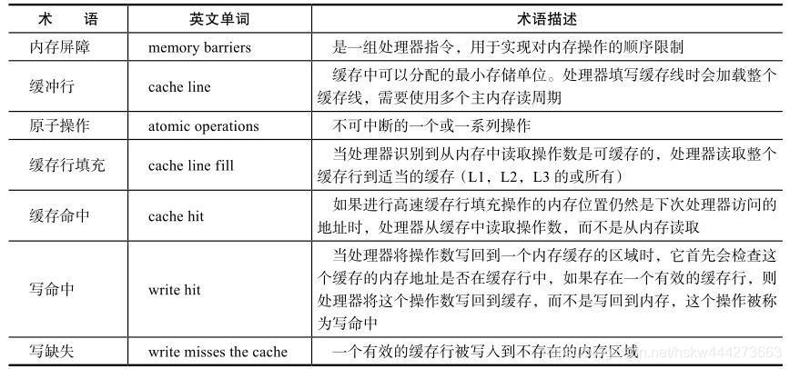

# 多线程

## 线程

线程是操作系统调度的最小单位,每个线程都有自己的计数器,栈和局部变量等属性.

## 多线程一定快吗

多线程会有`上下文的切换`,创建线程会有额外的开销.

不同类型的任务场景也会有不同的结果, CPU 密集型的任务 就不如 IO密集型任务的效率高

同时也受制于硬件,单核CPU使用多线程就不如多核CPU

因此结论就是 `不一定`

## 线程的状态

Java中的线程主要有六种状态


### New

当一个线程被 `new ` 出来的时候,就进入这种状态

```Java
Thread thread = new Thread(() -> System.out.println("hello"));
```

### Runnable

调用 Thread.start 方法后进入这个状态. 但实际上仍需等待CPU进行调度,获得时间片之后真正的运行

```Java
thread.start();
```

### Blocked

尝试获取锁时阻塞,获取到锁进入 Runnable 状态. 注意  **只有Synchronized获取锁会阻塞,Lock相关会进入Waiting状态**

### Waiting

调用 wait/join 方法后进入这个状态. 只能等待被唤醒.唤醒后进入 Runnable 状态

### Time_Wating

调用 wait(Time)/sleep/join(Time) 方法进入,在超时时间到或者被唤醒进入 Runnable 状态

### Terminated

终止

## 线程间通信

### volatile

### synchronized

### 等待通知机制

### 管道输入/输出流

这是一种比较神奇的想法

```Java
import java.io.IOException;
import java.io.PipedReader;
import java.io.PipedWriter;

/**
 * @author wangz
 */
public class Solution {
    public static void main(String[] args) throws IOException {
        PipedWriter writer = new PipedWriter();
        PipedReader reader = new PipedReader();
        writer.connect(reader);

        Thread printThread = new Thread(new Print(reader), "PrintThread");
        Thread inputThread = new Thread(new Reader(writer), "InputThread");
        inputThread.start();
        printThread.start();


    }
}

class Print implements Runnable {
    PipedReader in;

    public Print(PipedReader in) {
        this.in = in;
    }

    @Override
    public void run() {
        int rec;
        while (true) {
            try {
                if (((rec = in.read()) == -1)) {
                    break;
                }
                System.out.print((char) rec);
            } catch (IOException e) {
                e.printStackTrace();
            }
        }
    }
}


class Reader implements Runnable {
    PipedWriter writer;

    public Reader(PipedWriter writer) {
        this.writer = writer;
    }

    @Override
    public void run() {

        int rec;

        while (true) {
            try {
                if (((rec = System.in.read()) == -1)) {
                    break;
                }
                writer.write(rec);

            } catch (IOException e) {
                e.printStackTrace();
            }
        }
    }
}
```

### Thread.Join

### ThreadLocal

用于线程之间变量的隔离

## volatile详解

volatile 是轻量级的 synchronized, 保证了共享变量在线程之间的可见性.

### CPU术语定义



### volatile 指令

​	当一个变量被声明为 volatile 时,汇编指令会多出一条 `lock addl $0x0 (%esp)`

​	lock 指令会锁住总线

​	这条指令会将当前处理器缓存行中的数据写回内存,同时使其他处理器缓存了该内存地址的数据无效. 之二是通过`缓存一致性协议`来实现的. 处理器可以嗅探其他处理器的缓存和系统内存, 使得数据总是一致的.

## synchronized详解

synchronized 是通过进入和退出 `Monitor对象`来实现方法同步和代码块同步,但两者的实现有差异.

### Java对象头

