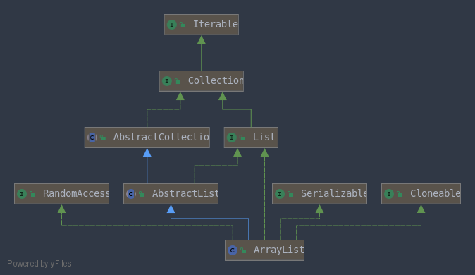
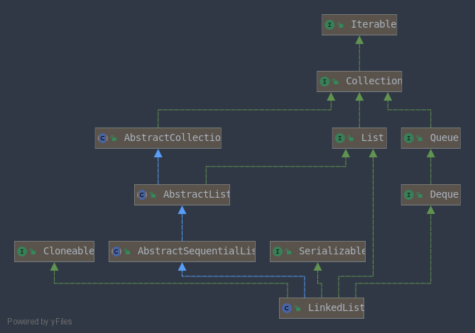

# 集合



## ArrayList

### 创建

ArrayList 的底层是使用 Object 数组实现的, 在创建的时候,会将 elementData 数组 指向一个空的对象数组.

```Java
public ArrayList() {
    this.elementData = DEFAULTCAPACITY_EMPTY_ELEMENTDATA;
}
```

如果指定了默认的大小,则会创建一个新的对象数组:

```Java
public ArrayList(int initialCapacity) {
    if (initialCapacity > 0) {
        this.elementData = new Object[initialCapacity];
    } 
}
```

### 扩容

```Java
private Object[] grow() {
    return grow(size + 1);
}
```

如果是第一次扩容,则会初始化大小为 10, 如果不是,则转去 `newLength` 方法去获得一个新的长度

```Java
private Object[] grow(int minCapacity) {
    int oldCapacity = elementData.length;
    if (oldCapacity > 0 || elementData != DEFAULTCAPACITY_EMPTY_ELEMENTDATA) {
        int newCapacity = ArraysSupport.newLength(oldCapacity,
                minCapacity - oldCapacity, /* minimum growth */
                oldCapacity >> 1           /* preferred growth */);
        return elementData = Arrays.copyOf(elementData, newCapacity);
    } else {
        // 初次添加元素,初始化为大小为 10 
        return elementData = new Object[Math.max(DEFAULT_CAPACITY, minCapacity)];
    }
}
```

总结一些下边的方法:

​	绝大部分情况下,都会扩容到原来大小的2倍.

​	如果扩容后大小不超过 `MAX_ARRAY_LENGTH = Integer.Max-8`, 返回扩容后大大小`Math.max(minGrowth, prefGrowth) + oldLength;`

​	如果超过了,则再次进行判断: 如果扩容后的大小为负数,说明溢出了,则申请的空间太大直接抛出OOM异常.

若仍在`MAX_ARRAY_LENGTH`范围内,返回`MAX_ARRAY_LENGTH`,否则返回 `Integer.MAX_VALUE`.

```Java
public static int newLength(int oldLength, int minGrowth, int prefGrowth) {
	// old = elementData.length
    // min = (minCapacity - oldCapacity)  就是当前数组中剩余的那些位置的个数
    // pref = elementData.length*2
    int newLength = Math.max(minGrowth, prefGrowth) + oldLength;
    if (newLength - MAX_ARRAY_LENGTH <= 0) {
        return newLength;
    }
    return hugeLength(oldLength, minGrowth);
}
```

```Java
// 处理大的长度的函数
private static int hugeLength(int oldLength, int minGrowth) {
    int minLength = oldLength + minGrowth;
    if (minLength < 0) { // overflow
        throw new OutOfMemoryError("Required array length too large");
    }
    if (minLength <= MAX_ARRAY_LENGTH) {
        return MAX_ARRAY_LENGTH;
    }
    return Integer.MAX_VALUE;
}
```

### RandomAccess

这是一个简单的接口,什么都没有定义. 只是表明 ArrayList 支持随机访问. LinkedList 就没有实现这个接口.

```Java
public interface RandomAccess {
}
```

### ArrayList 与 Vector 的区别

Vector 创建的时候会默认初始大小为0

扩容的时候有一个 `capacityIncrement` 变量,扩容的时候如果`capacityIncrement`不为零,则增长 `capacityIncrement`,否则``二倍增长``.

Vector 是线程安全的,方法都增加了 `synchronized`关键字修饰

## LinkedList



### 创建

事实上,在 new 出一个对象时什么都没有做

```Java
public LinkedList() {
}
```

### 增加

先封装一个双链表的节点,然后将它连到链表上即可

```Java
Node(Node<E> prev, E element, Node<E> next) {
    this.item = element;
    this.next = next;
    this.prev = prev;
}
```

```Java
void linkLast(E e) {
    final Node<E> l = last;
    final Node<E> newNode = new Node<>(l, e, null);
    last = newNode;
    if (l == null)
        first = newNode;
    else
        l.next = newNode;
    size++;
    modCount++;
}
```

## HashMap

## ConcurrentHashMap

## CopyOnWriteArrayList

