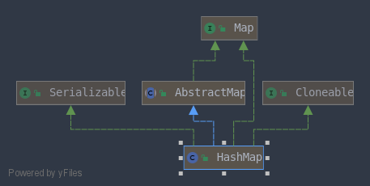
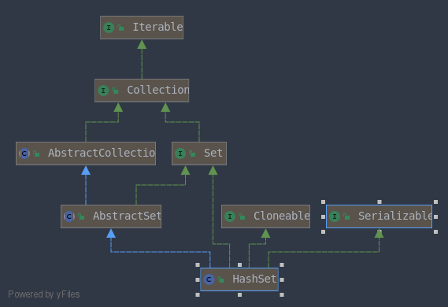
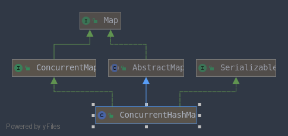

# 集合


## ArrayList

### 创建

ArrayList 的底层是使用 Object 数组实现的, 在创建的时候,会将 elementData 数组 指向一个空的对象数组.

```Java
public ArrayList() {
    this.elementData = DEFAULTCAPACITY_EMPTY_ELEMENTDATA;
}
```

如果指定了默认的大小,则会创建一个新的对象数组:

```Java
public ArrayList(int initialCapacity) {
    if (initialCapacity > 0) {
        this.elementData = new Object[initialCapacity];
    } 
}
```

### 扩容

```Java
private Object[] grow() {
    return grow(size + 1);
}
```

如果是第一次扩容,则会初始化大小为 10, 如果不是,则转去 `newLength` 方法去获得一个新的长度

```Java
private Object[] grow(int minCapacity) {
    int oldCapacity = elementData.length;
    if (oldCapacity > 0 || elementData != DEFAULTCAPACITY_EMPTY_ELEMENTDATA) {
        int newCapacity = ArraysSupport.newLength(oldCapacity,
                minCapacity - oldCapacity, /* minimum growth */
                oldCapacity >> 1           /* preferred growth */);
        return elementData = Arrays.copyOf(elementData, newCapacity);
    } else {
        // 初次添加元素,初始化为大小为 10 
        return elementData = new Object[Math.max(DEFAULT_CAPACITY, minCapacity)];
    }
}
```

总结一些下边的方法:

​	绝大部分情况下,都会扩容到原来大小的2倍.

​	如果扩容后大小不超过 `MAX_ARRAY_LENGTH = Integer.Max-8`, 返回扩容后大大小`Math.max(minGrowth, prefGrowth) + oldLength;`

​	如果超过了,则再次进行判断: 如果扩容后的大小为负数,说明溢出了,则申请的空间太大直接抛出OOM异常.

若仍在`MAX_ARRAY_LENGTH`范围内,返回`MAX_ARRAY_LENGTH`,否则返回 `Integer.MAX_VALUE`.

```Java
public static int newLength(int oldLength, int minGrowth, int prefGrowth) {
	// old = elementData.length
    // min = (minCapacity - oldCapacity)  就是当前数组中剩余的那些位置的个数
    // pref = elementData.length*2
    int newLength = Math.max(minGrowth, prefGrowth) + oldLength;
    if (newLength - MAX_ARRAY_LENGTH <= 0) {
        return newLength;
    }
    return hugeLength(oldLength, minGrowth);
}
```

```Java
// 处理大的长度的函数
private static int hugeLength(int oldLength, int minGrowth) {
    int minLength = oldLength + minGrowth;
    if (minLength < 0) { // overflow
        throw new OutOfMemoryError("Required array length too large");
    }
    if (minLength <= MAX_ARRAY_LENGTH) {
        return MAX_ARRAY_LENGTH;
    }
    return Integer.MAX_VALUE;
}
```

### RandomAccess

这是一个简单的接口,什么都没有定义. 只是表明 ArrayList 支持随机访问. LinkedList 就没有实现这个接口.

```Java
public interface RandomAccess {
}
```

### ArrayList 与 Vector 的区别

Vector 创建的时候会默认初始大小为0

扩容的时候有一个 `capacityIncrement` 变量,扩容的时候如果`capacityIncrement`不为零,则增长 `capacityIncrement`,否则``二倍增长``.

Vector 是线程安全的,方法都增加了 `synchronized`关键字修饰

## LinkedList


### 创建

事实上,在 new 出一个对象时什么都没有做

```Java
public LinkedList() {
}
```

### 增加

先封装一个双链表的节点,然后将它连到链表上即可

```Java
Node(Node<E> prev, E element, Node<E> next) {
    this.item = element;
    this.next = next;
    this.prev = prev;
}
```

```Java
void linkLast(E e) {
    final Node<E> l = last;
    final Node<E> newNode = new Node<>(l, e, null);
    last = newNode;
    if (l == null)
        first = newNode;
    else
        l.next = newNode;
    size++;
    modCount++;
}
```

## HashMap



`最大capacity`= 1<<30

### Node节点

```Java
static class Node<K,V> implements Map.Entry<K,V> {
    final int hash;
    final K key;
    V value;
    Node<K,V> next;

	// .........
    
    public final int hashCode() {
        return Objects.hashCode(key) ^ Objects.hashCode(value);
    }

    public final boolean equals(Object o) {
        if (o == this)
            return true;
        if (o instanceof Map.Entry) {
            Map.Entry<?,?> e = (Map.Entry<?,?>)o;
            if (Objects.equals(key, e.getKey()) &&
                Objects.equals(value, e.getValue()))
                return true;
        }
        return false;
    }
}
```

### 创建

在创建HashMap的时候,默认的负载因子是 16 . 负载因子的含义是当  占用的空间/总空间>=负载因子时,进行扩容操作

```Java
/**
 * Constructs an empty {@code HashMap} with the default initial capacity
 * (16) and the default load factor (0.75).
 */
public HashMap() {
    // 默认的负载因子 0.75 ,默认的容量是 16
    this.loadFactor = DEFAULT_LOAD_FACTOR; // all other fields defaulted
}
```

在创建的时候如果指定了初始的容量大小, Java不会直接按照给定的容量进行初始化,而是进行一个神奇的操作:

```Java
static final int tableSizeFor(int cap) {
    int n = -1 >>> Integer.numberOfLeadingZeros(cap - 1);
    return (n < 0) ? 1 : (n >= MAXIMUM_CAPACITY) ? MAXIMUM_CAPACITY : n + 1;
}
```

将这个函数的返回值作为真正的阈值,简而言之,这个函数的目的就是为了找到``不小于cap的2的幂次的数``

### 添加

添加的时候使用的是下边这个方法,后边两个参数的值为 `false` 和 `true`

```Java
    final V putVal(int hash, K key, V value, boolean onlyIfAbsent, boolean evict)       
```

这个方法有一点长:

```Java
final V putVal(int hash, K key, V value, boolean onlyIfAbsent,  boolean evict) {
    Node<K,V>[] tab; Node<K,V> p; int n, i;
    // 首先判断 map 是否未经初始化,如果未初始化, 调用 resize 方法进行初始化
    if ((tab = table) == null || (n = tab.length) == 0)
        n = (tab = resize()).length;
    // hash 一下,判断对应位置是否已经有值存在,不存在,则新建节点然后放进去即可
    if ((p = tab[i = (n - 1) & hash]) == null)
        tab[i] = newNode(hash, key, value, null);
    else {
        // key 已经存在了
        Node<K,V> e; K k;
        // 如果两个键相同,更新一下值即可
        if (p.hash == hash && ((k = p.key) == key || (key != null && key.equals(k))))
            e = p;
        // 如果是一个红黑树节点, 调用红黑树的 put 方法
        else if (p instanceof TreeNode)
            e = ((TreeNode<K,V>)p).putTreeVal(this, tab, hash, key, value);
        else {
            //在链表上查找
            for (int binCount = 0; ; ++binCount) {
                // 找到了链表的尾巴,将新的key编程节点插入链表尾部
                if ((e = p.next) == null) {
                    p.next = newNode(hash, key, value, null);
                    // 判断是否要进行树化,当链表的长度 >= 7 进入 treeifyBin 方法,但是并不一定会真的树化
                    if (binCount >= TREEIFY_THRESHOLD - 1) // -1 for 1st
                        treeifyBin(tab, hash);
                    break;
                }
                 // 在链表上发现了同样的 key ,直接返回 
                if (e.hash == hash && ((k = e.key) == key || (key != null && key.equals(k))))
                    break;
                p = e;
            }
        }
		//......
    }
}
```

### 扩容

这个方法真是太长了,简要概括: 要么是初始化一个未使用的map,要么就是将大小变为2倍

```Java
/**
 * Initializes or doubles table size.  If null, allocates in
 * accord with initial capacity target held in field threshold.
 * Otherwise, because we are using power-of-two expansion, the
 * elements from each bin must either stay at same index, or move
 * with a power of two offset in the new table.
 *
 * @return the table
 */
final Node<K,V>[] resize() {
    Node<K,V>[] oldTab = table;
    // 获得旧的 capacity
    int oldCap = (oldTab == null) ? 0 : oldTab.length;
    // 获得旧的阈值
    int oldThr = threshold;
    int newCap, newThr = 0;

    // 旧的  capacity>0 说明map不是初始化
    if (oldCap > 0) {
        //旧的capacity已经达到了最大值
        if (oldCap >= MAXIMUM_CAPACITY) {
            threshold = Integer.MAX_VALUE;
            return oldTab;
        }
        // 二倍操作
        else if ((newCap = oldCap << 1) < MAXIMUM_CAPACITY && oldCap >= DEFAULT_INITIAL_CAPACITY)
            newThr = oldThr << 1; // double threshold
    }
    // 只有初始化的时候才会进入这个分支,写代码的鬼才~
    else if (oldThr > 0) // initial capacity was placed in threshold
        newCap = oldThr;
    else {               // zero initial threshold signifies using defaults
        newCap = DEFAULT_INITIAL_CAPACITY;
        newThr = (int)(DEFAULT_LOAD_FACTOR * DEFAULT_INITIAL_CAPACITY);
    }
    
    // 计算一下新的阈值
    if (newThr == 0) {
        float ft = (float)newCap * loadFactor;
        
        // 展开了一下三目运算符
        //newThr = (newCap < MAXIMUM_CAPACITY && ft < (float)MAXIMUM_CAPACITY ?
        //          (int)ft : Integer.MAX_VALUE);
         if (newCap < MAXIMUM_CAPACITY && ft < (float) MAXIMUM_CAPACITY) {
            newThr = (int) ft;
        } else {
            newThr = Integer.MAX_VALUE;
        }
    }
    threshold = newThr;
    @SuppressWarnings({"rawtypes","unchecked"})
    // 开始进行值的迁移
    Node<K,V>[] newTab = (Node<K,V>[])new Node[newCap];
    table = newTab;
    if (oldTab != null) {
        for (int j = 0; j < oldCap; ++j) {
            Node<K,V> e;
            if ((e = oldTab[j]) != null) {
                oldTab[j] = null;
                if (e.next == null)
                    newTab[e.hash & (newCap - 1)] = e;
                else if (e instanceof TreeNode)
                    ((TreeNode<K,V>)e).split(this, newTab, j, oldCap);
                else { // preserve order
                    Node<K,V> loHead = null, loTail = null;
                    Node<K,V> hiHead = null, hiTail = null;
                    Node<K,V> next;
                    do {
                        next = e.next;
                        if ((e.hash & oldCap) == 0) {
                            if (loTail == null)
                                loHead = e;
                            else
                                loTail.next = e;
                            loTail = e;
                        }
                        else {
                            if (hiTail == null)
                                hiHead = e;
                            else
                                hiTail.next = e;
                            hiTail = e;
                        }
                    } while ((e = next) != null);
                    if (loTail != null) {
                        loTail.next = null;
                        newTab[j] = loHead;
                    }
                    if (hiTail != null) {
                        hiTail.next = null;
                        newTab[j + oldCap] = hiHead;
                    }
                }
            }
        }
    }
    return newTab;
}
```

### 底层实现

JDK1.8之前使用的是链表+数组的形式,之后使用的是链表+数组+红黑树的形式

### 扰动函数

其实就是一个求hash的函数,定义 null 的hash值为 0.

当 key 不为null时,将hashcode的高16位和低16位相与

```Java
static final int hash(Object key) {
    int h;
    return (key == null) ? 0 : (h = key.hashCode()) ^ (h >>> 16);
}
```

### 为什么长度是2的幂次

在进行put的时候,要进行 index = hash%length 来找到插入的位置,如果长度是2的幂次,直接进行与操作即可,能够极大的提高效率

## HashSet



### 创建

HashSet 是基于HashMap 实现的

```Java
public HashSet() {
    map = new HashMap<>();
}
```

### 检查重复

HashSet 在检查重复的时候会先检查hashcode,如果两个元素的key的hashcode相同,再调用 equals 方法进行判断.

## PriorityQueue

### 创建

底层仍然是用对象数组实现的

```Java
public PriorityQueue() {
    // DEFAULT_INITIAL_CAPACITY = 11
    // comparator = null
    this(DEFAULT_INITIAL_CAPACITY, null);
}
```

### 添加

真正有价值的是下边这个方法

```Java
// k 是插入的位置 x 是插入的值 ex 是对象数组,即底层存储结构
private static <T> void siftUpComparable(int k, T x, Object[] es) {
    Comparable<? super T> key = (Comparable<? super T>) x;
    while (k > 0) {
        int parent = (k - 1) >>> 1;
        Object e = es[parent];
        if (key.compareTo((T) e) >= 0)
            break;
        es[k] = e;
        k = parent;
    }
    es[k] = key;
}
```

## HashTable

### 创建

很神奇, HashTable 的初始容量是11

```Java
public Hashtable() {
    this(11, 0.75f);
}
```

### others

HashTable 的方法都有 Synchronized 修饰,但是锁的细粒度不够,因此现在几乎已经不用了.

同时, HashTable 的 value 不能为 null ,但是 key 可以为null.

```Java
public synchronized V put(K key, V value) {
    // Make sure the value is not null
    if (value == null) {
       throw new NullPointerException();
    }
}
```

## ConcurrentHashMap



### 实现

JDK 1.7 的 ConcurrentHashMap 和 HashMap 的实现大体上是类似的.

#### Node

最基本的Node节点

```Java
static class Node<K,V> implements Map.Entry<K,V> {
    final int hash;
    final K key;
    volatile V val;
    volatile Node<K,V> next;
}
```

#### ForwardingNode

一个特殊的仅仅在扩容时出现的节点,他的hash值永远是 `-1`

```Java
static final class ForwardingNode<K,V> extends Node<K,V> {
    final Node<K,V>[] nextTable;
    ForwardingNode(Node<K,V>[] tab) {
        // MOVED = -1
        super(MOVED, null, null);
        this.nextTable = tab;
    }
    //.....
}
```

#### TreeBin

TreeBin 的内部聚合了一个真正的 TreeNode, 但是 TreeBin 实现了简单的并发操作.

 	重要的一点，红黑树的 读锁状态 和 写锁状态 是互斥的，但是从ConcurrentHashMap角度来说，读写操作实际上可以是不互斥的    

​	红黑树的 读、写锁状态 是互斥的，指的是以红黑树方式进行的读操作和写操作（只有部分的put/remove需要加写锁）是互斥的    

 	但是当有线程持有红黑树的 写锁 时，读线程不会以红黑树方式进行读取操作，而是使用简单的链表方式进行读取，此时读操作和写操作可以并发执行    

​	当有线程持有红黑树的读锁 时，写线程可能会阻塞，不过因为红黑树的查找很快，写线程阻塞的时间很短

[	更多参考](https://my.oschina.net/qq785482254/blog/4307177)

```Java
/**
 * TreeNodes used at the heads of bins. TreeBins do not hold user
 * keys or values, but instead point to list of TreeNodes and
 * their root. They also maintain a parasitic read-write lock
 * forcing writers (who hold bin lock) to wait for readers (who do
 * not) to complete before tree restructuring operations.
 */
static final class TreeBin<K,V> extends Node<K,V> {
    TreeNode<K,V> root;
    volatile TreeNode<K,V> first;
    volatile Thread waiter;
    volatile int lockState;
    // values for lockState
    static final int WRITER = 1; // set while holding write lock
    static final int WAITER = 2; // set when waiting for write lock
    static final int READER = 4; // increment value for setting read lock
}
```

### 创建

```Java
/**
 * Creates a new, empty map with the default initial table size (16).
 */
public ConcurrentHashMap() {
}
```

### 并发级别

并发级别与 bin 的个数相关

```Java
if (initialCapacity < concurrencyLevel){   // Use at least as many bins
    initialCapacity = concurrencyLevel;
}
```

### 重要的属性

#### sizeCTL

表初始化和扩容控制,当为负值时表示当前的表正在进行初始化或者扩容.

​	-1 表示正在初始化

​	-(1+x) 表示有 x 个活动线程正在进行扩容

当表为null , 值为 0

当值为正数时, 表示初始化或者下一次扩容的大小

```Java
/**
 * Table initialization and resizing control.  When negative, the
 * table is being initialized or resized: -1 for initialization,
 * else -(1 + the number of active resizing threads).  Otherwise,
 * when table is null, holds the initial table size to use upon
 * creation, or 0 for default. After initialization, holds the
 * next element count value upon which to resize the table.
 */
private transient volatile int sizeCtl;
```

### 初始化

```Java
private final Node<K,V>[] initTable() {
    Node<K,V>[] tab; int sc;
    while ((tab = table) == null || tab.length == 0) {
        // 小于 0 说明有其他线程正在进行扩容或者初始化操作,让出时间片
        if ((sc = sizeCtl) < 0)
            Thread.yield(); // lost initialization race; just spin
        else if (U.compareAndSetInt(this, SIZECTL, sc, -1)) {
            try {
                // double check 的思想,防止其他线程扩容后当前线程仍然进行扩容
                if ((tab = table) == null || tab.length == 0) {
                    int n = (sc > 0) ? sc : DEFAULT_CAPACITY;
                    @SuppressWarnings("unchecked")
                    Node<K,V>[] nt = (Node<K,V>[])new Node<?,?>[n];
                    table = tab = nt;
                    sc = n - (n >>> 2);
                }
            } finally {
                sizeCtl = sc;
            }
            break;
        }
    }
    return tab;
}
```

### 增加

整体上类似于HashMap, 但是由于存在并发控制,因此使用了 CAS + synchronized 来保证并发安全

```Java
/** Implementation for put and putIfAbsent */

// onlyIfAbsent 的用处在于判断键存在时是否进行值得的替换
final V putVal(K key, V value, boolean onlyIfAbsent) {
    // 如果键或者值为null,则抛出空指针异常,这一点与 HashMap 不同
    if (key == null || value == null) throw new NullPointerException();
	// spread 仍是扰动函数,但是与HashMap的扰动函数有一点不同	
    int hash = spread(key.hashCode());
    int binCount = 0;
    for (Node<K,V>[] tab = table;;) {
        Node<K,V> f; int n, i, fh; K fk; V fv;
        // 表未初始化,则转去初始化
        if (tab == null || (n = tab.length) == 0)
            tab = initTable();
        // 如果待插入的位置上没有值,使用 CAS 的方式将值放进去
        else if ((f = tabAt(tab, i = (n - 1) & hash)) == null) {
            if (casTabAt(tab, i, null, new Node<K,V>(hash, key, value)))
                break; // no lock when adding to empty bin
        }
        // 如果发现有其他的线程正在进行扩容操作,转去帮助扩容
        // 如何发现的? 此处的 MOVED = -1 ,而只有 ForwardingNode 的hash 值是-1
        // 因此当前的节点是一个ForwardingNode,只有在扩容的时候才会出现 ForwardingNode
        else if ((fh = f.hash) == MOVED)
            tab = helpTransfer(tab, f);
        // 如果发现了相同的键值对,返回即可
        else if (onlyIfAbsent // check first node without acquiring lock
                 && fh == hash
                 && ((fk = f.key) == key || (fk != null && key.equals(fk)))
                 && (fv = f.val) != null)
            return fv;
        else {
            V oldVal = null;
            // 锁住当前的节点,当前的节点是一个 Node
            synchronized (f) {
                if (tabAt(tab, i) == f) {
                    if (fh >= 0) {
                        binCount = 1;
                        for (Node<K,V> e = f;; ++binCount) {
                            K ek;
                            // 元素已经存在,更新元素的值
                            if (e.hash == hash &&
                                ((ek = e.key) == key ||
                                 (ek != null && key.equals(ek)))) {
                                oldVal = e.val;
                                if (!onlyIfAbsent)
                                    e.val = value;
                                break;
                            }
                            // 否则就将元素插入到链表的尾部
                            Node<K,V> pred = e;
                            if ((e = e.next) == null) {
                                pred.next = new Node<K,V>(hash, key, value);
                                break;
                            }
                        }
                    }
                    // 如果当前节点不是链表而是红黑树,则调用红黑树的插入方法
                    else if (f instanceof TreeBin) {
                        Node<K,V> p;
                        binCount = 2;
                        if ((p = ((TreeBin<K,V>)f).putTreeVal(hash, key,
                                                       value)) != null) {
                            oldVal = p.val;
                            if (!onlyIfAbsent)
                                p.val = value;
                        }
                    }
                    else if (f instanceof ReservationNode)
                        throw new IllegalStateException("Recursive update");
                }
            }
            if (binCount != 0) {
                // 如果 bin 的树目>=7 ,则转去树化,但是并不是必须进行树化.
                if (binCount >= TREEIFY_THRESHOLD)
                    treeifyBin(tab, i);
                if (oldVal != null)
                    return oldVal;
                break;
            }
        }
    }
    addCount(1L, binCount);
    return null;
}
```

### 查找

查找过程是不加锁的

```Java
public V get(Object key) {
    Node<K,V>[] tab; Node<K,V> e, p; int n, eh; K ek;
	// 计算一下hash
    int h = spread(key.hashCode());
    // 如果第一个节点就找到了,返回即可
    if ((tab = table) != null && (n = tab.length) > 0 &&
        (e = tabAt(tab, (n - 1) & h)) != null) {
        if ((eh = e.hash) == h) {
            if ((ek = e.key) == key || (ek != null && key.equals(ek)))
                return e.val;
        }
        // 如果hash值小于0,那么只有两种情况 : ForwardingNode 或者 TreeBin
        // 调用相关的方法查询
        else if (eh < 0)
            return (p = e.find(h, key)) != null ? p.val : null;
		// 在链表上进行查找
        while ((e = e.next) != null) {
            if (e.hash == h &&
                ((ek = e.key) == key || (ek != null && key.equals(ek))))
                return e.val;
        }
    }
    return null;
}
```

> ForwardingNode 的查找

```Java
Node<K,V> find(int h, Object k) {
    // loop to avoid arbitrarily deep recursion on forwarding nodes
    outer: for (Node<K,V>[] tab = nextTable;;) {
        Node<K,V> e; int n;
        if (k == null || tab == null || (n = tab.length) == 0 ||
            (e = tabAt(tab, (n - 1) & h)) == null)
            return null;
        for (;;) {
            int eh; K ek;
            // 第一个节点就是要找的节点
            if ((eh = e.hash) == h &&
                ((ek = e.key) == k || (ek != null && k.equals(ek))))
                return e;
		   // 继续 "递归" ,但是采用循环的方式可以避免递归层数太深导致栈溢出
            if (eh < 0) {
                if (e instanceof ForwardingNode) {
                    tab = ((ForwardingNode<K,V>)e).nextTable;
                    continue outer;
                }
                else
                    return e.find(h, k);
            }
            //是一个普通的节点,则正常查找即可
            if ((e = e.next) == null)
                return null;
        }
    }
}
```

> TreeBin的查找

参考前边对 TreeBin的介绍, 红黑树上是不能同时进行读写操作的.

事实上 TreeBin 只是一个代理的角色,用于实现并发安全,真正的查找是由内部聚合的 `TreeNode` 实现的.

```Java
/**
 * Returns matching node or null if none. Tries to search
 * using tree comparisons from root, but continues linear
 * search when lock not available.
 */
final Node<K,V> find(int h, Object k) {
    if (k != null) {
        for (Node<K,V> e = first; e != null; ) {
            int s; K ek;
            if (((s = lockState) & (WAITER|WRITER)) != 0) {
                if (e.hash == h &&
                    ((ek = e.key) == k || (ek != null && k.equals(ek))))
                    return e;
                e = e.next;
            }
            else if (U.compareAndSetInt(this, LOCKSTATE, s, s + READER)) {
                TreeNode<K,V> r, p;
                try {
                    p = ((r = root) == null ? null :
                         r.findTreeNode(h, k, null));
                } finally {
                    Thread w;
                    if (U.getAndAddInt(this, LOCKSTATE, -READER) ==
                        (READER|WAITER) && (w = waiter) != null)
                        LockSupport.unpark(w);
                }
                return p;
            }
        }
    }
    return null;
}
```

## CopyOnWriteArrayList

### 创建

开始创建会初始化一个空的数组

```Java
public CopyOnWriteArrayList() {
    setArray(new Object[0]);
}
```

### 增加

在增加的时候,不会直接在原数组上进行修改,而是将原数组扩容,在进行赋值操作. 最后调用 setArray 完成增加.

即 `CopyOnWrite`

```Java
public boolean add(E e) {
    synchronized (lock) {
        Object[] es = getArray();
        int len = es.length;
        es = Arrays.copyOf(es, len + 1);
        es[len] = e;
        setArray(es);
        return true;
    }
}
```

### get

没有并发限制

```Java
public E get(int index) {
    return elementAt(getArray(), index);
}
```

## CopyOnWriteArraySet

### 创建

内部其实就是一个 CopyOnWriteArrayList ~

```Java
public CopyOnWriteArraySet() {
    al = new CopyOnWriteArrayList<E>();
}
```