# MySQL

## 面试常见

### varchar

> 支持65536吗

在创建时,如果将大小设置为 65536 会隐式转换为 text 而不是按照varchar来存储

使用英文字符集最大为 65532 大小,有额外开销

在创建时 varchar(N) 的 N 指的是字符数 , 而 最大 65536 指的是字节数. 因此在存储中文时远远达不到那么多.

同时 65536 是所有 varchar 字段的`总长度`

> char和varchar的区别

char 是定长的 , varchar 是变长的. 但是在多字节编码的情况下, 二者可以认为几乎没有区别.

## 索引

索引是一种帮助快速查找数据的`数据结构`

索引需要占据存储空间

索引会降低一些操作的速度

> 不同引擎支持的索引各有不同

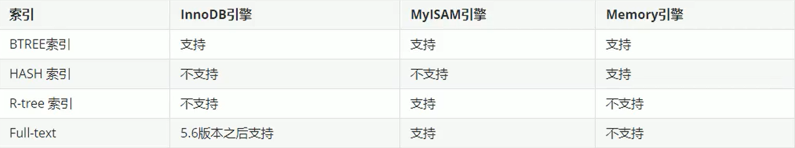

> 单值索引

> 唯一索引

> 多值索引


### BTree

InnoDB引擎使用的默认索引就是B+树

所有的数据存储在叶子结点上,非叶节点仅用来进行索引.

B＋树索引并不能找到一个给定键值的具体行。

B＋树索引能找到的只是被查找数据行所在的页。然后数据库通过把页读入到内存，再在内存中进行查找，最后得到要查找的数据。

B+树的索引一般都在 2~4 层,查找某一键值对的记录只需要2~4次IO,仅需 0.02~0.04 S

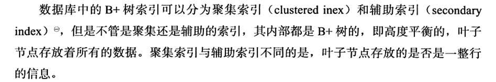

> 聚集索引

聚集索引(clustered index) 就是按照每张表的主键构造一棵B＋树，同时叶子节点中存放的即为整张表的行记录数据，也将聚集索引的叶子节点称为数据页。聚集索引的这个特性决定了索引组织表中数据也是索引的一部分。同B＋树数据结构一样，每个数据页都通过一个双向链表来进行链接。

`通过聚集索引可以直接找到数据`

> 非聚集索引

叶子节点并不包含行记录的全部数据。叶子节点除了包含键值以外， 每个叶子节点中的索引行中还包含了一个书签(bookmark) 。该书签用来告诉InnoDB 存储引擎哪里可以找到与索引相对应的行数据。这个书签实际就是聚集索引的主键

### Hash

InnoDB的hash索引是自适应的,人为无法干预.

### FullText

> 倒排索引

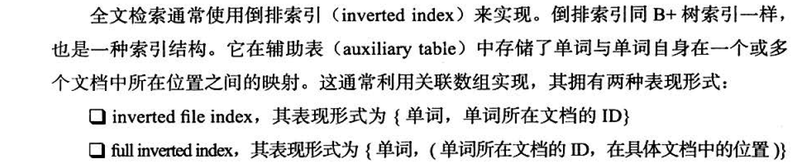

full inverted index 存储的是对(pair) ，即(Documentld, Position) 

`红黑树`

## 引擎概览

### lnnoDB 

​    InnoDB 存储引擎`支持事务`，其设计目标主要面向在线事务处理(OLTP) 的应用。其特点是`行锁设计`、支持外键，

并支持类似于Oracle 的非锁定读，即默认读取操作不会产生锁。

### MylSAM	

`不支持事务`、`表锁`设计，支持全文索引

缓冲池只缓存(cache) 索引文件，而`不缓冲数据文件`

MyISAM 存储引擎表由MYD 和MYI 组成， MYD 用来存放数据文件， MYI 用来存放索引文件。可以通过使用

Myisampack 工具来进一步压缩数据文件，因为myisampack工具使用赫夫曼(Huffman) 编码静态算法来压缩数据，

因此使用myisampack 工具压缩后的表是只读的，当然用户也可以通过myisampack 来解压数据文件。

### NDB

集群存储引擎

连接操作(JOIN) 是在MySQL 数据库层完成的，而不是在存储引擎层完成的。这意味着，复杂的连接操作需要巨大

的网络开销，因此查询速度很慢。

### Memory

表中的数据存放在内存中，如果数据库重启或发生崩溃，表中的数据都将消失。它非常适合存储临时数据的临时

表，以及数据仓库中的纬度表。Memory 存储引擎默认使用哈希索引，而不是我们熟悉的B+树索引。

虽然Memory 存储引擎速度非常快，但在使用上还是有一定的限制。比如，只支持表锁，并发性能较差，并且不支

持TEXT 和BLOB 列类型。最重要的是，存储变长字段(varchar) 时是按照定常字段(char) 的方式进行的，因此会浪费

内存. 

## InnoDB引擎

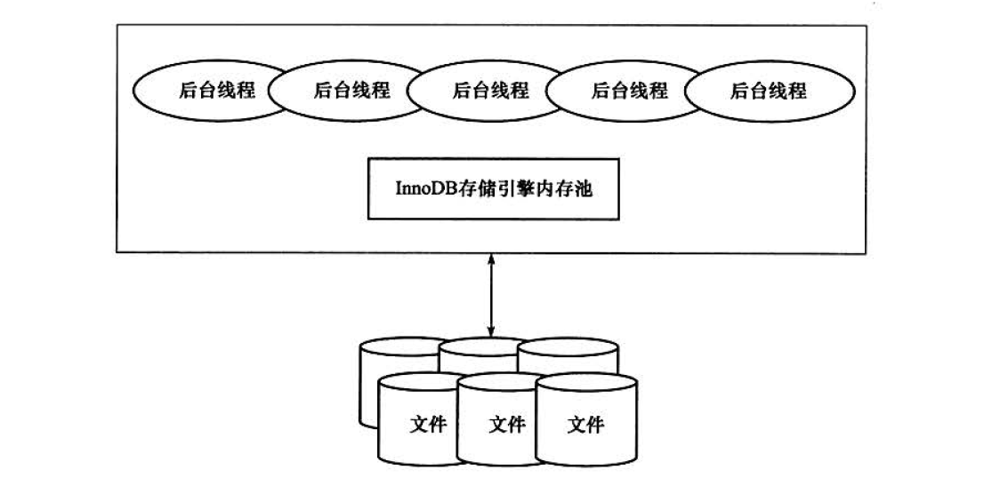

第一个完整支持ACID 事务的MySQL 存储引擎，其特点是`行锁设计`、支持`MVCC` 、支持`外键`、提供一致性非锁定读，同时被设计用来最有效地利用以及使用内存和CPU 。

InnoDB 是以页为单位进行存储的

### 体系架构概览

#### 线程模型

后台维护多个线程,每个线程执行不同的操作.

> Master Thread

Master Thread 是一个非常核心的后台线程，主要负责将缓冲池中的数据异步刷新到磁盘，保证数据的一致性，包括脏页的刷新、合并插入缓冲(INSERT BUFFER) 、UNDO 页的回收等。

> IO Thread

处理IO请求的回调

write 、read 、insert buffer 和log IO thread 。

> Purge Thread

事务被提交后，其所使用的undolog 可能不再需要，因此需要PurgeThread 来回收已经使用并分配的undo 页。

#### 内存

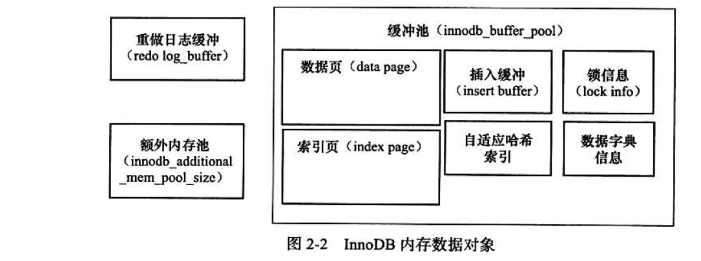

> 缓冲池

缓冲池中缓存的数据页类型有：索引页、数据页、undo 页、插入缓冲( insert buff er)、自适应哈希索引(adaptive hash index) 、InnoDB 存储的锁信息(lockinfo) 、数据字典信息(data dictionary) 等。不能简单地认为，缓冲池只是缓存索引页和数据页，它们只是占缓冲池很大的一部分而已。

缓冲池的写策略需要一个==checkpoint==

缓冲池中页的大小默认为`16KB`

可以有多个缓冲池, 缓冲池是按照 LRU 算法管理的. 但是当新记录插入时,并不是插入到尾部,而是插入到`LRU 列表长度的5/8 处`, 称为 `midpoint insertion strategy`

在InnoDB 存储引擎中，把midpoint 之后的列表称为old 列表，之前的列表称为new 列表。可以简单地理解为new

列表中的页都是最为活跃的热点数据。

`脏页`是cache中写入了但是还未写回磁盘的数据

> 重做日志缓冲

[重做日志]: https://juejin.im/entry/5ba0a254e51d450e735e4a1f

lnnoDB 存储引擎首先将重做日志信息先放入到这个缓冲区，然后按一定频率将其刷新到重做日志文件。重做日志缓冲一般不需要设置得很大，因为一般情况下每一秒钟会将重做日志缓冲刷新到日志文件，因此用户只需要保证每秒产生的事务批在这个缓冲大小之内即可。

> LRU List 、Free List 和Flush List

管理各种页

> 额外的内存池

在InnoDB 存储引擎中，对内存的管理是通过一种称为内存堆的方式进行的。

#### checkPoint

为了避免发生数据丢失的问题，当前事务数据库系统普遍都采用了`Write Ahead Log` 策略，即当事务提交时，先

写重做日志，再修改页。当由于发生宕机而导致数据丢失时，通过重做日志来完成数据的恢复。这也是事务ACID 

中D (Durability 持久性）的要求。


对于lnnoDB 存储引擎而言，是通过`LSN (Log Sequence Number)` 来标记版本的。而LSN 是8 字节的数字，其单位是字节。每个页有LSN, 重做日志中也有LSN,Checkpoint 也有LSN。

> sharp CheckPoint

Sharp Checkpoint 发生在数据库关闭时将所有的脏页都刷新回磁盘，这是默认的工作方式，即参数innodb_fast_ shutdown= 1 。

> Fuzzy Checkpoint

只刷新一部分脏页，而不是刷新所有的脏页回磁盘。

有如下的时机:


对于Master Thread中发生的Checkpoint, 差不多以每秒或每十秒的速度从缓冲池的脏页列表中刷新一定比例的页回磁盘。这个过程是异步的，即此时InnoDB 存储引擎可以进行其他的操作，用户查询线程不会阻塞。


FLUSH_ LRU _LIST Checkpoint 是因为InnoDB 存储引擎需要保证LRU 列表中需要有差不多100 个空闲页可供使用。在InnoDB 1.1.x 版本之前， 需要检查LRU 列表中是否有足够的可用空间操作发生在用户查询线程中，显然这会阻塞用户的查询操作。倘若没有100 个可用空闲页，那么InnoDB 存储引擎会将LRU 列表尾端的页移除。如果这些页中有脏页，那么需要进行Checkpoint, 而这些页是来自LRU 列表的，因此称为FLUSH_LRU LIST Checkpoint 


Dirty Page too much 脏页的数量太多，导致lnnoDB 存储引擎强制进行Checkpoint。其目的总的来说还是为了保证缓冲池中有足够可
用的页。

### master线程

Master Thread 具有最高的线程优先级别。其内部由多个循环(loop) 组成：

主循环(loop) 、后台循环(backgroup loop) 、刷新循环(flush loop) 、暂停循环(suspend loop) 。

Master Thread 会根据数据库运行的状态在四种循环中进行切换。

> 主循环 loop

有两大部分操作－每秒钟的操作和每10 秒的操作。

loop 循环通过thread sleep 来实现，这意味着所谓的每秒一次或每10 秒一次的操作是不精确的。在负载很大的情况下可能会有延迟(delay) ，只能说大概在这个频率下。


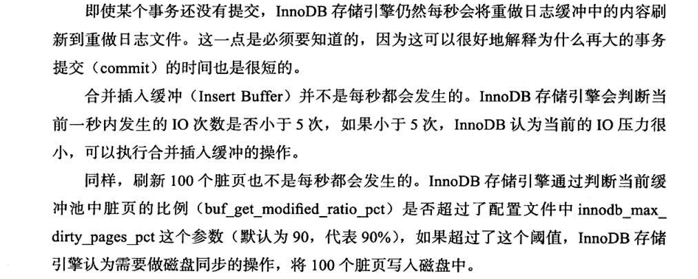


> background loop

若当前没有用户活动（数据库空闲时）或者数据库关闭(shutdown) ，就会切换到这个循环。

- 删除无用的undo页 		总是
- 合并20个插入缓冲        总是
- 跳回主循环                   总是
- 不断刷新100 个页直到符合条件 （可能，跳转到flush loop 中完成）

### 关键特性

#### Insert Buffer

仅适用于非唯一的辅助索引.

Insert Buffer 和数据页一样，也是物理页的一个组成部分。

InnoDB 存储引擎开创性地设计了Insert Buffer, 对于非聚集索引的插入或更新操作，不是每一次直接插入到索引

页中，而是先判断插入的非聚集索引页是否在缓冲池中，若在，则直接插入；若不在，则先放入到一个Insert 

Buffer 对象中，好似欺骗数据库这个非聚集的索引已经插到叶子节点，而实际并没有，只是存放在另一个位置。

然后再以一定的频率和情况进行Insert Buffer 和辅助索引页子节点的merge （合并）操作，这时通常能将多个插

入合并到一个操作中（因为在一个索引页中），这就大大提高了对于非聚集索引插入的性能。

> 内部实现

Insert Buffer 的数据结构是一棵`B＋`树


​		当一个辅助索引要插入到页(space, offset) 时，如果这个页不在缓冲池中，那 存储引擎首先根据上述规则构造一个search key, 接下来查询Insert buffer这棵B＋树，然后再将这条记录插人到Insert Buffer B＋树的叶子节点中。

`每个Insert Buffer Bitmap 页用来追踪16384 个辅助索引页，也就是256 个区(Extent) 。`

#### Change Buffer

可将其视为Insert Buffer 的升级。从这个版本开始， lnnoDB 存储引擎可以对DML 操作—-INSERT 、DELETE 、UPDATE都进行缓冲，他们分别是： Insert Buffer 、Delete Buffer 、Purge buffer 。

#### Merge Insert Buffer


#### double write

总体来说，double write buffer就是一种缓冲缓存技术，主要的目的就是为了防止数据在系统断电，异常crash情况下丢失数据。 里面有几个点需要注意的就是，数据在buffer pool中修改后成了脏页，这个过程会产生Binglog记录和redo记录，当然缓存数据写入数据文件是一个异步的工作。


doublewrite 由两部分组成， 一部分是内存中的doublewrite buffer, 大小为2MB, 另一部分是物理磁盘上共享表

空间中连续的128 个页，即2 个区(extent) ，大小同样为2MB。在对缓冲池的脏页进行刷新时，并不直接写磁

盘，而是会通过memcpy 函数将脏页先复制到内存中的doublewrite buffer, 之后通过doublewrite buffer 再分两

次，每次1MB 顺序地写入共享表空间的物理磁盘上，然后马上调用fsync 函数，同步磁盘，避免缓冲写带来的

问题。 doubleWriter空间是连续的,因此写入速度很快.

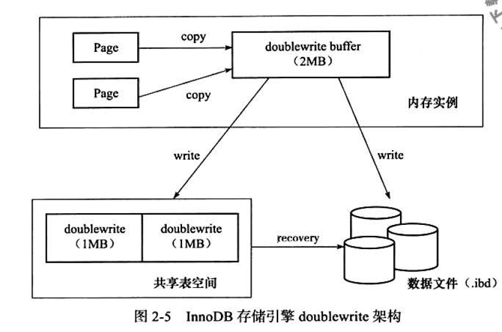

#### 自适应哈希索引

​	InnoDB 存储引擎会监控对表上各索引页的查询。如果观察到建立哈希索引可以带来速度提升，则建立哈希索引，称之为自适应哈希索引(Adaptive Hash Index, AHi) 。

​	AHI 是通过缓冲池的B＋树页构造而来，因此建立的速度很快，而且不需要对整张表构建哈希索引。InnoDB 存储引擎会自动根据访问的频率和模式来自动地为某些热点页建立哈希索引。


AHI的要求

- 对这个页的连续访问模式必须是一样的


#### 异步IO

与AIO 对应的是Sync 10, 即每进行一次IO 操作，需要等待此次操作结束才能继续接下来的操作。但是如果用户发出的是一条索引扫描的查询，那么这条SQL 查询语句可能需要扫描多个索引页，也就是需要进行多次的IO 操作。在每扫描一个页并等待其完成后再进行下一次的扫描，这是没有必要的。用户可以在发出一个IO 请求后立即再发出另一个IO 请求，当全部IO 请求发送完毕后，等待所有IO 操作的完成，这就是AIO 。

AIO 的另一个优势是可以进行IO Merge 操作，也就是将多个IO 合并为1 个IO, 这样可以提高IOPS 的性能。

#### 刷新邻接页

当刷新一个脏页时， InnoDB 存储引擎会检测该页所在区(extent) 的所有页，如果是脏页，那么一起进行刷新。这样做的好处显而易见，通过AIO 可以将多个IO 写入操作合并为一个IO 操作，故该工作机制在传统机械磁盘下有着显著的优势。

## 文件

#### 日志

> 错误日志

> 慢查询日志

> 查询日志

> 二进制日志

#### InnoDB

lnnoDB 采用将存储的数据按表空间(tablespace) 进行存放的设计。在默认配置下会有一个初始大小为10MB, 名为ibdatal 的文件。该文件就是默认的表空间文件(tablespace file) ，

## 表

### 索引组织表

在lnnoDB 存储引擎中，表都是根据主键顺序组织存放的，这种存储方式的表称为索引组织表(index organized table) 。在InnoDB 存储引擎表中，每张表都有个主键(Primary Key ). 主键的选取原则如下:


### 逻辑存储结构

表空间 -> 段 -> 区 -> 页 -> 行


> 表空间

表空间可以看做是InnoDB 存储引擎逻辑结构的最高层，所有的数据都存放在表空间中。

> 段

常见的段有数据段、索引段、回滚段等。

InnoDB 存储引擎表是索引组织的(index organized) ，因此`数据即索引`，索引即数据。那么`数据段`即为B＋树的`叶子节点 `, 索引段即为B＋树的非索引节点 , 即非叶子节点。

> 区

区是由连续页组成的空间，在任何情况下`每个区的大小都为1MB` 。

为了保证区中页的连续性， InnoDB 存储引擎一次从磁盘申请4~5 个区。在默认情况下， InnoDB 存储
引擎页的大小为16KB, 即`一个区中一共有64 个连续的页`。

> 页(块)

页是lnnoDB磁盘管理的最小单位。在InnoDB 存储引擎中，`默认每个页的大小为16KB`。

InnoDB 存储引擎是面向列的(row-oriented) ，也就说数据是按行进行存放的。每个页存放的行记录也是有硬性定义的，最多允许存放16KB / 2 -200 行的记录，即`7992 `行记录。

### 行记录格式

InnoDB 存储引擎提供了`Compact` 和`Redundant` 两种格式来存放行记录数据

> compact


​		变长字段列表是按照列的顺序逆序放置的, 如果某个变长字段的长度小于255字节,用一字节表示 ,大于255 ,置为 用2字节表示. 最大不超过 2 字节 , 因为 varchar 最大为 65535 = 2**16 -1

​		null 标志位表示当前记录是否包含 null 值 , 用 0/1 表示. 占`1字节`大小

​		记录头固定占用 `5字节`


> Redundant 

MySQL 5.0 之前使用


> 行溢出数据

InnoDB 存储引擎可以将一条记录中的`某些数据存储在真正的数据页面之外`。一般认为BLOB 、LOB 这类的`大对象列类型`的存储会把数据存放在数据页面之外。但是，这个理解有点偏差， BLOB 可以不将数据放在溢出页面，而且即便是VARCHAR 列数据类型，依然有可能被存放为行溢出数据。

当发生行溢出时，数据存放在页类型为`Uncompress BLOB `页中。

前 768字节的数据存储在InnoDB行中

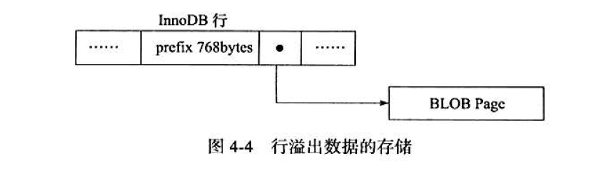

> Compressed 和Dynamic 


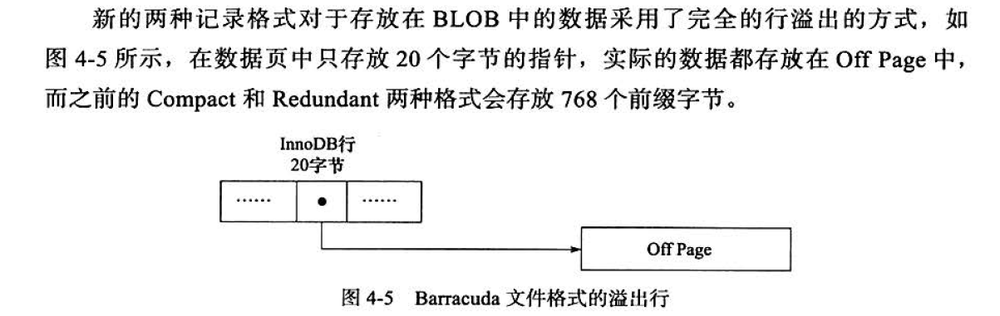

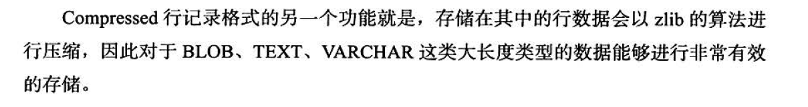

> char的存储

通常认为 char 存储的是定长的数据. 但是 char(N) 中的 N 代表是字符个数,不同的字符集会对应不同的字节, 导致底层存储的并不是定长的数据.

因此，对于多字节字符编码的CHAR 数据类型的存储， lnnoDB 存储引擎在内部`将其视为变长字符类型`。这也就意味着在变长长度列表中会记录CHAR数据类型的长度。

因此可以认为在多字节字符集的情况下， CHAR 和VARCHAR 的实际行存储基本是没有区别的。

### 数据页结构

页是InnoDB 存储引擎管理数据库的最小磁盘单位。页类型为 B-tree Node 的页存放的即是表中行的实际数据

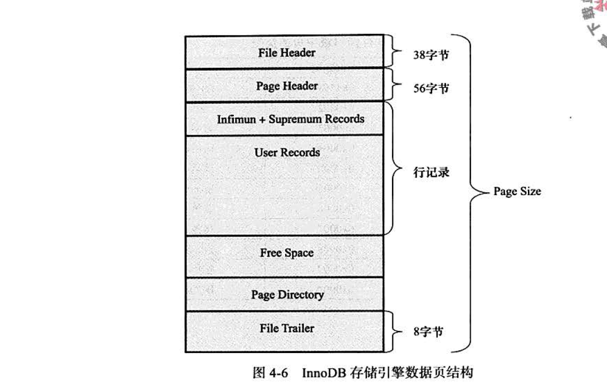

> File Header

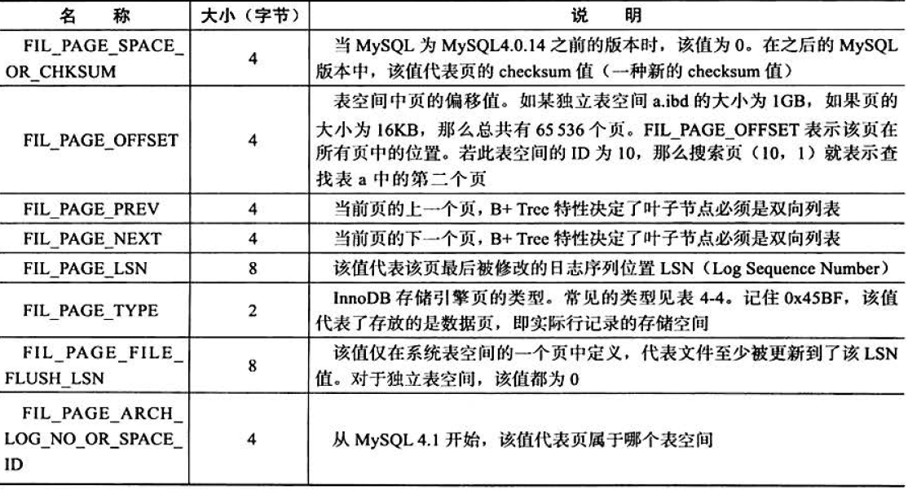

页类型 :

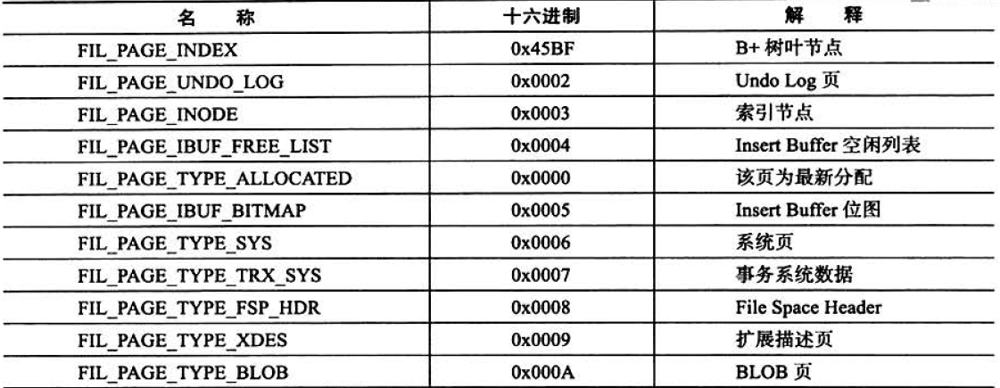

> Page Header


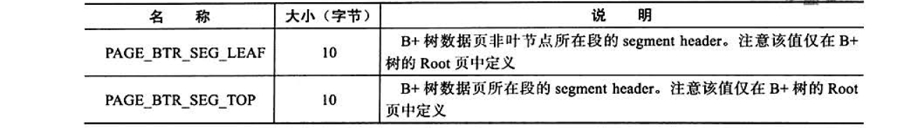

> lnfimum 和Supremum Record


	>User Record 和Free Space

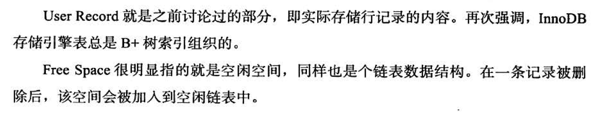

> Page Directory

Page Directory （页目录）中存放了记录的相对位置（注意，这里存放的是页相对位置，而不是偏移量）

在lnnoDB 中并不是每个记录拥有一个槽， InnoDB存储引擎的槽是一个稀疏目录(sparse directory), 即一个槽中

可能包含多个记录。

需要牢记的是， `B＋树索引本身并不能找到具体的一条记录，能找到只是该记录所在的页`。数据库把页载入到

内存，然后通过Page Directory 再进行二叉查找。只不过二叉查找的时间复杂度很低，同时在内存中的查找很

快，因此通常忽略这部分查找所用的时间。

> File Trailer

为了检测页是否已经完整地写入磁盘（如可能发生的写人过程中磁盘损坏、机器关机等）， lnnoDB 存储引擎的页中设置了File Trailer 部分。

### 视图

在MySQL 数据库中，视图(View) 是一个命名的虚表，它由一个SQL 查询来定义，可以当做表使用。与持久表(permanent table) 不同的是，视图中的数据没有实际的物理存储。

### 分区表

分区的过程是将一个表或索引分解为多个更小、更可管理的部分。就访间数据库的应用而言，从逻辑上讲，只有一个表或一个索引，但是在物理上这个表或索引可能由数十个物理分区组成。每个分区都是独立的对象，可以独自处理，也可以作为—个更大对象的一部分进行处理。

MySQL 数据库支持的分区类型为水平分区, 并不支持垂直分区. 此外， MySQL数据库的分区是局部分区索引， 一个分区中既存放了数据又存放了索引。

## 锁

锁是数据库系统区别于文件系统的一个关键特性。锁机制用于管理对共享资源的并发访问. 是==共享资源==,不仅仅局限于行记录.

> latch

latch 一般称为闩锁（轻量级的锁），因为其要求==锁定的时间必须非常短==。若持续的时间长，则应用的性能会非常差。在InnoDB 存储引擎中， latch 又可以分为 `mutex `（互斥量）和 `rwlock `（读写锁）。其目的是用来保证并发线程操作临界资源的正确性，并且通常没有死锁检测的机制。

> lock

lock 的对象是事务,用来锁定的是数据库中的对象，如表、页、行。 

在事务 commit 或者 rollback 之后释放, 存在死锁机制.

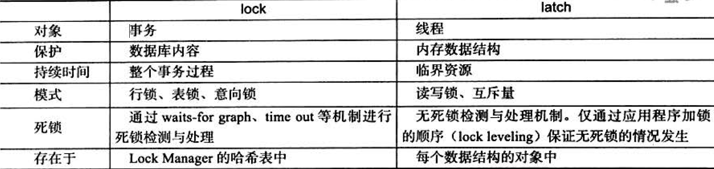

### InnoDB中的锁

InnoDB 实现了两种标准的 `行级锁`: 

==共享锁== 允许事务读取一行数据, 共享锁是没有排他性的

==排它锁== 允许事务删除或者更新一行数据

InnoDB 同时支持 `意向锁` : 面向表的锁

#### 一致性非锁定读

默认的读取方式

​	在读取一行数据的时候,如果发现当前的行被 ==排他锁==占用,不会等待锁释放,会直接去读取行的一个快照数据.

`多版本控制`

 		快照数据是指该行的之前版本的数据，该实现是通过undo 段来完成。而undo用来在事务中回滚数据，因此快照数据本身是没有额外的开销。此外，读取快照数据是不需要上锁的，因为没有事务需要对历史的数据进行修改操作。

​	在事务隔离级别 ==READ COMMITTED== 和 ==REPEATABLE READ==  (InnoDB 存储引擎的默认事务隔离级别）下， InnoDB 存储引擎使用非锁定的一致性读。

#### 一致性锁定读

在读取时使用特殊的 sql 可以使用这种模式 :

> SELECT…FOR UPDATE  在行上加 ==排它锁==

> SELECT…LOCK IN SHARE MODE 在行上加 ==共享锁==

注意 :  只能在事务中使用这种锁

#### 自增长与锁

在InnoDB 存储引擎的内存结构中，对每个含有自增长值的表都有一个自增长计数器(auto-increment counter) 

当对含有自增长的计数器的表进行插人操作时，这个计数器会被初始化，执行如下的语句来得到计数器的值：
``` SELECT MAX(aut o_ inc_col) FROM t FOR UPDATE;```

`AUTO-INC Locking` 立即释放,但是并发性能仍然很差.

#### 外键与锁

对于一个外键列，如果没有显式地对这个列加索引， lnnoDB 存储引擎自动对其加一个索引，因为这样可以避免表锁

### 锁算法

#### Record Lock

单个行记录的锁

Record Lock 总是会去`锁住索引记录`，如果lnnoDB 存储引擎表在建立的时候没有设置任何一个索引，那么这时InnoDB 存储引擎会使用隐式的主键来进行锁定。

#### Gap Lock

锁定一个范围,但不包含记录本身

#### Next Key Lock

锁定一个范围,包含记录本身

#### phantom problem

指在同一事务下，连续执行两次同样的SQL 语句可能导致不同的结果，第二次的SQL 语句可能会返回之前不存在的行。

lnnoDB 存储引擎采用Next-Key Locking 的算法避免Phantom Problem 。

### 锁问题

#### 脏读

脏数据是指事务对缓冲池中行记录的修改，并且还没有被提交(commit) 。

读到了脏数据，即一个事务可以读到另外一个事务中未提交的数据，则显然违反了数据库的隔离性。

> 脏读在生产环境中并不经常发生

只有在事务隔离级别为 `READ UNCOMMITTED` 时,才会发生脏读.

#### 不可重复读(phantom)

不可重复读是指在一个事务内多次读取同一数据集合。在这个事务还没有结束时，另外一个事务也访问该同一数据集合，并做了一些DML 操作。因此，在第一个事务中的两次读数据之间，由于第二个事务的修改，那么第一个==事务两次读到的数据可能是不一样的==。这样就发生了在一个事务内两次读到的数据是不一样的情况，这种情况称为不可重复读。

> 不可重复读是可以接受的

在  `READ COMMITTED` 时会发生不可重复读

#### 丢失更新

一个事务的更新操作会被另一个事务覆盖

> 当前的任何隔离级别都不会发生丢失更新问题

在生产中, `丢失`是真正的丢失, 即更新的操作未执行, 由此会导致丢失更新问题.

### 阻塞

在有些时刻一个事务中的锁需要等待另一个事务中的锁释放它所占用的资源，这就是阻塞。阻塞并不是一件坏事，其是为了确保事务可以并发且正常地运行。

### 死锁

#### 解决方案

==等待图==

==超时回滚==

### 锁升级

将当前锁的力度降低, 例如将行锁升级为列锁

InnoDB 是根据事务访问的每个页,采用 `位图`的方式对锁进行管理,因此开销低且不随规模增长.

## 事务

### ACID原则

> 原子性 A

> 一致性 C

一致性指事务将数据库从一种状态转变为下一种一致的状态。在事务开始之前和事务结束以后，数据库的完整性约束没有被破坏。

> 隔离性 I

> 持久性 D

### 扁平事务

在扁平事务中，所有操作都处于同一层次，其由BEGIN WORK 开始， 由COMMIT WORK 或ROLLBACK WORK 结束，其间的操作是原子的，要么都执行，要么都回滚。

### 带保存点的扁平事务

### 链事务

### 嵌套事务

### 分布式事务

### 事务的实现

注意, undo 与 redo 并==不是逆过程==

#### Redo

 物理日志 记录的是页的物理修改操作

​		InnoDB 是事务的存储引擎，其通过Force Log at Commit 机制实现事务的持久性，即当事务提交(COMMIT) 时，必须`先将该事务的所有日志写入到重做日志文件`进行持久化，待事务的COMMIT 操作完成才算完成。

​	重做日志分为两部分: redo log 和 undo log.

​	redo log 主要负责持久性 , undo log 负责事务回滚和MVCC

​	每次将重做日志缓冲写人重做日志文件后， InnoDB 存储引擎都需要调用一次fsync 操作,将内存中的文件写入磁盘中,同时也可以修改设置,在一定时间之后再讲文件写回磁盘. 这样会破坏一定的持久性,但是能提高效率.

> redo log buffer

易失的 `重做日志缓存` , 保存在内存中

> redo log file

非易失的, 文件的形式保存

#### Undo

是逻辑日志 SQL语句

#### purge

在 delete 和 update 操作时,可能只会执行逻辑操作,真正的操作要等待没有任何锁定时在purge中执行.

​	purge 用千最终完成delete 和update 操作。这样设计是因为InnoDB 存储引擎支持MVCC, 所以记录不能在事务提交时立即进行处理。这时其他事物可能正在引用这行，故InnoDB 存储引擎需要保存记录之前的版本。而是否可以删除该条记录通过purge 来进行判断。若该行记录已不被任何其他事务引用，那么就可以进行真正的delete 操作。可见， purge 操作是清理之前的delete 和update 操作，将上述操作“最终“完成。而实际执行的操作为delete 操作，清理之前行记录的版本。

#### group commit

### 事务隔离级别

隔离级别越低,则事务请求锁的数量和持有锁的时间久越少.

#### READ UNCOMMITTED

#### READ COMMITTED

#### REPEATABLE READ

默认的事务隔离级别

没有幻读的问题

#### SERIALIZABLE