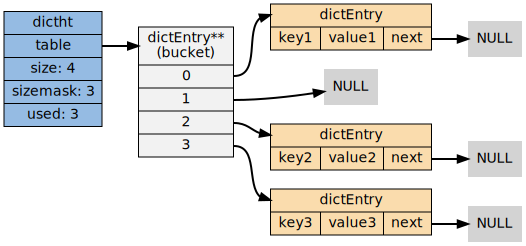
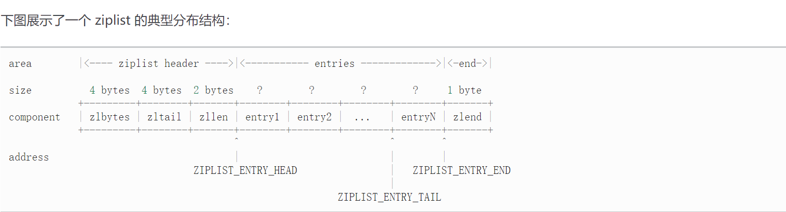
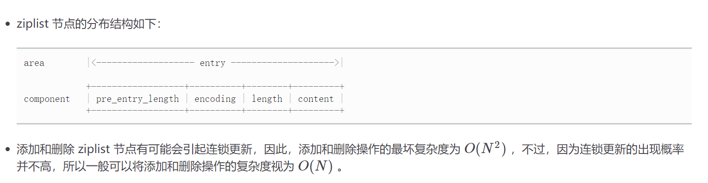
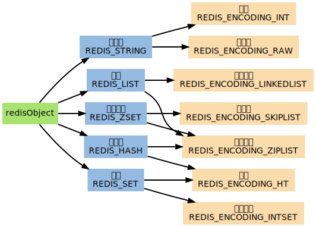
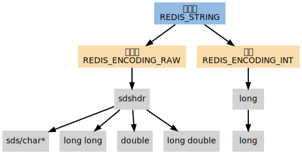
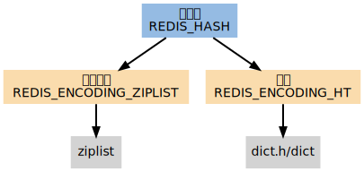
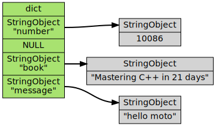
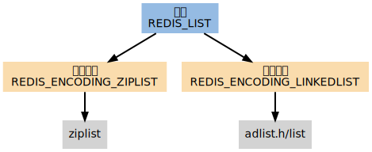
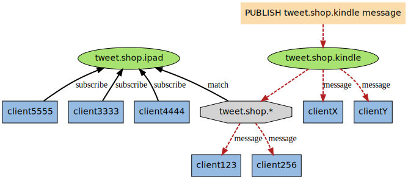
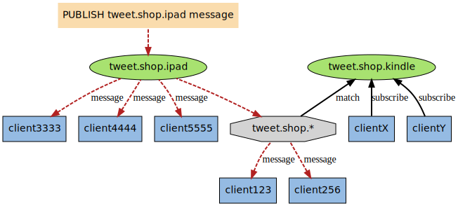

# Redis

## 数据结构

### SDS

SDS 的全程是**简单动态字符串**,是在C字符串上扩展而来的数据结构.

```C
struct SDS{
    int len;
    int free;
    char buffer[];
}
```

len 字段的加入,使得Redis能以常数时间获得字符串的长度信息

> 空间预分配

如果 len < 1MB

- 容量翻倍

否则

- 分配 1MB

> 惰性空间释放

释放空间时不是直接删除,而是增加 free 字段

> 二进制安全

​	SDS 的数组是用char实现的字节数组,但是并不是字符串数组,因为数组的使用长度是按照len字段来进行标识的,因此是二进制安全的,可以存储任意的二进制数据.

​	但同时,SDS也保存了 “\0”这样的C语言表示,因此可以使用C的函数

### 链表

```C++
struct list{
    list * pre;
    list * next;
    void * value;
}
```

显然这是一个双向列表,Redis的链表是许多数据类型的基础.

- 列表
- 发布订阅
- 慢查询
- 监视器
- …

### 字典

```C++
struct entry {
    void *key;
    union {
        void *value;
        uint64_t;
        int64_t;
    };
    entry *next;
};
```

```C++
struct dictht {
    entry **table;
    unsigned long size;
    unsigned long sizemask;
    unsigned long used;
};
```

字典可以理解为显示中的字典,其中包含两个ht

字典是数据库的底层实现




> hash算法

MurmurHash算法, 即使输入有序散列也是无序的

使用链地址法处理冲突,每个entry都有next节点

> Rehash

扩展时, ht[1] 的大小为 ht[0].used*2 的 2^n 幂, 即 **大于used\*2的那个2的幂次**,类似于 Java hashmap 的实现.

收缩时, ht[1] 的大小为 ht[0].used 的 2^n 幂,	即 **大于used的那个2的幂次**,类似于 Java hashmap 的实现.

Redis 采用的是 **渐进式Rehash**

> 扩容的时机

- 服务器==没有执行== BGSAVE 命令 或者 BGWRITEAOF 并且哈希表的负载因子 >=1
- 服务器==正在执行== BGSAVE 命令 或者 BGWRITEAOF 并且哈希表的负载因子 >=5
- 负载因子 = used/size

这两个策略可以在执行非常规任务时提高hash表的容量,减少rehash的次数

> 收缩的时机

负载因子 < 0.1

> 渐进式Rehash

1. 为ht[1] 分配空间
2. 维持 rehashIndex 索引,设置为 0
3. 每次对字典进行正常的CRUD时,对当前rehashIndex处的所有键值对进行rehash
4. rehashIndex为 -1 表示rehash 完成

- 在rehash,所有新的键值对都会被存储在 ht[1]上
- 查询时,需要查询两个ht

### 跳表


- 有序的数据结构
- 每个节点维持多个指向其他节点的指针

- 跳跃表在 Redis 的唯一作用， 就是实现有序集数据类型

- 跳跃表是一种随机化数据结构，查找、添加、删除操作都可以在对数期望时间下完成。
- 跳跃表目前在 Redis 的唯一作用，就是作为有序集类型的底层数据结构。
- 为了满足自身的需求，Redis 基于 William Pugh 论文中描述的跳跃表进行了修改，包括：
  1. `score` 值可重复。
  2. 对比一个元素需要同时检查它的 `score` 和 `memeber` 。
  3. 每个节点带有高度为 1 层的后退指针，用于从表尾方向向表头方向迭代。

### 整数集合

保存整数的抽象数据结构

当集合仅包含整数时Redis会使用整数集合保存数据

```C++
struct intset{
    uint32_t encoding;
    
    uint32_t length;
    // 虽然声明为 uint32,但是实际保存的是按照 encoding 的值来的
    int8_t contents[];
};
```

> 升级

不是扩容,是新的数据的长度大于原来集合的所有长度,需要进行位数的扩展

- 提升灵活性
- 节约内存
- 不支持降级

### 压缩列表

列表键和哈希键的底层实现之一,当列表键仅包含少量的项且每个项要么是==小整数==要么是==短字符串==才使用

**压缩列表的内存空间是连续的**





## 对象处理机制

Redis 必须让每个键都带有类型信息， 使得程序可以检查键的类型， 并为它选择合适的处理方式。

Redis 的每一种数据类型，比如字符串、列表、有序集， 它们都拥有不只一种底层实现（Redis 内部称之为编码，encoding）， 这说明， 每当对某种数据类型的键进行操作时， 程序都必须根据键所采取的编码， 进行不同的操作。

为了解决以上问题， Redis 构建了自己的类型系统， 这个系统的主要功能包括：

- `redisObject` 对象。
- 基于 `redisObject` 对象的类型检查。
- 基于 `redisObject` 对象的显式多态函数。
- 对 `redisObject` 进行分配、共享和销毁的机制。

### 对象结构

```C
/*
 * Redis 对象
 */
typedef struct redisObject {

    // 类型
    unsigned type:4;

    // 对齐位
    unsigned notused:2;

    // 编码方式
    unsigned encoding:4;

    // LRU 时间（相对于 server.lruclock）
    unsigned lru:22;

    // 引用计数
    int refcount;

    // 指向对象的值
    void *ptr;

} robj;
```

> 对象类型

```C
/*
 * 对象类型
 */
#define REDIS_STRING 0  // 字符串
#define REDIS_LIST 1    // 列表
#define REDIS_SET 2     // 集合
#define REDIS_ZSET 3    // 有序集
#define REDIS_HASH 4    // 哈希表
```

> encoding

```C
/*
 * 对象编码
 */
#define REDIS_ENCODING_RAW 0            // 编码为字符串
#define REDIS_ENCODING_INT 1            // 编码为整数
#define REDIS_ENCODING_HT 2             // 编码为哈希表
#define REDIS_ENCODING_ZIPMAP 3         // 编码为 zipmap
#define REDIS_ENCODING_LINKEDLIST 4     // 编码为双端链表
#define REDIS_ENCODING_ZIPLIST 5        // 编码为压缩列表
#define REDIS_ENCODING_INTSET 6         // 编码为整数集合
#define REDIS_ENCODING_SKIPLIST 7       // 编码为跳跃表
```



### 对象共享

有一些对象在 Redis 中非常常见， 比如命令的返回值 `OK` 、 `ERROR` 、 `WRONGTYPE` 等字符， 另外，一些小范围的整数，比如个位、十位、百位的整数都非常常见。

为了利用这种常见情况， Redis 在内部使用了一个 [Flyweight 模式](http://en.wikipedia.org/wiki/Flyweight_pattern) ： 通过预分配一些常见的值对象， 并在多个数据结构之间共享这些对象， 程序避免了重复分配的麻烦， 也节约了一些 CPU 时间。

Redis 预分配的值对象有如下这些：

- 各种命令的返回值，比如执行成功时返回的 `OK` ，执行错误时返回的 `ERROR` ，类型错误时返回的 `WRONGTYPE` 命令入队事务时返回的 `QUEUED` ，等等。
- 包括 `0` 在内，小于 `redis.h/REDIS_SHARED_INTEGERS` 的所有整数（`REDIS_SHARED_INTEGERS` 的默认值为 `10000`）

### 引用计数以及对象的销毁

 Redis 的对象系统使用了[引用计数](http://en.wikipedia.org/wiki/Reference_counting)技术来负责维持和销毁对象， 它的运作机制如下：

- 每个 `redisObject` 结构都带有一个 `refcount` 属性，指示这个对象被引用了多少次。
- 当新创建一个对象时，它的 `refcount` 属性被设置为 `1` 。
- 当对一个对象进行共享时，Redis 将这个对象的 `refcount` 增一。
- 当使用完一个对象之后，或者取消对共享对象的引用之后，程序将对象的 `refcount` 减一。
- 当对象的 `refcount` 降至 `0` 时，这个 `redisObject` 结构，以及它所引用的数据结构的内存，都会被释放。

**Redis会产生循环引用吗?**

### 字符串

字符串类型分别使用 `REDIS_ENCODING_INT` 和 `REDIS_ENCODING_RAW` 两种编码：

- `REDIS_ENCODING_INT` 使用 `long` 类型来保存 `long` 类型值。
- `REDIS_ENCODING_RAW` 则使用 `sdshdr` 结构来保存 `sds` 、 `long long` 、 `double` 和 `long double` 类型值。

换句话来说， 在 Redis 中， 只有能表示为 `long` 类型的值， 才会以整数的形式保存， 其他类型的整数、小数和字符串， 都是用 `sdshdr` 结构来保存。



### 哈希表

`REDIS_HASH` （哈希表）是 [HSET](http://redis.readthedocs.org/en/latest/hash/hset.html#hset) 、 [HLEN](http://redis.readthedocs.org/en/latest/hash/hlen.html#hlen) 等命令的操作对象， 它使用 `REDIS_ENCODING_ZIPLIST` 和 `REDIS_ENCODING_HT` 两种编码方式：



> dict

当哈希表使用字典编码时， 程序将哈希表的键（key）保存为字典的键， 将哈希表的值（value）保存为字典的值。

哈希表所使用的字典的键和值都是字符串对象。

下图展示了一个包含三个键值对的哈希表：



> ziplist

当使用 `REDIS_ENCODING_ZIPLIST` 编码哈希表时， 程序通过将键和值一同推入压缩列表， 从而形成保存哈希表所需的键-值对结构：

```reStructuredText
+---------+------+------+------+------+------+------+------+------+---------+
| ZIPLIST |      |      |      |      |      |      |      |      | ZIPLIST |
| ENTRY   | key1 | val1 | key2 | val2 | ...  | ...  | keyN | valN | ENTRY   |
| HEAD    |      |      |      |      |      |      |      |      | END     |
+---------+------+------+------+------+------+------+------+------+---------+
```

新添加的 key-value 对会被添加到压缩列表的表尾。

当进行查找/删除或更新操作时，程序先定位到键的位置，然后再通过对键的位置来定位值的位置。

### 列表

​	`REDIS_LIST` （列表）是 [LPUSH](http://redis.readthedocs.org/en/latest/list/lpush.html#lpush) 、 [LRANGE](http://redis.readthedocs.org/en/latest/list/lrange.html#lrange) 等命令的操作对象， 它使用 `REDIS_ENCODING_ZIPLIST` 和 `REDIS_ENCODING_LINKEDLIST` 这两种方式编码：



> 阻塞

[BLPOP](http://redis.readthedocs.org/en/latest/list/blpop.html#blpop) 、 [BRPOP](http://redis.readthedocs.org/en/latest/list/brpop.html#brpop) 和 [BRPOPLPUSH](http://redis.readthedocs.org/en/latest/list/brpoplpush.html#brpoplpush) 三个命令都可能造成客户端被阻塞， 以下将这些命令统称为列表的阻塞原语。

阻塞原语并不是一定会造成客户端阻塞：

- 只有当这些命令被用于空列表时， 它们才会阻塞客户端。
- 如果被处理的列表不为空的话， 它们就执行无阻塞版本的 [LPOP](http://redis.readthedocs.org/en/latest/list/lpop.html#lpop) 、 [RPOP](http://redis.readthedocs.org/en/latest/list/rpop.html#rpop) 或 [RPOPLPUSH](http://redis.readthedocs.org/en/latest/list/rpoplpush.html#rpoplpush) 命令。

当一个阻塞原语的处理目标为空键时， 执行该阻塞原语的客户端就会被阻塞。

阻塞一个客户端需要执行以下步骤：

1. 将客户端的状态设为“正在阻塞”，并记录阻塞这个客户端的各个键，以及阻塞的最长时限（timeout）等数据。
2. 将客户端的信息记录到 `server.db[i]->blocking_keys` 中（其中 `i` 为客户端所使用的数据库号码）。
3. 继续维持客户端和服务器之间的网络连接，但不再向客户端传送任何信息，造成客户端阻塞。

步骤 2 是将来解除阻塞的关键， `server.db[i]->blocking_keys` 是一个字典， 字典的键是那些造成客户端阻塞的键， 而字典的值是一个链表， 链表里保存了所有因为这个键而被阻塞的客户端 （被同一个键所阻塞的客户端可能不止一个）：

![digraph db_blocking_keys {      rankdir = LR;      node [shape = record, style = filled];      edge [style = bold];      // keys      blocking_keys [label = "blocking_keys |<key1> key1 |<key2> key2 |<key3> key3 | ... |<keyN> keyN", fillcolor = "#A8E270"];      // clients blocking for key1     client1 [label = "client1", fillcolor = "#95BBE3"];     client5 [label = "client5", fillcolor = "#95BBE3"];     client2 [label = "client2", fillcolor = "#95BBE3"];     null_1 [label = "NULL", shape=plaintext];          blocking_keys:key1 -> client2;     client2 -> client5;     client5 -> client1;     client1 -> null_1;      // clients blocking for key2     client7 [label = "client7", fillcolor = "#95BBE3"];     null_2 [label = "NULL", shape=plaintext];      blocking_keys:key2 -> client7;     client7 -> null_2;      // key3      client3 [label = "client3", fillcolor = "#95BBE3"];     client4 [label = "client4", fillcolor = "#95BBE3"];     client6 [label = "client6", fillcolor = "#95BBE3"];     null_3 [label = "NULL", shape=plaintext];      blocking_keys:key3 -> client3;     client3 -> client4;     client4 -> client6;     client6 -> null_3; }](Redis.assets/graphviz-72233dd6a912518ff6874fdad4e20356091a6063.svg)

在上图展示的 `blocking_keys` 例子中， `client2` 、 `client5` 和 `client1` 三个客户端就正被 `key1` 阻塞， 而其他几个客户端也正在被别的两个 key 阻塞。

当客户端被阻塞之后，脱离阻塞状态有以下三种方法：

1. 被动脱离：有其他客户端为造成阻塞的键推入了新元素。
2. 主动脱离：到达执行阻塞原语时设定的最大阻塞时间。
3. 强制脱离：客户端强制终止和服务器的连接，或者服务器停机。

> 先阻塞先服务

当程序添加一个新的被阻塞客户端到 `server.blocking_keys` 字典的链表中时， 它将该客户端放在链表的最后， 而当 `handleClientsBlockedOnLists` 取消客户端的阻塞时， 它从链表的最前面开始取消阻塞： 这个链表形成了一个 FIFO 队列， 最先被阻塞的客户端总是最先脱离阻塞状态， Redis 文档称这种模式为先阻塞先服务（FBFS，first-block-first-serve）。

举个例子，在下图所示的阻塞状况中， 如果客户端对数据库执行 `PUSH key3 value` ， 那么只有 `client3` 会被取消阻塞， `client6` 和 `client4` 仍然阻塞； 如果客户端对数据库执行 `PUSH key3 value1 value2` ， 那么 `client3` 和 `client4` 的阻塞都会被取消， 而客户端 `client6` 依然处于阻塞状态：

![digraph db_blocking_keys {      rankdir = LR;      node [shape = record, style = filled];      edge [style = bold];      // keys      blocking_keys [label = "blocking_keys |<key1> key1 |<key2> key2 |<key3> key3 | ... |<keyN> keyN", fillcolor = "#A8E270"];      // clients blocking for key1     client1 [label = "client1", fillcolor = "#95BBE3"];     client5 [label = "client5", fillcolor = "#95BBE3"];     client2 [label = "client2", fillcolor = "#95BBE3"];     null_1 [label = "NULL", shape=plaintext];          blocking_keys:key1 -> client2;     client2 -> client5;     client5 -> client1;     client1 -> null_1;      // clients blocking for key2     client7 [label = "client7", fillcolor = "#95BBE3"];     null_2 [label = "NULL", shape=plaintext];      blocking_keys:key2 -> client7;     client7 -> null_2;      // key3      client3 [label = "client3", fillcolor = "#95BBE3"];     client4 [label = "client4", fillcolor = "#95BBE3"];     client6 [label = "client6", fillcolor = "#95BBE3"];     null_3 [label = "NULL", shape=plaintext];      blocking_keys:key3 -> client3;     client3 -> client4;     client4 -> client6;     client6 -> null_3; }](Redis.assets/graphviz-72233dd6a912518ff6874fdad4e20356091a6063.svg)

### 集合

`REDIS_SET` （集合）是 [SADD](http://redis.readthedocs.org/en/latest/set/sadd.html#sadd) 、 [SRANDMEMBER](http://redis.readthedocs.org/en/latest/set/srandmember.html#srandmember) 等命令的操作对象， 它使用 `REDIS_ENCODING_INTSET` 和 `REDIS_ENCODING_HT` 两种方式编码：

![digraph redis_set {          node [shape=plaintext, style = filled];      edge [style = bold];      // type      REDIS_SET [label="集合\nREDIS_SET", fillcolor = "#95BBE3"];      // encoding      REDIS_ENCODING_INTSET [label="intset\nREDIS_ENCODING_INTSET", fillcolor = "#FADCAD"];     REDIS_ENCODING_HT [label="字典\nREDIS_ENCODING_HT", fillcolor = "#FADCAD"];      // edge      REDIS_SET -> REDIS_ENCODING_INTSET;     REDIS_SET -> REDIS_ENCODING_HT;      // datastruct 1      intset [label="intset.h/intset"];      REDIS_ENCODING_INTSET -> intset;      // datastruct 2      dict [label="dict.h/dict"];          REDIS_ENCODING_HT -> dict; }](Redis.assets/graphviz-2f54a5b62b3507f0e6d579358e426c78b0dfbd5c.svg)

### 有序集

`REDIS_ZSET` （有序集）是 [ZADD](http://redis.readthedocs.org/en/latest/sorted_set/zadd.html#zadd) 、 [ZCOUNT](http://redis.readthedocs.org/en/latest/sorted_set/zcount.html#zcount) 等命令的操作对象， 它使用 `REDIS_ENCODING_ZIPLIST` 和 `REDIS_ENCODING_SKIPLIST` 两种方式编码：

![digraph redis_zset {          node [shape=plaintext, style = filled];      edge [style = bold];      // type      REDIS_ZSET [label="有序集合\nREDIS_ZSET", fillcolor = "#95BBE3"];      // encoding      REDIS_ENCODING_ZIPLIST [label="ziplist\nREDIS_ENCODING_ZIPLIST", fillcolor = "#FADCAD"];     REDIS_ENCODING_SKIPLIST [label="跳跃表\nREDIS_ENCODING_SKIPLIST", fillcolor = "#FADCAD"];      // edge      REDIS_ZSET -> REDIS_ENCODING_ZIPLIST;     REDIS_ZSET -> REDIS_ENCODING_SKIPLIST;      // datastruct 1      ziplist [label="ziplist"];      REDIS_ENCODING_ZIPLIST -> ziplist;      // datastruct 2      zset [label="redis.h/zset"];      dict [label="dict.h/dict"];     zskiplist [label="redis.h/zskiplist"];      REDIS_ENCODING_SKIPLIST -> zset;      zset -> dict;     zset -> zskiplist; }](Redis.assets/graphviz-4d10098056ec25ed0e239f64bbcac524bce31bc8.svg)

`zset` 同时使用字典和跳跃表两个数据结构来保存有序集元素。

其中， 元素的成员由一个 `redisObject` 结构表示， 而元素的 `score` 则是一个 `double` 类型的浮点数， 字典和跳跃表两个结构通过将指针共同指向这两个值来节约空间 （不用每个元素都复制两份）。

下图展示了一个 `REDIS_ENCODING_SKIPLIST` 编码的有序集：

![digraph zset {      rankdir = LR;      node [shape = record, style = filled];      edge [style = bold];      label = "在实际中，字典和跳跃表通过指针来共享元素的 member 和 score\n图中对每个元素都重复显示了一遍，只是为了展示的方便";      zset [label = "<head>zset |<dict>dict |<zskiplist> zskiplist"];      // skiplist      skiplist [label ="<head>zskipNode |<3> |<2> |<1> |<score>score\n NULL |<robj>robj\n NULL", fillcolor = "#FADCAD"];     six [label = "<head>zskipNode |<3> |<2> |<1> |<score>score\n 6 |<robj>robj\n x", fillcolor = "#FADCAD"];     ten [label = "<head>zskipNode | <1> |<score>score\n 10 |<robj>robj\n y", fillcolor = "#FADCAD"];     fiften [label = "<head>zskipNode |<3> |<2> |<1> |<score>score\n 15 |<robj>robj\n z", fillcolor = "#FADCAD"];      zset:dict -> dict:head;     zset:zskiplist -> skiplist:head;     skiplist:3 -> six:3;      skiplist:2 -> six:2;     skiplist:1 -> six:1;     six:1 -> ten:1;     six:2 -> fiften:2;     six:3 -> fiften:3;     ten:1 -> fiften:1;       // dict      dict [label = "<head>dictht | ... |<table> table | ...", fillcolor = "#A8E270"];     bucket [label = "<head>dictEntry**\n(bucket) |<0> 0 |<1> 1 |<2> 2", fillcolor = "#95BBE3"];     entry_x [label = "<head>dictEntry |{<key>key\n x |<value>value\n 6}", fillcolor = "#F2F2F2"];     entry_y [label = "<head>dictEntry |{<key>key\n y |<value>value\n 10}", fillcolor = "#F2F2F2"];     entry_z [label = "<head>dictEntry |{<key>key\n z |<value>value\n 15}", fillcolor = "#F2F2F2"];      dict:table -> bucket:head;      bucket:0 -> entry_x:head;     bucket:1 -> entry_y:head;     bucket:2 -> entry_z:head;  }](Redis.assets/graphviz-66d218f87c15bc835d88c696af175d2ba39ae420.svg)

## 事务

Redis 通过 [MULTI](http://redis.readthedocs.org/en/latest/transaction/multi.html#multi) 、 [DISCARD](http://redis.readthedocs.org/en/latest/transaction/discard.html#discard) 、 [EXEC](http://redis.readthedocs.org/en/latest/transaction/exec.html#exec) 和 [WATCH](http://redis.readthedocs.org/en/latest/transaction/watch.html#watch) 四个命令来实现事务功能

一个事务从开始到执行会经历以下三个阶段：

1. 开始事务。
2. 命令入队。
3. 执行事务。

> 开始事务

[MULTI](http://redis.readthedocs.org/en/latest/transaction/multi.html#multi) 命令的执行标记着事务的开始：

```
redis> MULTI
OK
```

这个命令唯一做的就是， 将客户端的 `REDIS_MULTI` 选项打开， 让**客户端**从非事务状态切换到事务状态。

![digraph normal_to_transaction {      rankdir = LR;      node [shape = circle, style = filled];      edge [style = bold];      label = "客户端状态的切换";      normal [label = "非事务状态", fillcolor = "#FADCAD"];      transaction [label = "事务状态", fillcolor = "#A8E270"];      normal -> transaction [label = "打开选项\nREDIS_MULTI"]; }](Redis.assets/graphviz-0ff9f2e58803dbb8c1c400e1f8191f77d4c2917e.svg)

> 命令入队

当客户端处于非事务状态下时， 所有发送给服务器端的命令都会立即被服务器执行：

```
redis> SET msg "hello moto"
OK

redis> GET msg
"hello moto"
```

但是， 当客户端进入事务状态之后， 服务器在收到来自客户端的命令时， 不会立即执行命令， 而是将这些命令全部放进一个事务队列里， 然后返回 `QUEUED` ， 表示命令已入队：

```
redis> MULTI
OK

redis> SET msg "hello moto"
QUEUED

redis> GET msg
QUEUED
```

以下流程图展示了这一行为：

![digraph enqueue {      node [shape = plaintext, style = filled];      edge [style = bold];      command_in [label = "服务器接到来自客户端的命令"];      in_transaction_or_not [label = "客户端是否正处于事务状态？", shape = diamond, fillcolor = "#95BBE3"];      enqueu_command [label = "将命令放进事务队列里", fillcolor = "#A8E270"];      return_enqueued [label = "向客户端返回 QUEUED 字符串\n表示命令已入队", fillcolor = "#A8E270"];      exec_command [label = "执行命令", fillcolor = "#FADCAD"];      return_command_result [label = "向客户端返回命令的执行结果", fillcolor = "#FADCAD"];      //       command_in -> in_transaction_or_not;      in_transaction_or_not -> enqueu_command [label = "是"];      in_transaction_or_not -> exec_command [label = "否"];      exec_command -> return_command_result;      enqueu_command -> return_enqueued; }](Redis.assets/graphviz-8a0f8eae0bb8180e877b799921dd690267c2d3b4.svg)

事务队列是一个数组， 每个数组项是都包含三个属性：

1. 要执行的命令（cmd）。
2. 命令的参数（argv）。
3. 参数的个数（argc）。

举个例子， 如果客户端执行以下命令：

```
redis> MULTI
OK

redis> SET book-name "Mastering C++ in 21 days"
QUEUED

redis> GET book-name
QUEUED

redis> SADD tag "C++" "Programming" "Mastering Series"
QUEUED

redis> SMEMBERS tag
QUEUED
```

那么程序将为客户端创建以下事务队列：

| 数组索引 | cmd        | argv                                                | argc |
| :------- | :--------- | :-------------------------------------------------- | :--- |
| `0`      | `SET`      | `["book-name", "Mastering C++ in 21 days"]`         | `2`  |
| `1`      | `GET`      | `["book-name"]`                                     | `1`  |
| `2`      | `SADD`     | `["tag", "C++", "Programming", "Mastering Series"]` | `4`  |
| `3`      | `SMEMBERS` | `["tag"]`                                           | `1`  |

> 执行事务

前面说到， 当客户端进入事务状态之后， 客户端发送的命令就会被放进事务队列里。

但其实并不是所有的命令都会被放进事务队列， 其中的例外就是 [EXEC](http://redis.readthedocs.org/en/latest/transaction/exec.html#exec) 、 [DISCARD](http://redis.readthedocs.org/en/latest/transaction/discard.html#discard) 、 [MULTI](http://redis.readthedocs.org/en/latest/transaction/multi.html#multi) 和 [WATCH](http://redis.readthedocs.org/en/latest/transaction/watch.html#watch) 这四个命令 —— 当这四个命令从客户端发送到服务器时， 它们会像客户端处于非事务状态一样， 直接被服务器执行：

![digraph not_enque_command {      node [shape = plaintext, style = filled];      edge [style = bold];      command_in [label = "服务器接到来自客户端的命令"];      in_transaction_or_not [label = "客户端是否正处于事务状态？", shape = diamond, fillcolor = "#95BBE3"];      not_exec_and_discard [label = "命令是否\nEXEC 、 DISCARD 、\nMULTI 或 WATCH ？", shape = diamond, fillcolor = "#FFC1C1"];      enqueu_command [label = "将命令放进事务队列里", fillcolor = "#A8E270"];      return_enqueued [label = "向客户端返回 QUEUED 字符串\n表示命令已入队", fillcolor = "#A8E270"];      exec_command [label = "执行命令", fillcolor = "#FADCAD"];      return_command_result [label = "向客户端返回命令的执行结果", fillcolor = "#FADCAD"];      //       command_in -> in_transaction_or_not;      in_transaction_or_not -> not_exec_and_discard [label = "是"];      not_exec_and_discard -> enqueu_command [label = "否"];      not_exec_and_discard -> exec_command [label = "是"];      in_transaction_or_not -> exec_command [label = "否"];      exec_command -> return_command_result;      enqueu_command -> return_enqueued; }](Redis.assets/graphviz-836c8a3dc33526a649d9ecf5b7b959d72b38cc7d.svg)

如果客户端正处于事务状态， 那么当 [EXEC](http://redis.readthedocs.org/en/latest/transaction/exec.html#exec) 命令执行时， 服务器根据客户端所保存的事务队列， 以先进先出（FIFO）的方式执行事务队列中的命令： 最先入队的命令最先执行， 而最后入队的命令最后执行。

比如说，对于以下事务队列：

| 数组索引 | cmd        | argv                                                | argc |
| :------- | :--------- | :-------------------------------------------------- | :--- |
| `0`      | `SET`      | `["book-name", "Mastering C++ in 21 days"]`         | `2`  |
| `1`      | `GET`      | `["book-name"]`                                     | `1`  |
| `2`      | `SADD`     | `["tag", "C++", "Programming", "Mastering Series"]` | `4`  |
| `3`      | `SMEMBERS` | `["tag"]`                                           | `1`  |

程序会首先执行 [SET](http://redis.readthedocs.org/en/latest/string/set.html#set) 命令， 然后执行 [GET](http://redis.readthedocs.org/en/latest/string/get.html#get) 命令， 再然后执行 [SADD](http://redis.readthedocs.org/en/latest/set/sadd.html#sadd) 命令， 最后执行 [SMEMBERS](http://redis.readthedocs.org/en/latest/set/smembers.html#smembers) 命令。

执行事务中的命令所得的结果会以 FIFO 的顺序保存到一个回复队列中。

比如说，对于上面给出的事务队列，程序将为队列中的命令创建如下回复队列：

| 数组索引 | 回复类型          | 回复内容                                     |
| :------- | :---------------- | :------------------------------------------- |
| `0`      | status code reply | `OK`                                         |
| `1`      | bulk reply        | `"Mastering C++ in 21 days"`                 |
| `2`      | integer reply     | `3`                                          |
| `3`      | multi-bulk reply  | `["Mastering Series", "C++", "Programming"]` |

当事务队列里的所有命令被执行完之后， [EXEC](http://redis.readthedocs.org/en/latest/transaction/exec.html#exec) 命令会将回复队列作为自己的执行结果返回给客户端， 客户端从事务状态返回到非事务状态， 至此， 事务执行完毕。

事务的整个执行过程可以用以下伪代码表示：

```python
def execute_transaction():

    # 创建空白的回复队列
    reply_queue = []

    # 取出事务队列里的所有命令、参数和参数数量
    for cmd, argv, argc in client.transaction_queue:

        # 执行命令，并取得命令的返回值
        reply = execute_redis_command(cmd, argv, argc)

        # 将返回值追加到回复队列末尾
        reply_queue.append(reply)

    # 清除客户端的事务状态
    clear_transaction_state(client)

    # 清空事务队列
    clear_transaction_queue(client)

    # 将事务的执行结果返回给客户端
    send_reply_to_client(client, reply_queue)
```

> tips

事务中的命令和普通命令在执行上还是有一点区别的，其中最重要的两点是：

1. 非事务状态下的命令以单个命令为单位执行，前一个命令和后一个命令的客户端不一定是同一个；

   而事务状态则是以一个事务为单位，执行事务队列中的所有命令：**除非当前事务执行完毕，否则服务器不会中断事务，也不会执行其他客户端的其他命令。**

2. 在非事务状态下，执行命令所得的结果会立即被返回给客户端；

   而事务则是将所有命令的结果集合到回复队列，再作为 [EXEC](http://redis.readthedocs.org/en/latest/transaction/exec.html#exec) 命令的结果返回给客户端。

> 带watch的事务

[WATCH](http://redis.readthedocs.org/en/latest/transaction/watch.html#watch) 命令用于在事务开始之前监视任意数量的键： 当调用 [EXEC](http://redis.readthedocs.org/en/latest/transaction/exec.html#exec) 命令执行事务时， 如果任意一个被监视的键已经被其他客户端修改了， 那么整个事务不再执行， 直接返回失败。

以下示例展示了一个执行失败的事务例子：

```
redis> WATCH name
OK

redis> MULTI
OK

redis> SET name peter
QUEUED

redis> EXEC
(nil)
```

以下执行序列展示了上面的例子是如何失败的：

| 时间 | 客户端 A         | 客户端 B        |
| :--- | :--------------- | :-------------- |
| T1   | `WATCH name`     |                 |
| T2   | `MULTI`          |                 |
| T3   | `SET name peter` |                 |
| T4   |                  | `SET name john` |
| T5   | `EXEC`           |                 |

在时间 T4 ，客户端 B 修改了 `name` 键的值， 当客户端 A 在 T5 执行 [EXEC](http://redis.readthedocs.org/en/latest/transaction/exec.html#exec) 时，Redis 会发现 `name` 这个被监视的键已经被修改， 因此客户端 A 的事务不会被执行，而是直接返回失败。

> watch的实现

在每个代表数据库的 `redis.h/redisDb` 结构类型中， 都保存了一个 `watched_keys` 字典， 字典的键是这个数据库被监视的键， 而字典的值则是一个链表， 链表中保存了所有监视这个键的客户端。

比如说，以下字典就展示了一个 `watched_keys` 字典的例子：

![digraph watched_keys {      rankdir = LR;      node [shape = record, style = filled];      edge [style = bold];      // keys      watched_keys [label = "watched_keys |<key1> key1 |<key2> key2 |<key3> key3 | ... |<keyN> keyN", fillcolor = "#A8E270"];      // clients blocking for key1     client1 [label = "client1", fillcolor = "#95BBE3"];     client5 [label = "client5", fillcolor = "#95BBE3"];     client2 [label = "client2", fillcolor = "#95BBE3"];     null_1 [label = "NULL", shape = plaintext];          watched_keys:key1 -> client2;     client2 -> client5;     client5 -> client1;     client1 -> null_1;      // clients blocking for key2     client7 [label = "client7", fillcolor = "#95BBE3"];     null_2 [label = "NULL", shape = plaintext];      watched_keys:key2 -> client7;     client7 -> null_2;      // key3      client3 [label = "client3", fillcolor = "#95BBE3"];     client4 [label = "client4", fillcolor = "#95BBE3"];     client6 [label = "client6", fillcolor = "#95BBE3"];     null_3 [label = "NULL", shape = plaintext];      watched_keys:key3 -> client3;     client3 -> client4;     client4 -> client6;     client6 -> null_3; }](Redis.assets/graphviz-9aea81f33da1373550c590eb0b7ca0c2b3d38366.svg)

其中， 键 `key1` 正在被 `client2` 、 `client5` 和 `client1` 三个客户端监视， 其他一些键也分别被其他别的客户端监视着。

[WATCH](http://redis.readthedocs.org/en/latest/transaction/watch.html#watch) 命令的作用， 就是将当前客户端和要监视的键在 `watched_keys` 中进行关联。

举个例子， 如果当前客户端为 `client10086` ， 那么当客户端执行 `WATCH key1 key2` 时， 前面展示的 `watched_keys` 将被修改成这个样子：

![digraph new_watched_keys {      rankdir = LR;      node [shape = record, style = filled];      edge [style = bold];      // keys      watched_keys [label = "watched_keys |<key1> key1 |<key2> key2 |<key3> key3 | ... |<keyN> keyN", fillcolor = "#A8E270"];      // clients blocking for key1     client1 [label = "client1", fillcolor = "#95BBE3"];     client5 [label = "client5", fillcolor = "#95BBE3"];     client2 [label = "client2", fillcolor = "#95BBE3"];     client10086 [label = "client10086", fillcolor = "#FFC1C1"];     null_1 [label = "NULL", shape = plaintext];          watched_keys:key1 -> client2;     client2 -> client5;     client5 -> client1;     client1 -> client10086;     client10086 -> null_1;      // clients blocking for key2     client7 [label = "client7", fillcolor = "#95BBE3"];     client10086_2 [label = "client10086", fillcolor = "#FFC1C1"];     null_2 [label = "NULL", shape = plaintext];      watched_keys:key2 -> client7;     client7 -> client10086_2;     client10086_2 -> null_2;      // key3      client3 [label = "client3", fillcolor = "#95BBE3"];     client4 [label = "client4", fillcolor = "#95BBE3"];     client6 [label = "client6", fillcolor = "#95BBE3"];     null_3 [label = "NULL", shape = plaintext];      watched_keys:key3 -> client3;     client3 -> client4;     client4 -> client6;     client6 -> null_3; }](Redis.assets/graphviz-fe5e31054c282a3cdd86656994fe1678a3d4f201.svg)

通过 `watched_keys` 字典， 如果程序想检查某个键是否被监视， 那么它只要检查字典中是否存在这个键即可； 如果程序要获取监视某个键的所有客户端， 那么只要取出键的值（一个链表）， 然后对链表进行遍历即可。

在任何对数据库键空间（key space）进行修改的命令成功执行之后 （比如 [FLUSHDB](http://redis.readthedocs.org/en/latest/server/flushdb.html#flushdb) 、 [SET](http://redis.readthedocs.org/en/latest/string/set.html#set) 、 [DEL](http://redis.readthedocs.org/en/latest/key/del.html#del) 、 [LPUSH](http://redis.readthedocs.org/en/latest/list/lpush.html#lpush) 、 [SADD](http://redis.readthedocs.org/en/latest/set/sadd.html#sadd) 、 [ZREM](http://redis.readthedocs.org/en/latest/sorted_set/zrem.html#zrem) ，诸如此类）， `multi.c/touchWatchedKey` 函数都会被调用 —— 它检查数据库的 `watched_keys` 字典， 看是否有客户端在监视已经被命令修改的键， 如果有的话， 程序将所有监视这个/这些被修改键的客户端的 `REDIS_DIRTY_CAS` 选项打开：

![digraph dirty_cas {      rankdir = LR;      node [shape = circle, style = filled];      edge [style = bold];      label = "客户端状态的切换";      normal [label = "非事务状态", fillcolor = "#FADCAD"];      transaction [label = "事务状态", fillcolor = "#A8E270"];      dirty_cas [label = "事务安全性\n已被破坏", fillcolor = "#B22222"];      normal -> transaction [label = "打开选项\nREDIS_MULTI"];      transaction -> dirty_cas [label = "打开选项\nREDIS_DIRTY_CAS"]; }](Redis.assets/graphviz-e5c66122242aa10939b696dfeeb905343c5202bd.svg)

当客户端发送 [EXEC](http://redis.readthedocs.org/en/latest/transaction/exec.html#exec) 命令、触发事务执行时， 服务器会对客户端的状态进行检查：

- 如果客户端的 `REDIS_DIRTY_CAS` 选项已经被打开，那么说明被客户端监视的键至少有一个已经被修改了，事务的安全性已经被破坏。服务器会放弃执行这个事务，直接向客户端返回空回复，表示事务执行失败。
- 如果 `REDIS_DIRTY_CAS` 选项没有被打开，那么说明所有监视键都安全，服务器正式执行事务。

可以用一段伪代码来表示这个检查：

```python
def check_safety_before_execute_trasaction():

    if client.state & REDIS_DIRTY_CAS:
        # 安全性已破坏，清除事务状态
        clear_transaction_state(client)
        # 清空事务队列
        clear_transaction_queue(client)
        # 返回空回复给客户端
        send_empty_reply(client)
    else:
        # 安全性完好，执行事务
        execute_transaction()
```

举个例子，假设数据库的 `watched_keys` 字典如下图所示：

![digraph watched_keys {      rankdir = LR;      node [shape = record, style = filled];      edge [style = bold];      // keys      watched_keys [label = "watched_keys |<key1> key1 |<key2> key2 |<key3> key3 | ... |<keyN> keyN", fillcolor = "#A8E270"];      // clients blocking for key1     client1 [label = "client1", fillcolor = "#95BBE3"];     client5 [label = "client5", fillcolor = "#95BBE3"];     client2 [label = "client2", fillcolor = "#95BBE3"];     null_1 [label = "NULL", shape = plaintext];          watched_keys:key1 -> client2;     client2 -> client5;     client5 -> client1;     client1 -> null_1;      // clients blocking for key2     client7 [label = "client7", fillcolor = "#95BBE3"];     null_2 [label = "NULL", shape = plaintext];      watched_keys:key2 -> client7;     client7 -> null_2;      // key3      client3 [label = "client3", fillcolor = "#95BBE3"];     client4 [label = "client4", fillcolor = "#95BBE3"];     client6 [label = "client6", fillcolor = "#95BBE3"];     null_3 [label = "NULL", shape = plaintext];      watched_keys:key3 -> client3;     client3 -> client4;     client4 -> client6;     client6 -> null_3; }](Redis.assets/graphviz-9aea81f33da1373550c590eb0b7ca0c2b3d38366.svg)

如果某个客户端对 `key1` 进行了修改（比如执行 `DEL key1` ）， 那么所有监视 `key1` 的客户端， 包括 `client2` 、 `client5` 和 `client1` 的 `REDIS_DIRTY_CAS` 选项都会被打开， 当客户端 `client2` 、 `client5` 和 `client1` 执行 [EXEC](http://redis.readthedocs.org/en/latest/transaction/exec.html#exec) 的时候， 它们的事务都会以失败告终。

最后，当一个客户端结束它的事务时，无论事务是成功执行，还是失败， `watched_keys` 字典中和这个客户端相关的资料都会被清除。

## 订阅发布

Redis 通过 [PUBLISH](http://redis.readthedocs.org/en/latest/pub_sub/publish.html#publish) 、 [SUBSCRIBE](http://redis.readthedocs.org/en/latest/pub_sub/subscribe.html#subscribe) 等命令实现了订阅与发布模式， 这个功能提供两种信息机制， 分别是订阅/发布到**频道**和订阅/发布到**模式****

### 频道的订阅和发布

Redis 的 [SUBSCRIBE](http://redis.readthedocs.org/en/latest/pub_sub/subscribe.html#subscribe) 命令可以让客户端订阅任意数量的频道， 每当有新信息发送到被订阅的频道时， 信息就会被发送给所有订阅指定频道的客户端。

作为例子， 下图展示了频道 `channel1` ， 以及订阅这个频道的三个客户端 —— `client2` 、 `client5` 和 `client1` 之间的关系：

![digraph pubsub_relation {      rankdir = BT;      node [style = filled];      edge [style = bold];      channel1 [label = "channel1", fillcolor = "#A8E270"];      node [shape = box, fillcolor = "#95BBE3"];      client2 [label = "client2"];     client5 [label = "client5"];     client1 [label = "client1"];      client2 -> channel1 [label = "subscribe"];     client5 -> channel1 [label = "subscribe"];     client1 -> channel1 [label = "subscribe"]; }](Redis.assets/graphviz-58f7b1f1f52b28f59291d194555fc9f4b1462a4c.svg)

当有新消息通过 [PUBLISH](http://redis.readthedocs.org/en/latest/pub_sub/publish.html#publish) 命令发送给频道 `channel1` 时， 这个消息就会被发送给订阅它的三个客户端：


> 订阅频道

每个 Redis 服务器进程都维持着一个表示服务器状态的 `redis.h/redisServer` 结构， 结构的 `pubsub_channels` 属性是一个字典， 这个字典就用于保存订阅频道的信息：

```C
struct redisServer {
    // ...
    dict *pubsub_channels;
    // ...
};
```

其中，字典的键为正在被订阅的频道， 而字典的值则是一个链表， 链表中保存了所有订阅这个频道的客户端。

比如说，在下图展示的这个 `pubsub_channels` 示例中， `client2` 、 `client5` 和 `client1` 就订阅了 `channel1` ， 而其他频道也分别被别的客户端所订阅：

![digraph pubsub {      rankdir = LR;      node [shape = record, style = filled];      edge [style = bold];      // keys      pubsub [label = "pubsub_channels |<channel1> channel1 |<channel2> channel2 |<channel3> channel3 | ... |<channelN> channelN", fillcolor = "#A8E270"];      // clients blocking for channel1     client1 [label = "client1", fillcolor = "#95BBE3"];     client5 [label = "client5", fillcolor = "#95BBE3"];     client2 [label = "client2", fillcolor = "#95BBE3"];     null_1 [label = "NULL", shape = plaintext];          pubsub:channel1 -> client2;     client2 -> client5;     client5 -> client1;     client1 -> null_1;      // clients blocking for channel2     client7 [label = "client7", fillcolor = "#95BBE3"];     null_2 [label = "NULL", shape = plaintext];      pubsub:channel2 -> client7;     client7 -> null_2;      // channel      client3 [label = "client3", fillcolor = "#95BBE3"];     client4 [label = "client4", fillcolor = "#95BBE3"];     client6 [label = "client6", fillcolor = "#95BBE3"];     null_3 [label = "NULL", shape = plaintext];      pubsub:channel3 -> client3;     client3 -> client4;     client4 -> client6;     client6 -> null_3; }](Redis.assets/graphviz-241c988b86bb9bed6bf26537e654baaab4eef77b.svg)

当客户端调用 [SUBSCRIBE](http://redis.readthedocs.org/en/latest/pub_sub/subscribe.html#subscribe) 命令时， 程序就将客户端和要订阅的频道在 `pubsub_channels` 字典中关联起来。

举个例子，如果客户端 `client10086` 执行命令 `SUBSCRIBE channel1 channel2 channel3` ，那么前面展示的 `pubsub_channels` 将变成下面这个样子：

![digraph new_subscribe {      rankdir = LR;      node [shape = record, style = filled];      edge [style = bold];      // keys      pubsub [label = "pubsub_channels |<channel1> channel1 |<channel2> channel2 |<channel3> channel3 | ... |<channelN> channelN", fillcolor = "#A8E270"];      // clients blocking for channel1     client1 [label = "client1", fillcolor = "#95BBE3"];     client5 [label = "client5", fillcolor = "#95BBE3"];     client2 [label = "client2", fillcolor = "#95BBE3"];     client10086 [label = "client10086", fillcolor = "#FFC1C1"];     client10086_1 [label = "client10086", fillcolor = "#FFC1C1"];     client10086_2 [label = "client10086", fillcolor = "#FFC1C1"];     null_1 [label = "NULL", shape = plaintext];     null_2 [label = "NULL", shape = plaintext];     null_3 [label = "NULL", shape = plaintext];          pubsub:channel1 -> client2;     client2 -> client5;     client5 -> client1;     client1 -> client10086;     client10086 -> null_1;      // clients blocking for channel2     client7 [label = "client7", fillcolor = "#95BBE3"];      pubsub:channel2 -> client7;     client7 -> client10086_1;     client10086_1 -> null_2;      // channel      client3 [label = "client3", fillcolor = "#95BBE3"];     client4 [label = "client4", fillcolor = "#95BBE3"];     client6 [label = "client6", fillcolor = "#95BBE3"];      pubsub:channel3 -> client3;     client3 -> client4;     client4 -> client6;     client6 -> client10086_2;     client10086_2 -> null_3; }](Redis.assets/graphviz-cb250b1be4aaaedc9d5ddde113a80998d7f9c480.svg)

[SUBSCRIBE](http://redis.readthedocs.org/en/latest/pub_sub/subscribe.html#subscribe) 命令的行为可以用伪代码表示如下：

```
def SUBSCRIBE(client, channels):

    # 遍历所有输入频道
    for channel in channels:

        # 将客户端添加到链表的末尾
        redisServer.pubsub_channels[channel].append(client)
```

通过 `pubsub_channels` 字典， 程序只要检查某个频道是否为字典的键， 就可以知道该频道是否正在被客户端订阅； 只要取出某个键的值， 就可以得到所有订阅该频道的客户端的信息。

> 发表消息到频道

当调用 `PUBLISH channel message` 命令， 程序首先根据 `channel` 定位到字典的键， 然后将信息发送给字典值链表中的所有客户端。

比如说，对于以下这个 `pubsub_channels` 实例， 如果某个客户端执行命令 `PUBLISH channel1 "hello moto"` ，那么 `client2` 、 `client5` 和 `client1` 三个客户端都将接收到 `"hello moto"` 信息：

![digraph pubsub {      rankdir = LR;      node [shape = record, style = filled];      edge [style = bold];      // keys      pubsub [label = "pubsub_channels |<channel1> channel1 |<channel2> channel2 |<channel3> channel3 | ... |<channelN> channelN", fillcolor = "#A8E270"];      // clients blocking for channel1     client1 [label = "client1", fillcolor = "#95BBE3"];     client5 [label = "client5", fillcolor = "#95BBE3"];     client2 [label = "client2", fillcolor = "#95BBE3"];     null_1 [label = "NULL", shape = plaintext];          pubsub:channel1 -> client2;     client2 -> client5;     client5 -> client1;     client1 -> null_1;      // clients blocking for channel2     client7 [label = "client7", fillcolor = "#95BBE3"];     null_2 [label = "NULL", shape = plaintext];      pubsub:channel2 -> client7;     client7 -> null_2;      // channel      client3 [label = "client3", fillcolor = "#95BBE3"];     client4 [label = "client4", fillcolor = "#95BBE3"];     client6 [label = "client6", fillcolor = "#95BBE3"];     null_3 [label = "NULL", shape = plaintext];      pubsub:channel3 -> client3;     client3 -> client4;     client4 -> client6;     client6 -> null_3; }](Redis.assets/graphviz-241c988b86bb9bed6bf26537e654baaab4eef77b.svg)

[PUBLISH](http://redis.readthedocs.org/en/latest/pub_sub/publish.html#publish) 命令的实现可以用以下伪代码来描述：

```python
def PUBLISH(channel, message):

    # 遍历所有订阅频道 channel 的客户端
    for client in server.pubsub_channels[channel]:

        # 将信息发送给它们
        send_message(client, message)
```

> 退订

使用 [UNSUBSCRIBE](http://redis.readthedocs.org/en/latest/pub_sub/unsubscribe.html#unsubscribe) 命令可以退订指定的频道， 这个命令执行的是订阅的反操作： 它从 `pubsub_channels` 字典的给定频道（键）中， 删除关于当前客户端的信息， 这样被退订频道的信息就不会再发送给这个客户端。

### 模式的订阅和发布

当使用 [PUBLISH](http://redis.readthedocs.org/en/latest/pub_sub/publish.html#publish) 命令发送信息到某个频道时， 不仅所有订阅该频道的客户端会收到信息， 如果有某个/某些模式和这个频道匹配的话， 那么所有订阅这个/这些频道的客户端也同样会收到信息。

下图展示了一个带有频道和模式的例子， 其中 `tweet.shop.*` 模式匹配了 `tweet.shop.kindle` 频道和 `tweet.shop.ipad` 频道， 并且有不同的客户端分别订阅它们三个：

![digraph pattern_relation {          rankdir = BT;      node [style = filled];     edge [style = bold];      kindle [label = "tweet.shop.kindle", fillcolor = "#A8E270"];      ipad [label = "tweet.shop.ipad", fillcolor = "#A8E270"];      node [shape = octagon];     pattern [label = "tweet.shop.*"];      pattern -> kindle [label = "match"];     pattern -> ipad [label = "match"];      node [shape = box];      client123 [fillcolor = "#95BBE3"];     client256 [fillcolor = "#95BBE3"];      clientX [fillcolor = "#95BBE3"];     clientY [fillcolor = "#95BBE3"];      client3333 [fillcolor = "#95BBE3"];     client4444 [fillcolor = "#95BBE3"];     client5555 [fillcolor = "#95BBE3"];      client123 -> pattern [label = "subscribe"];     client256 -> pattern [label = "subscribe"];      clientX -> kindle [label = "subscribe"];     clientY -> kindle [label = "subscribe"];      client3333 -> ipad [label = "subscribe"];     client4444 -> ipad [label = "subscribe"];     client5555 -> ipad [label = "subscribe"]; }](Redis.assets/graphviz-49c2b60cc3c2b52ec1623fbd8a9002eb6f335a54.svg)

当有信息发送到 `tweet.shop.kindle` 频道时， 信息除了发送给 `clientX` 和 `clientY` 之外， 还会发送给订阅 `tweet.shop.*` 模式的 `client123` 和 `client256` ：



另一方面， 如果接收到信息的是频道 `tweet.shop.ipad` ， 那么 `client123` 和 `client256` 同样会收到信息：



> 订阅

`redisServer.pubsub_patterns` 属性是一个链表，链表中保存着所有和模式相关的信息：

```
struct redisServer {
    // ...
    list *pubsub_patterns;
    // ...
};
```

链表中的每个节点都包含一个 `redis.h/pubsubPattern` 结构：

```
typedef struct pubsubPattern {
    redisClient *client;
    robj *pattern;
} pubsubPattern;
```

`client` 属性保存着订阅模式的客户端，而 `pattern` 属性则保存着被订阅的模式。

每当调用 `PSUBSCRIBE` 命令订阅一个模式时， 程序就创建一个包含客户端信息和被订阅模式的 `pubsubPattern` 结构， 并将该结构添加到 `redisServer.pubsub_patterns` 链表中。

作为例子，下图展示了一个包含两个模式的 `pubsub_patterns` 链表， 其中 `client123` 和 `client256` 都正在订阅 `tweet.shop.*` 模式：

![digraph publish_pattern {          rankdir = LR;      node [shape = record, style = filled];      edge [style = bold];      redisServer [label = "redisServer| ... |<pubsub_patterns> pubsub_patterns | ...", fillcolor = "#A8E270"];      pubsubPattern_1 [label = "pubsubPattern | client \n client123 | pattern \n tweet.shop.*", fillcolor = "#95BBE3"];      pubsubPattern_2 [label = "pubsubPattern | client \n client256 | pattern \n tweet.shop.*", fillcolor = "#95BBE3"];      redisServer:pubsub_patterns -> pubsubPattern_1;     pubsubPattern_1 -> pubsubPattern_2; }](Redis.assets/graphviz-b8d101c1b582531bce2b0daef87adbaf30ebc195.svg)

如果这时客户端 `client10086` 执行 `PSUBSCRIBE broadcast.list.*` ， 那么 `pubsub_patterns` 链表将被更新成这样：

![digraph pubsub_pattern {          rankdir = LR;      node [shape = record, style = filled];      edge [style = bold];      redisServer [label = "redisServer| ... |<pubsub_patterns> pubsub_patterns | ...", fillcolor = "#A8E270"];      pubsubPattern_1 [label = "pubsubPattern | client \n client123 | pattern \n tweet.shop.*", fillcolor = "#95BBE3"];      pubsubPattern_2 [label = "pubsubPattern | client \n client256 | pattern \n tweet.shop.*", fillcolor = "#95BBE3"];      pubsubPattern_3 [label = "pubsubPattern | client \n client10086 | pattern \n broadcast.live.*", fillcolor = "#FFC1C1"];      redisServer:pubsub_patterns -> pubsubPattern_1;     pubsubPattern_1 -> pubsubPattern_2;     pubsubPattern_2 -> pubsubPattern_3; }](Redis.assets/graphviz-a84f3abf466ca19297faaa4e11d37f9257355c60.svg)

通过遍历整个 `pubsub_patterns` 链表，程序可以检查所有正在被订阅的模式，以及订阅这些模式的客户端。

> 发布消息

发送信息到模式的工作也是由 [PUBLISH](http://redis.readthedocs.org/en/latest/pub_sub/publish.html#publish) 命令进行的， 在前面讲解频道的时候， 我们给出了这样一段伪代码， 说它定义了 [PUBLISH](http://redis.readthedocs.org/en/latest/pub_sub/publish.html#publish) 命令的行为：

```
def PUBLISH(channel, message):

    # 遍历所有订阅频道 channel 的客户端
    for client in server.pubsub_channels[channel]:

        # 将信息发送给它们
        send_message(client, message)
```

但是，这段伪代码并没有完整描述 [PUBLISH](http://redis.readthedocs.org/en/latest/pub_sub/publish.html#publish) 命令的行为， 因为 [PUBLISH](http://redis.readthedocs.org/en/latest/pub_sub/publish.html#publish) 除了将 `message` 发送到所有订阅 `channel` 的客户端之外， 它还会将 `channel` 和 `pubsub_patterns` 中的模式进行对比， 如果 `channel` 和某个模式匹配的话， 那么也将 `message` 发送到订阅那个模式的客户端。

完整描述 [PUBLISH](http://redis.readthedocs.org/en/latest/pub_sub/publish.html#publish) 功能的伪代码定于如下：

```python
def PUBLISH(channel, message):

    # 遍历所有订阅频道 channel 的客户端
    for client in server.pubsub_channels[channel]:

        # 将信息发送给它们
        send_message(client, message)

    # 取出所有模式，以及订阅模式的客户端
    for pattern, client in server.pubsub_patterns:

        # 如果 channel 和模式匹配
        if match(channel, pattern):

            # 那么也将信息发给订阅这个模式的客户端
            send_message(client, message)
```

举个例子，如果 Redis 服务器的 `pubsub_patterns` 状态如下：

![digraph pubsub_pattern {          rankdir = LR;      node [shape = record, style = filled];      edge [style = bold];      redisServer [label = "redisServer| ... |<pubsub_patterns> pubsub_patterns | ...", fillcolor = "#A8E270"];      pubsubPattern_1 [label = "pubsubPattern | client \n client123 | pattern \n tweet.shop.*", fillcolor = "#95BBE3"];      pubsubPattern_2 [label = "pubsubPattern | client \n client256 | pattern \n tweet.shop.*", fillcolor = "#95BBE3"];      pubsubPattern_3 [label = "pubsubPattern | client \n client10086 | pattern \n broadcast.live.*", fillcolor = "#FFC1C1"];      redisServer:pubsub_patterns -> pubsubPattern_1;     pubsubPattern_1 -> pubsubPattern_2;     pubsubPattern_2 -> pubsubPattern_3; }](Redis.assets/graphviz-a84f3abf466ca19297faaa4e11d37f9257355c60.svg)

那么当某个客户端发送信息 `"Amazon Kindle, $69."` 到 `tweet.shop.kindle` 频道时， 除了所有订阅了 `tweet.shop.kindle` 频道的客户端会收到信息之外， 客户端 `client123` 和 `client256` 也同样会收到信息， 因为这两个客户端订阅的 `tweet.shop.*` 模式和 `tweet.shop.kindle` 频道匹配。

> 退订

使用 [PUNSUBSCRIBE](http://redis.readthedocs.org/en/latest/pub_sub/punsubscribe.html#punsubscribe) 命令可以退订指定的模式， 这个命令执行的是订阅模式的反操作： 程序会删除 `redisServer.pubsub_patterns` 链表中， 所有和被退订模式相关联的 `pubsubPattern` 结构， 这样客户端就不会再收到和模式相匹配的频道发来的信息。

## 慢查询

慢查询日志是 Redis 提供的一个用于观察系统性能的功能

![digraph g {      rankdir = LR;      node [shape = record, style = filled];      edge [style = bold];      // nodes      redisServer [label = "redisServer | ... |<slowlog> slowlog | ... ", fillcolor = "#A8E270"];      slowlog_1 [label = "<head>slowlogEntry | argv | argc | id | duration | time", fillcolor = "#95BBE3"];     slowlog_2 [label = "<head>slowlogEntry | argv | argc | id | duration | time", fillcolor = "#95BBE3"];     slowlog_3 [label = "<head>slowlogEntry | argv | argc | id | duration | time", fillcolor = "#95BBE3"];      // edges      redisServer:slowlog -> slowlog_1;     slowlog_1 -> slowlog_2;     slowlog_2 -> slowlog_3; }](Redis.assets/graphviz-e28cd61cb3d560503a1c2bc0e5f1f1e2cd4fcf92.svg)

# 数据库

Redis 中的每个数据库，都由一个 `redis.h/redisDb` 结构表示：

```C
typedef struct redisDb {

    // 保存着数据库以整数表示的号码
    int id;

    // 保存着数据库中的所有键值对数据
    // 这个属性也被称为键空间（key space）
    dict *dict;

    // 保存着键的过期信息
    dict *expires;

    // 实现列表阻塞原语，如 BLPOP
    // 在列表类型一章有详细的讨论
    dict *blocking_keys;
    dict *ready_keys;

    // 用于实现 WATCH 命令
    // 在事务章节有详细的讨论
    dict *watched_keys;

} redisDb;
```

![digraph db {      rankdir = LR;      node [shape = record, style = filled];      edge [style = bold];      // node      redisDb [label = "redisDb | id |<dict> dict | ...", fillcolor = "#A8E270"];      dict [label = "<head>dict\n(key space) |<number>StringObject\n \"number\" | NULL |<book>StringObject\n \"book\" |<message>StringObject\n \"message\"", fillcolor = "#95BBE3"];      number [label = "<head>ListObject | { 123 | 456 | 789 }", fillcolor = "#FADCAD"];      book [label = "<head>HashObject |<name>StringObject\n \"name\" |<author>StringObject\n \"author\" |<publisher>StringObject\n \"publisher\"", fillcolor = "#F2F2F2"];      book_name [label = "<head>StringObject | \"Mastering C++ in 21 days\""];     book_author [label = "<head>StringObject | \"Someone\""];     book_publisher [label = "<head>StringObject | \"Oh-Really? Publisher\""];      message [label = "<head>StringObject | \"hello moto\""];      // edge      redisDb:dict -> dict:head;      dict:number -> number:head;     dict:book -> book:head;     dict:message -> message:head;      book:name -> book_name:head;     book:author -> book_author:head;     book:publisher -> book_publisher:head; }](Redis.assets/graphviz-f7d41d371c9e008ce371e7303e6bb07fb8a48257.svg)

## 键的过期

在数据库中， 所有键的过期时间都被保存在 `redisDb` 结构的 `expires` 字典里：

```C
typedef struct redisDb {

    // ...

    dict *expires;

    // ...

} redisDb;
```

![digraph db_with_expire_time {      rankdir = LR;      node [shape = record, style = filled];      edge [style = bold];      // node      redisDb [label = "redisDb | id |<dict> dict |<expires> expires | ...", fillcolor = "#A8E270"];      // dict      dict [label = "<head>dict\n(key space) |<number>StringObject\n \"number\" | NULL |<book>StringObject\n \"book\" |<message>StringObject\n \"message\"", fillcolor = "#95BBE3"];      number [label = "<head>ListObject | { 123 | 456 | 789 }", fillcolor = "#FADCAD"];      book [label = "<head>HashObject |<name>StringObject\n \"name\" |<author>StringObject\n \"author\" |<publisher>StringObject\n \"publisher\"", fillcolor = "#F2F2F2"];      book_name [label = "<head>StringObject | \"Mastering C++ in 21 days\""];     book_author [label = "<head>StringObject | \"Someone\""];     book_publisher [label = "<head>StringObject | \"Oh-Really? Publisher\""];      message [label = "<head>StringObject | \"hello moto\""];      // dict edge      redisDb:dict -> dict:head;      dict:number -> number:head;     dict:book -> book:head;     dict:message -> message:head;      book:name -> book_name:head;     book:author -> book_author:head;     book:publisher -> book_publisher:head;      // expires      expires [label = "<head>dict |<number>StringObject\n \"number\" | NULL |<book>StringObject\n \"book\" | NULL ", fillcolor = "#95BBE3"];      expire_of_number [label = "<head>long long | 1360454400000 "];      expire_of_book [label = "<head>long long | 1360800000000 "];      // expires edge      redisDb:expires -> expires:head;      expires:number -> expire_of_number:head;     expires:book -> expire_of_book:head;  }](Redis.assets/graphviz-db4eb6451979faf62da12bc0943cd00a9e0097e4.svg)

**在实际中， 键空间字典的键和过期时间字典的键都指向同一个字符串对象， 所以不会浪费任何空间**

> 设置生存时间

Redis 有四个命令可以设置键的生存时间（可以存活多久）和过期时间（什么时候到期）：

- [EXPIRE](http://redis.readthedocs.org/en/latest/key/expire.html#expire) 以秒为单位设置键的生存时间；
- [PEXPIRE](http://redis.readthedocs.org/en/latest/key/pexpire.html#pexpire) 以毫秒为单位设置键的生存时间；
- [EXPIREAT](http://redis.readthedocs.org/en/latest/key/expireat.html#expireat) 以秒为单位，设置键的过期 UNIX 时间戳；
- [PEXPIREAT](http://redis.readthedocs.org/en/latest/key/pexpireat.html#pexpireat) 以毫秒为单位，设置键的过期 UNIX 时间戳。

虽然有那么多种不同单位和不同形式的设置方式， 但是 `expires` 字典的值只保存“以毫秒为单位的过期 UNIX 时间戳”， 这就是说， 通过进行转换， 所有命令的效果最后都和 [PEXPIREAT](http://redis.readthedocs.org/en/latest/key/pexpireat.html#pexpireat) 命令的效果一样。

> 过期键的判定

通过 `expires` 字典， 可以用以下步骤检查某个键是否过期：

1. 检查键是否存在于 `expires` 字典：如果存在，那么取出键的过期时间；
2. 检查当前 UNIX 时间戳是否大于键的过期时间：如果是的话，那么键已经过期；否则，键未过期。

可以用伪代码来描述这一过程：

```python
def is_expired(key):

    # 取出键的过期时间
    key_expire_time = expires.get(key)

    # 如果过期时间不为空，并且当前时间戳大于过期时间，那么键已经过期
    if expire_time is not None and current_timestamp() > key_expire_time:
        return True

    # 否则，键未过期或没有设置过期时间
    return False
```

> 过期键的删除

我们知道了过期时间保存在 `expires` 字典里， 又知道了该如何判定一个键是否过期， 现在剩下的问题是， 如果一个键是过期的， 那它什么时候会被删除？

这个问题有三种可能的答案：

1. 定时删除：在设置键的过期时间时，创建一个定时事件，当过期时间到达时，由事件处理器自动执行键的删除操作。
2. 惰性删除：放任键过期不管，但是在每次从 `dict` 字典中取出键值时，要检查键是否过期，如果过期的话，就删除它，并返回空；如果没过期，就返回键值。
3. 定期删除：每隔一段时间，对 `expires` 字典进行检查，删除里面的过期键。

### 定时删除

定时删除策略对内存是最友好的： 因为它保证过期键会在第一时间被删除， 过期键所消耗的内存会立即被释放。

这种策略的缺点是， 它对 CPU 时间是最不友好的： 因为删除操作可能会占用大量的 CPU 时间 —— 在内存不紧张、但是 CPU 时间非常紧张的时候 （比如说，进行交集计算或排序的时候）， 将 CPU 时间花在删除那些和当前任务无关的过期键上， 这种做法毫无疑问会是低效的。

除此之外， 目前 Redis 事件处理器对时间事件的实现方式 —— 无序链表， 查找一个时间复杂度为 O(N) —— 并不适合用来处理大量时间事件。

### 惰性删除

惰性删除对 CPU 时间来说是最友好的： 它只会在取出键时进行检查， 这可以保证删除操作只会在非做不可的情况下进行 —— 并且删除的目标仅限于当前处理的键， 这个策略不会在删除其他无关的过期键上花费任何 CPU 时间。

惰性删除的缺点是， 它对内存是最不友好的： 如果一个键已经过期， 而这个键又仍然保留在数据库中， 那么 `dict` 字典和 `expires` 字典都需要继续保存这个键的信息， 只要这个过期键不被删除， 它占用的内存就不会被释放。

在使用惰性删除策略时， 如果数据库中有非常多的过期键， 但这些过期键又正好没有被访问的话， 那么它们就永远也不会被删除（除非用户手动执行）， 这对于性能非常依赖于内存大小的 Redis 来说， 肯定不是一个好消息。

举个例子， 对于一些按时间点来更新的数据， 比如日志（log）， 在某个时间点之后， 对它们的访问就会大大减少， 如果大量的这些过期数据积压在数据库里面， 用户以为它们已经过期了（已经被删除了）， 但实际上这些键却没有真正的被删除（内存也没有被释放）， 那结果肯定是非常糟糕。

### 定期删除

从上面对定时删除和惰性删除的讨论来看， 这两种删除方式在单一使用时都有明显的缺陷： 定时删除占用太多 CPU 时间， 惰性删除浪费太多内存。

定期删除是这两种策略的一种折中：

- 它每隔一段时间执行一次删除操作，并通过限制删除操作执行的时长和频率，籍此来减少删除操作对 CPU 时间的影响。
- 另一方面，通过定期删除过期键，它有效地减少了因惰性删除而带来的内存浪费。

```python
def activeExpireCycle():

    # 遍历数据库（不一定能全部都遍历完，看时间是否足够）
    for db in server.db:

        # MAX_KEY_PER_DB 是一个 DB 最大能处理的 key 个数
        # 它保证时间不会全部用在个别的 DB 上（避免饥饿）
        i = 0
        while (i < MAX_KEY_PER_DB):

            # 数据库为空，跳出 while ，处理下个 DB
            if db.is_empty(): break

            # 随机取出一个带 TTL 的键
            key_with_ttl = db.expires.get_random_key()

            # 检查键是否过期，如果是的话，将它删除
            if is_expired(key_with_ttl):
                db.deleteExpiredKey(key_with_ttl)

            # 当执行时间到达上限，函数就返回，不再继续
            # 这确保删除操作不会占用太多的 CPU 时间
            if reach_time_limit(): return

            i += 1
```

### 实际策略

Redis 使用的过期键删除策略是惰性删除加上定期删除， 这两个策略相互配合，可以很好地在合理利用 CPU 时间和节约内存空间之间取得平衡。

### 对持久化的影响

> RDB

在创建新的 RDB 文件时，程序会对键进行检查，过期的键不会被写入到更新后的 RDB 文件中。

因此，过期键对更新后的 RDB 文件没有影响。

> AOF

在键已经过期，但是还没有被惰性删除或者定期删除之前，这个键不会产生任何影响，AOF 文件也不会因为这个键而被修改。

当过期键被惰性删除、或者定期删除之后，程序会向 AOF 文件追加一条 `DEL` 命令，来显式地记录该键已被删除。

举个例子， 如果客户端使用 `GET message` 试图访问 `message` 键的值， 但 `message` 已经过期了， 那么服务器执行以下三个动作：

1. 从数据库中删除 `message` ；
2. 追加一条 `DEL message` 命令到 AOF 文件；
3. 向客户端返回 `NIL` 。

> AOF重写

和 RDB 文件类似， 当进行 AOF 重写时， 程序会对键进行检查， 过期的键不会被保存到重写后的 AOF 文件。

因此，过期键对重写后的 AOF 文件没有影响。

> 主从复制

当服务器带有附属节点时， 过期键的删除由主节点统一控制：

- 如果服务器是主节点，那么它在删除一个过期键之后，会显式地向所有附属节点发送一个 `DEL` 命令。
- 如果服务器是附属节点，那么当它碰到一个过期键的时候，它会向程序返回键已过期的回复，但并不真正的删除过期键。因为程序只根据键是否已经过期、而不是键是否已经被删除来决定执行流程，所以这种处理并不影响命令的正确执行结果。当接到从主节点发来的 `DEL` 命令之后，附属节点才会真正的将过期键删除掉。

附属节点不自主对键进行删除是为了和主节点的数据保持绝对一致， 因为这个原因， 当一个过期键还存在于主节点时，这个键在所有附属节点的副本也不会被删除。

这种处理机制对那些使用大量附属节点，并且带有大量过期键的应用来说，可能会造成一部分内存不能立即被释放，但是，因为过期键通常很快会被主节点发现并删除，所以这实际上也算不上什么大问题。

# RDB

在 Redis 运行时， RDB 程序将当前内存中的数据库快照保存到磁盘文件中， 在 Redis 重启动时， RDB 程序可以通过载入 RDB 文件来还原数据库的状态。

RDB 功能最核心的是 `rdbSave` 和 `rdbLoad` 两个函数， 前者用于生成 RDB 文件到磁盘， 而后者则用于将 RDB 文件中的数据重新载入到内存中：

![digraph persistent {      rankdir = LR;      node [shape = circle, style = filled];      edge [style = bold];      redis_object [label = "内存中的\n数据对象", fillcolor = "#A8E270"];      rdb [label = "磁盘中的\nRDB文件", fillcolor = "#95BBE3"];      redis_object -> rdb [label = "rdbSave"];      rdb -> redis_object [label = "rdbLoad"]; }](Redis.assets/graphviz-cd96bfa5c61ef2b8dd69a9b0a97cde047cb722a8.svg)

## 保存

`rdbSave` 函数负责将内存中的数据库数据以 RDB 格式保存到磁盘中， 如果 RDB 文件已存在， 那么新的 RDB 文件将替换已有的 RDB 文件。

在保存 RDB 文件期间， 主进程会被**阻塞**， 直到保存完成为止。

[SAVE](http://redis.readthedocs.org/en/latest/server/save.html#save) 和 [BGSAVE](http://redis.readthedocs.org/en/latest/server/bgsave.html#bgsave) 两个命令都会调用 `rdbSave` 函数，但它们调用的方式各有不同：

- [SAVE](http://redis.readthedocs.org/en/latest/server/save.html#save) 直接调用 `rdbSave` ，阻塞 Redis 主进程，直到保存完成为止。在主进程阻塞期间，服务器不能处理客户端的任何请求。
- [BGSAVE](http://redis.readthedocs.org/en/latest/server/bgsave.html#bgsave) 则 `fork` 出一个子进程，子进程负责调用 `rdbSave` ，并在保存完成之后向主进程发送信号，通知保存已完成。因为 `rdbSave` 在子进程被调用，所以 Redis 服务器在 [BGSAVE](http://redis.readthedocs.org/en/latest/server/bgsave.html#bgsave) 执行期间仍然可以继续处理客户端的请求。

通过伪代码来描述这两个命令，可以很容易地看出它们之间的区别：

```python
def SAVE():

    rdbSave()


def BGSAVE():

    pid = fork()

    if pid == 0:

        # 子进程保存 RDB
        rdbSave()

    elif pid > 0:

        # 父进程继续处理请求，并等待子进程的完成信号
        handle_request()

    else:

        # pid == -1
        # 处理 fork 错误
        handle_fork_error()
```

### SAVE

 当 [SAVE](http://redis.readthedocs.org/en/latest/server/save.html#save) 执行时， Redis 服务器是阻塞的， 所以当 [SAVE](http://redis.readthedocs.org/en/latest/server/save.html#save) 正在执行时， 新的 [SAVE](http://redis.readthedocs.org/en/latest/server/save.html#save) 、 [BGSAVE](http://redis.readthedocs.org/en/latest/server/bgsave.html#bgsave) 或 [BGREWRITEAOF](http://redis.readthedocs.org/en/latest/server/bgrewriteaof.html#bgrewriteaof) 调用都不会产生任何作用。

只有在上一个 [SAVE](http://redis.readthedocs.org/en/latest/server/save.html#save) 执行完毕、 Redis 重新开始接受请求之后， 新的 [SAVE](http://redis.readthedocs.org/en/latest/server/save.html#save) 、 [BGSAVE](http://redis.readthedocs.org/en/latest/server/bgsave.html#bgsave) 或 [BGREWRITEAOF](http://redis.readthedocs.org/en/latest/server/bgrewriteaof.html#bgrewriteaof) 命令才会被处理。

另外， 因为 AOF 写入由后台线程完成， 而 [BGREWRITEAOF](http://redis.readthedocs.org/en/latest/server/bgrewriteaof.html#bgrewriteaof) 则由子进程完成， 所以在 [SAVE](http://redis.readthedocs.org/en/latest/server/save.html#save) 执行的过程中， AOF 写入和 [BGREWRITEAOF](http://redis.readthedocs.org/en/latest/server/bgrewriteaof.html#bgrewriteaof) 可以同时进行。

### BGSAVE

在执行 [SAVE](http://redis.readthedocs.org/en/latest/server/save.html#save) 命令之前， 服务器会检查 [BGSAVE](http://redis.readthedocs.org/en/latest/server/bgsave.html#bgsave) 是否正在执行当中， 如果是的话， 服务器就不调用 `rdbSave` ， 而是向客户端返回一个出错信息， 告知在 [BGSAVE](http://redis.readthedocs.org/en/latest/server/bgsave.html#bgsave) 执行期间， 不能执行 [SAVE](http://redis.readthedocs.org/en/latest/server/save.html#save) 。

这样做可以避免 [SAVE](http://redis.readthedocs.org/en/latest/server/save.html#save) 和 [BGSAVE](http://redis.readthedocs.org/en/latest/server/bgsave.html#bgsave) 调用的两个 `rdbSave` 交叉执行， 造成竞争条件。

另一方面， 当 [BGSAVE](http://redis.readthedocs.org/en/latest/server/bgsave.html#bgsave) 正在执行时， 调用新 [BGSAVE](http://redis.readthedocs.org/en/latest/server/bgsave.html#bgsave) 命令的客户端会收到一个出错信息， 告知 [BGSAVE](http://redis.readthedocs.org/en/latest/server/bgsave.html#bgsave) 已经在执行当中。


[BGREWRITEAOF](http://redis.readthedocs.org/en/latest/server/bgrewriteaof.html#bgrewriteaof) 和 [BGSAVE](http://redis.readthedocs.org/en/latest/server/bgsave.html#bgsave) 不能同时执行：

- 如果 [BGSAVE](http://redis.readthedocs.org/en/latest/server/bgsave.html#bgsave) 正在执行，那么 [BGREWRITEAOF](http://redis.readthedocs.org/en/latest/server/bgrewriteaof.html#bgrewriteaof) 的重写请求会被延迟到 [BGSAVE](http://redis.readthedocs.org/en/latest/server/bgsave.html#bgsave) 执行完毕之后进行，执行 [BGREWRITEAOF](http://redis.readthedocs.org/en/latest/server/bgrewriteaof.html#bgrewriteaof) 命令的客户端会收到请求被延迟的回复。
- 如果 [BGREWRITEAOF](http://redis.readthedocs.org/en/latest/server/bgrewriteaof.html#bgrewriteaof) 正在执行，那么调用 [BGSAVE](http://redis.readthedocs.org/en/latest/server/bgsave.html#bgsave) 的客户端将收到出错信息，表示这两个命令不能同时执行。

[BGREWRITEAOF](http://redis.readthedocs.org/en/latest/server/bgrewriteaof.html#bgrewriteaof) 和 [BGSAVE](http://redis.readthedocs.org/en/latest/server/bgsave.html#bgsave) 两个命令在操作方面并没有什么冲突的地方， 不能同时执行它们只是一个性能方面的考虑： 并发出两个子进程， 并且两个子进程都同时进行大量的磁盘写入操作， 这怎么想都不会是一个好主意。

## 载入

当 Redis 服务器启动时， `rdbLoad` 函数就会被执行， 它读取 RDB 文件， 并将文件中的数据库数据载入到内存中。

在载入期间， 服务器每载入 1000 个键就处理一次所有已到达的请求， 不过只有 `PUBLISH` 、 `SUBSCRIBE` 、 `PSUBSCRIBE` 、 `UNSUBSCRIBE` 、 `PUNSUBSCRIBE` 五个命令的请求会被正确地处理， 其他命令一律返回错误。 等到载入完成之后， 服务器才会开始正常处理所有命令。

发布与订阅功能和其他数据库功能是完全隔离的，前者不写入也不读取数据库，所以在服务器载入期间，订阅与发布功能仍然可以正常使用，而不必担心对载入数据的完整性产生影响。

另外， 因为 AOF 文件的保存频率通常要高于 RDB 文件保存的频率， 所以一般来说， AOF 文件中的数据会比 RDB 文件中的数据要新。

因此， 如果服务器在启动时， 打开了 AOF 功能， 那么程序优先使用 AOF 文件来还原数据。 只有在 AOF 功能未打开的情况下， Redis 才会使用 RDB 文件来还原数据。

## 文件结构

一个 RDB 文件可以分为以下几个部分：

```
+-------+-------------+-----------+-----------------+-----+-----------+
| REDIS | RDB-VERSION | SELECT-DB | KEY-VALUE-PAIRS | EOF | CHECK-SUM |
+-------+-------------+-----------+-----------------+-----+-----------+

                      |<-------- DB-DATA ---------->|
```

### REDIS

文件的最开头保存着 `REDIS` 五个字符，标识着一个 RDB 文件的开始。

在读入文件的时候，程序可以通过检查一个文件的前五个字节，来快速地判断该文件是否有可能是 RDB 文件。

### RDB-VERSION

一个四字节长的以字符表示的整数，记录了该文件所使用的 RDB 版本号。

目前的 RDB 文件版本为 `????` 。当前Redis6.0已经发布了,这个值究竟是多少还等待验证.

因为不同版本的 RDB 文件互不兼容，所以在读入程序时，需要根据版本来选择不同的读入方式。

### DB-DATA

这个部分在一个 RDB 文件中会出现任意多次，每个 `DB-DATA` 部分保存着服务器上一个非空数据库的所有数据。

### SELECT-DB

这域保存着跟在后面的键值对所属的数据库号码。

在读入 RDB 文件时，程序会根据这个域的值来切换数据库，确保数据被还原到正确的数据库上。

### KEY-VALUE-PAIRS

因为空的数据库不会被保存到 RDB 文件，所以这个部分至少会包含一个键值对的数据。

每个键值对的数据使用以下结构来保存：

```
+----------------------+---------------+-----+-------+
| OPTIONAL-EXPIRE-TIME | TYPE-OF-VALUE | KEY | VALUE |
+----------------------+---------------+-----+-------+
```

`OPTIONAL-EXPIRE-TIME` 域是可选的，如果键没有设置过期时间，那么这个域就不会出现； 反之，如果这个域出现的话，那么它记录着键的过期时间，在当前版本的 RDB 中，过期时间是一个以毫秒为单位的 UNIX 时间戳。

`KEY` 域保存着键，格式和 `REDIS_ENCODING_RAW` 编码的字符串对象一样（见下文）。

`TYPE-OF-VALUE` 域记录着 `VALUE` 域的值所使用的编码， 根据这个域的指示， 程序会使用不同的方式来保存和读取 `VALUE` 的值。

下文提到的编码在《[对象处理机制](https://redisbook.readthedocs.io/en/latest/datatype/object.html#object-chapter)》章节介绍过，如果忘记了可以回去重温下。

保存 `VALUE` 的详细格式如下：

- `REDIS_ENCODING_INT` 编码的 `REDIS_STRING` 类型对象：

  如果值可以表示为 `8` 位、 `16` 位或 `32` 位有符号整数，那么直接以整数类型的形式来保存它们：

  ```
  +---------+
  | integer |
  +---------+
  ```

  比如说，整数 `8` 可以用 `8` 位序列 `00001000` 保存。

  当读入这类值时，程序按指定的长度读入字节数据，然后将数据转换回整数类型。

  另一方面，如果值不能被表示为最高 `32` 位的有符号整数，那么说明这是一个 `long long` 类型的值，在 RDB 文件中，这种类型的值以字符序列的形式保存。

  一个字符序列由两部分组成：

  ```
  +-----+---------+
  | LEN | CONTENT |
  +-----+---------+
  ```

  其中， `CONTENT` 域保存了字符内容，而 `LEN` 则保存了以字节为单位的字符长度。

  当进行载入时，读入器先读入 `LEN` ，创建一个长度等于 `LEN` 的字符串对象，然后再从文件中读取 `LEN` 字节数据，并将这些数据设置为字符串对象的值。

- `REDIS_ENCODING_RAW` 编码的 `REDIS_STRING` 类型值有三种保存方式：

  1. 如果值可以表示为 `8` 位、 `16` 位或 `32` 位长的有符号整数，那么用整数类型的形式来保存它们。

  2. 如果字符串长度大于 `20` ，并且服务器开启了 [LZF 压缩功能](http://oldhome.schmorp.de/marc/liblzf.html) ，那么对字符串进行压缩，并保存压缩之后的数据。

     经过 LZF 压缩的字符串会被保存为以下结构：

     ```
     +----------+----------------+--------------------+
     | LZF-FLAG | COMPRESSED-LEN | COMPRESSED-CONTENT |
     +----------+----------------+--------------------+
     ```

     `LZF-FLAG` 告知读入器，后面跟着的是被 LZF 算法压缩过的数据。

     `COMPRESSED-CONTENT` 是被压缩后的数据， `COMPRESSED-LEN` 则是该数据的字节长度。

  3. 在其他情况下，程序直接以普通字节序列的方式来保存字符串。比如说，对于一个长度为 `20` 字节的字符串，需要使用 `20` 字节的空间来保存它。

     这种字符串被保存为以下结构：

     ```
     +-----+---------+
     | LEN | CONTENT |
     +-----+---------+
     ```

     `LEN` 为字符串的字节长度， `CONTENT` 为字符串。

  当进行载入时，读入器先检测字符串保存的方式，再根据不同的保存方式，用不同的方法取出内容，并将内容保存到新建的字符串对象当中。

- `REDIS_ENCODING_LINKEDLIST` 编码的 `REDIS_LIST` 类型值保存为以下结构：

  ```
  +-----------+--------------+--------------+-----+--------------+
  | NODE-SIZE | NODE-VALUE-1 | NODE-VALUE-2 | ... | NODE-VALUE-N |
  +-----------+--------------+--------------+-----+--------------+
  ```

  其中 `NODE-SIZE` 保存链表节点数量，后面跟着 `NODE-SIZE` 个节点值。节点值的保存方式和字符串的保存方式一样。

  当进行载入时，读入器读取节点的数量，创建一个新的链表，然后一直执行以下步骤，直到指定节点数量满足为止：

  1. 读取字符串表示的节点值
  2. 将包含节点值的新节点添加到链表中

- `REDIS_ENCODING_HT` 编码的 `REDIS_SET` 类型值保存为以下结构：

  ```
  +----------+-----------+-----------+-----+-----------+
  | SET-SIZE | ELEMENT-1 | ELEMENT-2 | ... | ELEMENT-N |
  +----------+-----------+-----------+-----+-----------+
  ```

  `SET-SIZE` 记录了集合元素的数量，后面跟着多个元素值。元素值的保存方式和字符串的保存方式一样。

  载入时，读入器先读入集合元素的数量 `SET-SIZE` ，再连续读入 `SET-SIZE` 个字符串，并将这些字符串作为新元素添加至新创建的集合。

- `REDIS_ENCODING_SKIPLIST` 编码的 `REDIS_ZSET` 类型值保存为以下结构：

  ```
  +--------------+-------+---------+-------+---------+-----+-------+---------+
  | ELEMENT-SIZE | MEB-1 | SCORE-1 | MEB-2 | SCORE-2 | ... | MEB-N | SCORE-N |
  +--------------+-------+---------+-------+---------+-----+-------+---------+
  ```

  其中 `ELEMENT-SIZE` 为有序集元素的数量， `MEB-i` 为第 `i` 个有序集元素的成员， `SCORE-i` 为第 `i` 个有序集元素的分值。

  当进行载入时，读入器读取有序集元素数量，创建一个新的有序集，然后一直执行以下步骤，直到指定元素数量满足为止：

  1. 读入字符串形式保存的成员 `member`
  2. 读入字符串形式保存的分值 `score` ，并将它转换为浮点数
  3. 添加 `member` 为成员、 `score` 为分值的新元素到有序集

- `REDIS_ENCODING_HT` 编码的 `REDIS_HASH` 类型值保存为以下结构：

  ```
  +-----------+-------+---------+-------+---------+-----+-------+---------+
  | HASH-SIZE | KEY-1 | VALUE-1 | KEY-2 | VALUE-2 | ... | KEY-N | VALUE-N |
  +-----------+-------+---------+-------+---------+-----+-------+---------+
  ```

  `HASH-SIZE` 是哈希表包含的键值对的数量， `KEY-i` 和 `VALUE-i` 分别是哈希表的键和值。

  载入时，程序先创建一个新的哈希表，然后读入 `HASH-SIZE` ，再执行以下步骤 `HASH-SIZE` 次：

  1. 读入一个字符串
  2. 再读入另一个字符串
  3. 将第一个读入的字符串作为键，第二个读入的字符串作为值，插入到新建立的哈希中。

- `REDIS_LIST` 类型、 `REDIS_HASH` 类型和 `REDIS_ZSET` 类型都使用了 `REDIS_ENCODING_ZIPLIST` 编码， `ziplist` 在 RDB 中的保存方式如下：

  ```
  +-----+---------+
  | LEN | ZIPLIST |
  +-----+---------+
  ```

  载入时，读入器先读入 `ziplist` 的字节长，再根据该字节长读入数据，最后将数据还原成一个 `ziplist` 。

- `REDIS_ENCODING_INTSET` 编码的 `REDIS_SET` 类型值保存为以下结构：

  ```
  +-----+--------+
  | LEN | INTSET |
  +-----+--------+
  ```

  载入时，读入器先读入 `intset` 的字节长度，再根据长度读入数据，最后将数据还原成 `intset` 。

### EOF

标志着数据库内容的结尾（不是文件的结尾），值为 `rdb.h/EDIS_RDB_OPCODE_EOF` （`255`）。

### CHECK-SUM

RDB 文件所有内容的校验和， 一个 `uint_64t` 类型值。

REDIS 在写入 RDB 文件时将校验和保存在 RDB 文件的末尾， 当读取时， 根据它的值对内容进行校验。

如果这个域的值为 `0` ， 那么表示 Redis 关闭了校验和功能。

## summary

- `rdbSave` 会将数据库数据保存到 RDB 文件，并在保存完成之前阻塞调用者。

- [SAVE](http://redis.readthedocs.org/en/latest/server/save.html#save) 命令直接调用 `rdbSave` ，阻塞 Redis 主进程； [BGSAVE](http://redis.readthedocs.org/en/latest/server/bgsave.html#bgsave) 用子进程调用 `rdbSave` ，主进程仍可继续处理命令请求。

- [SAVE](http://redis.readthedocs.org/en/latest/server/save.html#save) 执行期间， AOF 写入可以在后台线程进行， [BGREWRITEAOF](http://redis.readthedocs.org/en/latest/server/bgrewriteaof.html#bgrewriteaof) 可以在子进程进行，所以这三种操作可以同时进行。

- 为了避免产生竞争条件， [BGSAVE](http://redis.readthedocs.org/en/latest/server/bgsave.html#bgsave) 执行时， [SAVE](http://redis.readthedocs.org/en/latest/server/save.html#save) 命令不能执行。

- 为了避免性能问题， [BGSAVE](http://redis.readthedocs.org/en/latest/server/bgsave.html#bgsave) 和 [BGREWRITEAOF](http://redis.readthedocs.org/en/latest/server/bgrewriteaof.html#bgrewriteaof) 不能同时执行。

- 调用 `rdbLoad` 函数载入 RDB 文件时，不能进行任何和数据库相关的操作，不过订阅与发布方面的命令可以正常执行，因为它们和数据库不相关联。

- RDB 文件的组织方式如下：

  ```
  +-------+-------------+-----------+-----------------+-----+-----------+
  | REDIS | RDB-VERSION | SELECT-DB | KEY-VALUE-PAIRS | EOF | CHECK-SUM |
  +-------+-------------+-----------+-----------------+-----+-----------+
  
                        |<-------- DB-DATA ---------->|
  ```

- 键值对在 RDB 文件中的组织方式如下：

  ```
  +----------------------+---------------+-----+-------+
  | OPTIONAL-EXPIRE-TIME | TYPE-OF-VALUE | KEY | VALUE |
  +----------------------+---------------+-----+-------+
  ```

  RDB 文件使用不同的格式来保存不同类型的值。

# AOF

Redis 分别提供了 RDB 和 AOF 两种持久化机制：

- RDB 将数据库的快照（snapshot）以二进制的方式保存到磁盘中。
- AOF 则以协议文本的方式，将所有对数据库进行过写入的命令（及其参数）记录到 AOF 文件，以此达到记录数据库状态的目的。

![digraph persistent {      rankdir = LR;      node [shape = circle, style = filled];      edge [style = "dashed, bold"];      // node      client [label = "客户端", fillcolor = "#FADCAD"];      server [label = "服务器", fillcolor = "#A8E270"];      aof [label = "AOF \n 文件", fillcolor = "#95BBE3"];      // edge      client -> server [label = "命令请求"];     server -> aof [ label = "网络协议格式的\n命令内容"]; }](Redis.assets/graphviz-a7c5f2bb064f2c0307d15dca06d7d31d3adfc032.svg)

同步命令到 AOF 文件的整个过程可以分为三个阶段：

1. 命令传播：Redis 将执行完的命令、命令的参数、命令的参数个数等信息发送到 AOF 程序中。
2. 缓存追加：AOF 程序根据接收到的命令数据，将命令转换为网络通讯协议的格式，然后将协议内容追加到服务器的 AOF 缓存中。
3. 文件写入和保存：AOF 缓存中的内容被写入到 AOF 文件末尾，如果设定的 AOF 保存条件被满足的话， `fsync` 函数或者 `fdatasync` 函数会被调用，将写入的内容真正地保存到磁盘中。

## 命令传播

当一个 Redis 客户端需要执行命令时， 它通过网络连接， 将协议文本发送给 Redis 服务器。

比如说， 要执行命令 `SET KEY VALUE` ， 客户端将向服务器发送文本 `"*3\r\n$3\r\nSET\r\n$3\r\nKEY\r\n$5\r\nVALUE\r\n"` 。

服务器在接到客户端的请求之后， 它会根据协议文本的内容， 选择适当的命令函数， 并将各个参数从字符串文本转换为 Redis 字符串对象（`StringObject`）。

比如说， 针对上面的 [SET](http://redis.readthedocs.org/en/latest/string/set.html#set) 命令例子， Redis 将客户端的命令指针指向实现 [SET](http://redis.readthedocs.org/en/latest/string/set.html#set) 命令的 `setCommand` 函数， 并创建三个 Redis 字符串对象， 分别保存 `SET` 、 `KEY` 和 `VALUE` 三个参数（命令也算作参数）。

每当命令函数成功执行之后， 命令参数都会被传播到 AOF 程序， 以及 REPLICATION 程序。

```python
if (execRedisCommand(cmd, argv, argc) == EXEC_SUCCESS):

    if aof_is_turn_on():
        # 传播命令到 AOF 程序
        propagate_aof(cmd, argv, argc)

    if replication_is_turn_on():
        # 传播命令到 REPLICATION 程序
        propagate_replication(cmd, argv, argc)
```

## 缓存追加

当命令被传播到 AOF 程序之后， 程序会根据命令以及命令的参数， 将命令从字符串对象转换回原来的协议文本。

比如说， 如果 AOF 程序接受到的三个参数分别保存着 `SET` 、 `KEY` 和 `VALUE` 三个字符串， 那么它将生成协议文本 `"*3\r\n$3\r\nSET\r\n$3\r\nKEY\r\n$5\r\nVALUE\r\n"` 。

协议文本生成之后， 它会被追加到 `redis.h/redisServer` 结构的 `aof_buf` 末尾。

`redisServer` 结构维持着 Redis 服务器的状态， `aof_buf` 域则保存着所有等待写入到 AOF 文件的协议文本：

```C
struct redisServer {

    // 其他域...

    sds aof_buf;

    // 其他域...
};
```

至此， 追加命令到缓存的步骤执行完毕。

综合起来，整个缓存追加过程可以分为以下三步：

1. 接受命令、命令的参数、以及参数的个数、所使用的数据库等信息。
2. 将命令还原成 Redis 网络通讯协议。
3. 将协议文本追加到 `aof_buf` 末尾。

## 文件写入和保存

每当服务器常规任务函数被执行、 或者事件处理器被执行时， `aof.c/flushAppendOnlyFile` 函数都会被调用， 这个函数执行以下两个工作：

WRITE：根据条件，将 `aof_buf` 中的缓存写入到 AOF 文件。

SAVE：根据条件，调用 `fsync` 或 `fdatasync` 函数，将 AOF 文件保存到磁盘中。

两个步骤都需要根据一定的条件来执行， 而这些条件由 AOF 所使用的保存模式来决定。

## AOF 保存模式

Redis 目前支持三种 AOF 保存模式，它们分别是：

1. `AOF_FSYNC_NO` ：不保存。
2. `AOF_FSYNC_EVERYSEC` ：每一秒钟保存一次。
3. `AOF_FSYNC_ALWAYS` ：每执行一个命令保存一次。

以下三个小节将分别讨论这三种保存模式。

### 不保存

在这种模式下， 每次调用 `flushAppendOnlyFile` 函数， WRITE 都会被执行， 但 SAVE 会被略过。

在这种模式下， SAVE 只会在以下任意一种情况中被执行：

- Redis 被关闭
- AOF 功能被关闭
- 系统的写缓存被刷新（可能是缓存已经被写满，或者定期保存操作被执行）

这三种情况下的 SAVE 操作都会引起 Redis 主进程阻塞。

### 每一秒钟保存一次

在这种模式中， SAVE 原则上每隔一秒钟就会执行一次， 因为 SAVE 操作是由后台子线程调用的， 所以它不会引起服务器主进程阻塞。

注意， 在上一句的说明里面使用了词语“原则上”， 在实际运行中， 程序在这种模式下对 `fsync` 或 `fdatasync` 的调用并不是每秒一次， 它和调用 `flushAppendOnlyFile` 函数时 Redis 所处的状态有关。

每当 `flushAppendOnlyFile` 函数被调用时， 可能会出现以下四种情况：

- 子线程正在执行 SAVE ，并且：

  > 1. 这个 SAVE 的执行时间未超过 2 秒，那么程序直接返回，并不执行 WRITE 或新的 SAVE 。
  > 2. 这个 SAVE 已经执行超过 2 秒，那么程序执行 WRITE ，但不执行新的 SAVE 。注意，因为这时 WRITE 的写入必须等待子线程先完成（旧的） SAVE ，因此这里 WRITE 会比平时阻塞更长时间。

- 子线程没有在执行 SAVE ，并且：

  > 1. 上次成功执行 SAVE 距今不超过 1 秒，那么程序执行 WRITE ，但不执行 SAVE 。
  > 2. 上次成功执行 SAVE 距今已经超过 1 秒，那么程序执行 WRITE 和 SAVE 。

可以用流程图表示这四种情况：

![digraph flush {      node [shape = plaintext, style = filled, fillcolor = "#FADCAD"];      edge [style = bold];      //      SAVE_running_choice [label = "SAVE 正在执行？", shape = diamond, fillcolor = "#A8E270"];      over_2_second_choice [label = "运行时间\n超过 2 秒？", shape = diamond, fillcolor = "#95BBE3"];      not_over_2_second [label = "情况 1 ：\n函数直接返回\n 不执行 WRITE 或\n新的 SAVE"];      over_2_second [label = "情况 2 ：\n执行 WRITE \n 但不执行新的 SAVE \n"];      SAVE_running_choice -> over_2_second_choice [label = "是"];      over_2_second_choice -> not_over_2_second [label = "否"];      over_2_second_choice -> over_2_second [label = "是"];      finish_over_2_second [label = "距离上次 SAVE\n 执行成功\n超过 1 秒？", shape = diamond, fillcolor = "#95BBE3"];      no [label = "情况 3 ：\n 执行 WRITE \n 但不执行新的 SAVE "];      yes [label = "情况 4 ：\n 执行 WRITE 和\n新的 SAVE\n"];      SAVE_running_choice -> finish_over_2_second [label = "否"];      finish_over_2_second -> yes [label = "是"];      finish_over_2_second -> no [label = "否"];  }](Redis.assets/graphviz-1b226a6d0f09ed1b61a30d899372834634b96504.svg)

根据以上说明可以知道， 在“每一秒钟保存一次”模式下， 如果在情况 1 中发生故障停机， 那么用户最多损失小于 2 秒内所产生的所有数据。

如果在情况 2 中发生故障停机， 那么用户损失的数据是可以超过 2 秒的。

Redis 官网上所说的， AOF 在“每一秒钟保存一次”时发生故障， 只丢失 1 秒钟数据的说法， 实际上并不准确。

### 每执行一个命令保存一次

在这种模式下，每次执行完一个命令之后， WRITE 和 SAVE 都会被执行。

另外，因为 SAVE 是由 Redis 主进程执行的，所以在 SAVE 执行期间，主进程会被阻塞，不能接受命令请求。

## AOF 保存模式对性能和安全性的影响

在上一个小节， 我们简短地描述了三种 AOF 保存模式的工作方式， 现在， 是时候研究一下这三个模式在安全性和性能方面的区别了。

对于三种 AOF 保存模式， 它们对服务器主进程的阻塞情况如下：

1. 不保存（`AOF_FSYNC_NO`）：写入和保存都由主进程执行，两个操作都会阻塞主进程。
2. 每一秒钟保存一次（`AOF_FSYNC_EVERYSEC`）：写入操作由主进程执行，阻塞主进程。保存操作由子线程执行，不直接阻塞主进程，但保存操作完成的快慢会影响写入操作的阻塞时长。
3. 每执行一个命令保存一次（`AOF_FSYNC_ALWAYS`）：和模式 1 一样。

因为阻塞操作会让 Redis 主进程无法持续处理请求， 所以一般说来， 阻塞操作执行得越少、完成得越快， Redis 的性能就越好。

模式 1 的保存操作只会在AOF 关闭或 Redis 关闭时执行， 或者由操作系统触发， 在一般情况下， 这种模式只需要为写入阻塞， 因此它的写入性能要比后面两种模式要高， 当然， 这种性能的提高是以降低安全性为代价的： 在这种模式下， 如果运行的中途发生停机， 那么丢失数据的数量由操作系统的缓存冲洗策略决定。

模式 2 在性能方面要优于模式 3 ， 并且在通常情况下， 这种模式最多丢失不多于 2 秒的数据， 所以它的安全性要高于模式 1 ， 这是一种兼顾性能和安全性的保存方案。

模式 3 的安全性是最高的， 但性能也是最差的， 因为服务器必须阻塞直到命令信息被写入并保存到磁盘之后， 才能继续处理请求。

综合起来，三种 AOF 模式的操作特性可以总结如下：

| 模式                 | WRITE 是否阻塞？ | SAVE 是否阻塞？ | 停机时丢失的数据量                                    |
| :------------------- | :--------------- | :-------------- | :---------------------------------------------------- |
| `AOF_FSYNC_NO`       | 阻塞             | 阻塞            | 操作系统最后一次对 AOF 文件触发 SAVE 操作之后的数据。 |
| `AOF_FSYNC_EVERYSEC` | 阻塞             | 不阻塞          | 一般情况下不超过 2 秒钟的数据。                       |
| `AOF_FSYNC_ALWAYS`   | 阻塞             | 阻塞            | 最多只丢失一个命令的数据。                            |

## AOF 文件的读取和数据还原

AOF 文件保存了 Redis 的数据库状态， 而文件里面包含的都是符合 Redis 通讯协议格式的命令文本。

这也就是说， 只要根据 AOF 文件里的协议， 重新执行一遍里面指示的所有命令， 就可以还原 Redis 的数据库状态了。

Redis 读取 AOF 文件并还原数据库的详细步骤如下：

1. 创建一个不带网络连接的**伪客户端**（fake client）。
2. 读取 AOF 所保存的文本，并根据内容还原出命令、命令的参数以及命令的个数。
3. 根据命令、命令的参数和命令的个数，使用伪客户端执行该命令。
4. 执行 2 和 3 ，直到 AOF 文件中的所有命令执行完毕。

完成第 4 步之后， AOF 文件所保存的数据库就会被完整地还原出来。

注意， 因为 Redis 的命令只能在客户端的上下文中被执行， 而 AOF 还原时所使用的命令来自于 AOF 文件， 而不是网络， 所以程序使用了一个没有网络连接的伪客户端来执行命令。 伪客户端执行命令的效果， 和带网络连接的客户端执行命令的效果， 完全一样。

整个读取和还原过程可以用以下伪代码表示：

```python
def READ_AND_LOAD_AOF():

    # 打开并读取 AOF 文件
    file = open(aof_file_name)
    while file.is_not_reach_eof():

        # 读入一条协议文本格式的 Redis 命令
        cmd_in_text = file.read_next_command_in_protocol_format()

        # 根据文本命令，查找命令函数，并创建参数和参数个数等对象
        cmd, argv, argc = text_to_command(cmd_in_text)

        # 执行命令
        execRedisCommand(cmd, argv, argc)

    # 关闭文件
    file.close()
```

## AOF 重写

AOF 文件通过同步 Redis 服务器所执行的命令， 从而实现了数据库状态的记录， 但是， 这种同步方式会造成一个问题： 随着运行时间的流逝， AOF 文件会变得越来越大。

举个例子， 如果服务器执行了以下命令：

```bash
RPUSH list 1 2 3 4      // [1, 2, 3, 4]

RPOP list               // [1, 2, 3]

LPOP list               // [2, 3]

LPUSH list 1            // [1, 2, 3]
```

那么光是记录 `list` 键的状态， AOF 文件就需要保存四条命令。

另一方面， 有些被频繁操作的键， 对它们所调用的命令可能有成百上千、甚至上万条， 如果这样被频繁操作的键有很多的话， AOF 文件的体积就会急速膨胀， 对 Redis 、甚至整个系统的造成影响。

为了解决以上的问题， Redis 需要对 AOF 文件进行重写（rewrite）： 创建一个新的 AOF 文件来代替原有的 AOF 文件， 新 AOF 文件和原有 AOF 文件保存的数据库状态完全一样， 但新 AOF 文件的体积小于等于原有 AOF 文件的体积。


实际上， AOF 重写并不需要对原有的 AOF 文件进行任何写入和读取， 它针对的是数据库中键的当前值。

考虑这样一个情况， 如果服务器对键 `list` 执行了以下四条命令：

```js
RPUSH list 1 2 3 4      // [1, 2, 3, 4]

RPOP list               // [1, 2, 3]

LPOP list               // [2, 3]

LPUSH list 1            // [1, 2, 3]
```

那么当前列表键 `list` 在数据库中的值就为 `[1, 2, 3]` 。

如果我们要保存这个列表的当前状态， 并且尽量减少所使用的命令数， 那么最简单的方式不是去 AOF 文件上分析前面执行的四条命令， 而是直接读取 `list` 键在数据库的当前值， 然后用一条 `RPUSH 1 2 3` 命令来代替前面的四条命令。

再考虑这样一个例子， 如果服务器对集合键 `animal` 执行了以下命令：

```
SADD animal cat                 // {cat}

SADD animal dog panda tiger     // {cat, dog, panda, tiger}

SREM animal cat                 // {dog, panda, tiger}

SADD animal cat lion            // {cat, lion, dog, panda, tiger}
```

那么使用一条 `SADD animal cat lion dog panda tiger` 命令， 就可以还原 `animal` 集合的状态， 这比之前的四条命令调用要大大减少。

除了列表和集合之外， 字符串、有序集、哈希表等键也可以用类似的方法来保存状态， 并且保存这些状态所使用的命令数量， 比起之前建立这些键的状态所使用命令的数量要大大减少。

根据键的类型， 使用适当的写入命令来重现键的当前值， 这就是 AOF 重写的实现原理。 整个重写过程可以用伪代码表示如下：

```python
def AOF_REWRITE(tmp_tile_name):

  f = create(tmp_tile_name)

  # 遍历所有数据库
  for db in redisServer.db:

    # 如果数据库为空，那么跳过这个数据库
    if db.is_empty(): continue

    # 写入 SELECT 命令，用于切换数据库
    f.write_command("SELECT " + db.number)

    # 遍历所有键
    for key in db:

      # 如果键带有过期时间，并且已经过期，那么跳过这个键
      if key.have_expire_time() and key.is_expired(): continue

      if key.type == String:

        # 用 SET key value 命令来保存字符串键

        value = get_value_from_string(key)

        f.write_command("SET " + key + value)

      elif key.type == List:

        # 用 RPUSH key item1 item2 ... itemN 命令来保存列表键

        item1, item2, ..., itemN = get_item_from_list(key)

        f.write_command("RPUSH " + key + item1 + item2 + ... + itemN)

      elif key.type == Set:

        # 用 SADD key member1 member2 ... memberN 命令来保存集合键

        member1, member2, ..., memberN = get_member_from_set(key)

        f.write_command("SADD " + key + member1 + member2 + ... + memberN)

      elif key.type == Hash:

        # 用 HMSET key field1 value1 field2 value2 ... fieldN valueN 命令来保存哈希键

        field1, value1, field2, value2, ..., fieldN, valueN =\
        get_field_and_value_from_hash(key)

        f.write_command("HMSET " + key + field1 + value1 + field2 + value2 +\
                        ... + fieldN + valueN)

      elif key.type == SortedSet:

        # 用 ZADD key score1 member1 score2 member2 ... scoreN memberN
        # 命令来保存有序集键

        score1, member1, score2, member2, ..., scoreN, memberN = \
        get_score_and_member_from_sorted_set(key)

        f.write_command("ZADD " + key + score1 + member1 + score2 + member2 +\
                        ... + scoreN + memberN)

      else:

        raise_type_error()

      # 如果键带有过期时间，那么用 EXPIREAT key time 命令来保存键的过期时间
      if key.have_expire_time():
        f.write_command("EXPIREAT " + key + key.expire_time_in_unix_timestamp())

    # 关闭文件
    f.close()
```

> 后台重写

Redis 决定将 AOF 重写程序放到（后台）子进程里执行， 这样处理的最大好处是：

1. 子进程进行 AOF 重写期间，主进程可以继续处理命令请求。
2. 子进程带有主进程的数据副本，使用子进程而不是线程，可以在避免锁的情况下，保证数据的安全性。

不过， 使用子进程也有一个问题需要解决： 因为子进程在进行 AOF 重写期间， 主进程还需要继续处理命令， 而新的命令可能对现有的数据进行修改， 这会让当前数据库的数据和重写后的 AOF 文件中的数据不一致。

为了解决这个问题， Redis 增加了一个 AOF 重写缓存， 这个缓存在 fork 出子进程之后开始启用， Redis 主进程在接到新的写命令之后， 除了会将这个写命令的协议内容追加到现有的 AOF 文件之外， 还会追加到这个缓存中：

![digraph p {      node [style = filled];      edge [style = "bold, dashed"];      //       client [label = "客户端", fillcolor = "#95BBE3"];      server [label = "服务器", fillcolor = "#A8E270"];      client -> server [label = "命令请求"];      current_aof [label = "现有 AOF 文件", shape = box, fillcolor = "#FADCAD"];      aof_rewrite_buf [label = "AOF 重写缓存", shape = box, fillcolor = "#FADCAD"];      server -> current_aof [label = "命令协议内容"];      server -> aof_rewrite_buf [label = "命令协议内容"]; }](Redis.assets/graphviz-982033b83f571a133367a8830ee5cca84f6a08e5.svg)

换言之， 当子进程在执行 AOF 重写时， 主进程需要执行以下三个工作：

1. 处理命令请求。
2. 将写命令追加到现有的 AOF 文件中。
3. 将写命令追加到 AOF 重写缓存中。

这样一来可以保证：

1. 现有的 AOF 功能会继续执行，即使在 AOF 重写期间发生停机，也不会有任何数据丢失。
2. 所有对数据库进行修改的命令都会被记录到 AOF 重写缓存中。

当子进程完成 AOF 重写之后， 它会向父进程发送一个完成信号， 父进程在接到完成信号之后， 会调用一个信号处理函数， 并完成以下工作：

1. 将 AOF 重写缓存中的内容全部写入到新 AOF 文件中。
2. 对新的 AOF 文件进行改名，覆盖原有的 AOF 文件。

当步骤 1 执行完毕之后， 现有 AOF 文件、新 AOF 文件和数据库三者的状态就完全一致了。

当步骤 2 执行完毕之后， 程序就完成了新旧两个 AOF 文件的交替。

这个信号处理函数执行完毕之后， 主进程就可以继续像往常一样接受命令请求了。 在整个 AOF 后台重写过程中， 只有最后的写入缓存和改名操作会造成主进程阻塞， 在其他时候， AOF 后台重写都不会对主进程造成阻塞， 这将 AOF 重写对性能造成的影响降到了最低。

以上就是 AOF 后台重写， 也即是 [BGREWRITEAOF](http://redis.readthedocs.org/en/latest/server/bgrewriteaof.html#bgrewriteaof) 命令的工作原理。

> 触发条件

AOF 重写可以由用户通过调用 [BGREWRITEAOF](http://redis.readthedocs.org/en/latest/server/bgrewriteaof.html#bgrewriteaof) 手动触发。

另外， 服务器在 AOF 功能开启的情况下， 会维持以下三个变量：

- 记录当前 AOF 文件大小的变量 `aof_current_size` 。
- 记录最后一次 AOF 重写之后， AOF 文件大小的变量 `aof_rewrite_base_size` 。
- 增长百分比变量 `aof_rewrite_perc` 。

每次当 `serverCron` 函数执行时， 它都会检查以下条件是否全部满足， 如果是的话， 就会触发自动的 AOF 重写：

1. 没有 [BGSAVE](http://redis.readthedocs.org/en/latest/server/bgsave.html#bgsave) 命令在进行。
2. 没有 [BGREWRITEAOF](http://redis.readthedocs.org/en/latest/server/bgrewriteaof.html#bgrewriteaof) 在进行。
3. 当前 AOF 文件大小大于 `server.aof_rewrite_min_size` （默认值为 1 MB）。
4. 当前 AOF 文件大小和最后一次 AOF 重写后的大小之间的比率大于等于指定的增长百分比。

默认情况下， 增长百分比为 `100%` ， 也即是说， 如果前面三个条件都已经满足， 并且当前 AOF 文件大小比最后一次 AOF 重写时的大小要大一倍的话， 那么触发自动 AOF 重写。

# 事件

https://redisbook.readthedocs.io/en/latest/internal/ae.html

事件是 Redis 服务器的核心， 它处理两项重要的任务：

1. 处理文件事件：在多个客户端中实现多路复用，接受它们发来的命令请求，并将命令的执行结果返回给客户端。
2. 时间事件：实现服务器常规操作（server cron job）。

## 文件事件

Redis 服务器通过在多个客户端之间进行多路复用， 从而实现高效的命令请求处理： 多个客户端通过套接字连接到 Redis 服务器中， 但只有在套接字可以无阻塞地进行读或者写时， 服务器才会和这些客户端进行交互。

Redis 将这类因为对套接字进行多路复用而产生的事件称为文件事件（file event）， 文件事件可以分为读事件和写事件两类。

### 读事件

读事件标志着客户端命令请求的发送状态。

当一个新的客户端连接到服务器时， 服务器会给为该客户端绑定读事件， 直到客户端断开连接之后， 这个读事件才会被移除。

读事件在整个网络连接的生命期内， 都会在等待和就绪两种状态之间切换：

- 当客户端只是连接到服务器，但并没有向服务器发送命令时，该客户端的读事件就处于等待状态。
- 当客户端给服务器发送命令请求，并且请求已到达时（相应的套接字可以无阻塞地执行读操作），该客户端的读事件处于就绪状态。

作为例子， 下图展示了三个已连接到服务器、但并没有发送命令的客户端：

![digraph e  {      node [style = filled];      edge [style = "dotted, bold"];      rankdir = BT;      server [label = "服务器", shape=circle, fillcolor = "#95BBE3"];      cx [label = "客户端 X", fillcolor = "#A8E270"];      cy [label = "客户端 Y", fillcolor = "#A8E270"];      cz [label = "客户端 Z", fillcolor = "#A8E270"];      cx -> server [dir=none, style=dotted, label="等待命令请求"];     cy -> server [dir=none, style=dotted, label="等待命令请求"];     cz -> server [dir=none, style=dotted, label="等待命令请求"]; }](Redis.assets/graphviz-b34667a48cb66a804038c7eec759ec0289167da9.svg)

这三个客户端的状态如下表：

| 客户端   | 读事件状态 | 命令发送状态 |
| -------- | ---------- | ------------ |
| 客户端 X | 等待       | 未发送       |
| 客户端 Y | 等待       | 未发送       |
| 客户端 Z | 等待       | 未发送       |

之后， 当客户端 X 向服务器发送命令请求， 并且命令请求已到达时， 客户端 X 的读事件状态变为就绪：

![digraph e  {     node [style = filled];      edge [style = "dotted, bold"];      rankdir = BT;      server [label = "服务器", shape=circle, fillcolor = "#95BBE3"];      cx [label = "客户端 X", fillcolor = "#A8E270"];      cy [label = "客户端 Y", fillcolor = "#A8E270"];      cz [label = "客户端 Z", fillcolor = "#A8E270"];      cx -> server [style= "dashed, bold" , label="发送命令请求", color = "#B22222"];      cy -> server [dir=none, style=dotted, label="等待命令请求"];     cz -> server [dir=none, style=dotted, label="等待命令请求"]; }](Redis.assets/graphviz-c7d00af9c8ecdddd84ca97815c785fc1a740fc64.svg)

这时， 三个客户端的状态如下表（只有客户端 X 的状态被更新了）：

| 客户端   | 读事件状态 | 命令发送状态           |
| -------- | ---------- | ---------------------- |
| 客户端 X | **就绪**   | **已发送，并且已到达** |
| 客户端 Y | 等待       | 未发送                 |
| 客户端 Z | 等待       | 未发送                 |

当事件处理器被执行时， 就绪的文件事件会被识别到， 相应的命令请求会被发送到命令执行器， 并对命令进行求值。

### 写事件

写事件标志着客户端对命令结果的接收状态。

和客户端自始至终都关联着读事件不同， 服务器只会在有命令结果要传回给客户端时， 才会为客户端关联写事件， 并且在命令结果传送完毕之后， 客户端和写事件的关联就会被移除。

一个写事件会在两种状态之间切换：

- 当服务器有命令结果需要返回给客户端，但客户端还未能执行无阻塞写，那么写事件处于等待状态。
- 当服务器有命令结果需要返回给客户端，并且客户端可以进行无阻塞写，那么写事件处于就绪状态。

当客户端向服务器发送命令请求， 并且请求被接受并执行之后， 服务器就需要将保存在缓存内的命令执行结果返回给客户端， 这时服务器就会为客户端关联写事件。

作为例子， 下图展示了三个连接到服务器的客户端， 其中服务器正等待客户端 X 变得可写， 从而将命令的执行结果返回给它：

![digraph e  {     node [style = filled];      edge [style = "dotted, bold"];      rankdir = BT;      server [label = "服务器", shape=circle, fillcolor = "#95BBE3"];      cx [label = "客户端 X", fillcolor = "#A8E270"];      cy [label = "客户端 Y", fillcolor = "#A8E270"];      cz [label = "客户端 Z", fillcolor = "#A8E270"];      cx -> server [dir=none, style=dotted, label="等待将命令结果返回\n等待命令请求"];     cy -> server [dir=none, style=dotted, label="等待命令请求"];     cz -> server [dir=none, style=dotted, label="等待命令请求"]; }](Redis.assets/graphviz-3fa5735cd763caa71e083a6bfe45f2f01eb506f9.svg)

此时三个客户端的事件状态分别如下表：

| 客户端   | 读事件状态 | 写事件状态 |
| -------- | ---------- | ---------- |
| 客户端 X | 等待       | 等待       |
| 客户端 Y | 等待       | 无         |
| 客户端 Z | 等待       | 无         |

当客户端 X 的套接字可以进行无阻塞写操作时， 写事件就绪， 服务器将保存在缓存内的命令执行结果返回给客户端：

![digraph e  {     node [style = filled];      edge [style = "dotted, bold"];      rankdir = BT;      server [label = "服务器", shape=circle, fillcolor = "#95BBE3"];      cx [label = "客户端 X", fillcolor = "#A8E270"];      cy [label = "客户端 Y", fillcolor = "#A8E270"];      cz [label = "客户端 Z", fillcolor = "#A8E270"];      cx -> server [dir=back, style="dashed, bold", label="返回命令执行结果\n等待命令请求", color = "#B22222"];     cy -> server [dir=none, style=dotted, label="等待命令请求"];     cz -> server [dir=none, style=dotted, label="等待命令请求"]; }](Redis.assets/graphviz-dc7ecfee261001e09df0232990301cf3dc834de7.svg)

此时三个客户端的事件状态分别如下表（只有客户端 X 的状态被更新了）：

| 客户端   | 读事件状态 | 写事件状态 |
| -------- | ---------- | ---------- |
| 客户端 X | 等待       | **已就绪** |
| 客户端 Y | 等待       | 无         |
| 客户端 Z | 等待       | 无         |

当命令执行结果被传送回客户端之后， 客户端和写事件之间的关联会被解除（只剩下读事件）， 至此， 返回命令执行结果的动作执行完毕：

![digraph e  {      node [style = filled];      edge [style = "dotted, bold"];      rankdir = BT;      server [label = "服务器", shape=circle, fillcolor = "#95BBE3"];      cx [label = "客户端 X", fillcolor = "#A8E270"];      cy [label = "客户端 Y", fillcolor = "#A8E270"];      cz [label = "客户端 Z", fillcolor = "#A8E270"];      cx -> server [dir=none, style=dotted, label="等待命令请求"];     cy -> server [dir=none, style=dotted, label="等待命令请求"];     cz -> server [dir=none, style=dotted, label="等待命令请求"]; }](Redis.assets/graphviz-b34667a48cb66a804038c7eec759ec0289167da9.svg)

同时关联写事件和读事件

前面提到过，读事件只有在客户端断开和服务器的连接时，才会被移除。

这也就是说，当客户端关联写事件的时候，实际上它在同时关联读/写两种事件。

因为在同一次文件事件处理器的调用中， 单个客户端只能执行其中一种事件（要么读，要么写，但不能又读又写）， 当出现读事件和写事件同时就绪的情况时， 事件处理器优先处理读事件。

这也就是说， 当服务器有命令结果要返回客户端， 而客户端又有新命令请求进入时， 服务器先处理新命令请求。

## 时间事件

时间事件记录着那些要在指定时间点运行的事件， 多个时间事件以无序链表的形式保存在服务器状态中。

每个时间事件主要由三个属性组成：

- `when` ：以毫秒格式的 UNIX 时间戳为单位，记录了应该在什么时间点执行事件处理函数。
- `timeProc` ：事件处理函数。
- `next` 指向下一个时间事件，形成链表。

根据 `timeProc` 函数的返回值，可以将时间事件划分为两类：

- 如果事件处理函数返回 `ae.h/AE_NOMORE` ，那么这个事件为单次执行事件：该事件会在指定的时间被处理一次，之后该事件就会被删除，不再执行。
- 如果事件处理函数返回一个非 `AE_NOMORE` 的整数值，那么这个事件为循环执行事件：该事件会在指定的时间被处理，之后它会按照事件处理函数的返回值，更新事件的 `when` 属性，让这个事件在之后的某个时间点再次运行，并以这种方式一直更新并运行下去。

可以用伪代码来表示这两种事件的处理方式：

```python
def handle_time_event(server, time_event):

    # 执行事件处理器，并获取返回值
    # 返回值可以是 AE_NOMORE ，或者一个表示毫秒数的非符整数值
    retval = time_event.timeProc()

    if retval == AE_NOMORE:

        # 如果返回 AE_NOMORE ，那么将事件从链表中删除，不再执行
        server.time_event_linked_list.delete(time_event)

    else:

        # 否则，更新事件的 when 属性
        # 让它在当前时间之后的 retval 毫秒之后再次运行
        time_event.when = unix_ts_in_ms() + retval
```

当时间事件处理器被执行时， 它遍历所有链表中的时间事件， 检查它们的到达事件（`when` 属性）， 并执行其中的已到达事件：

```python
def process_time_event(server):

    # 遍历时间事件链表
    for time_event in server.time_event_linked_list:

        # 检查事件是否已经到达
        if time_event.when <= unix_ts_in_ms():

            # 处理已到达事件
            handle_time_event(server, time_event)
```

无序链表并不影响时间事件处理器的性能

在目前的版本中， 正常模式下的 Redis 只带有 `serverCron` 一个时间事件， 而在 benchmark 模式下， Redis 也只使用两个时间事件。

在这种情况下， 程序几乎是将无序链表退化成一个指针来使用， 所以使用无序链表来保存时间事件， 并不影响事件处理器的性能。

## summary

- Redis 的事件分为时间事件和文件事件两类。
- 文件事件分为读事件和写事件两类：读事件实现了命令请求的接收，写事件实现了命令结果的返回。
- 时间事件分为单次执行事件和循环执行事件，服务器常规操作 `serverCron` 就是循环事件。
- 文件事件和时间事件之间是合作关系：一种事件会等待另一种事件完成之后再执行，不会出现抢占情况。
- 时间事件的实际执行时间通常会比预定时间晚一些。