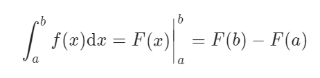

# 动态规划

## 比特位计数

```java
    public int[] countBits(int num) {

        int[] dp = new int[num + 1];
        
        for (int i = 0; i <= num; i++) {
            if (i % 2 != 0) {
                dp[i] = dp[i - 1] + 1;
            } else {
                dp[i] = dp[i / 2];
            }
        }
        return dp;
    }
```

## 把数字转换成字符串

### 标准的动态规划

```java
public int translateNum(int num) {

    int[] arr = Arrays.stream(String.valueOf(num).split("")).mapToInt(Integer::valueOf).toArray();

    int[] dp = new int[arr.length];

    if (arr.length == 1) {
        return 1;
    } else if (dp.length == 2) {
        if ((10 * arr[0] + arr[1]) >= 10 && (arr[0] * 10 + arr[1]) <= 25) {
            return 2;
        } else {
            return 1;
        }
    }

    dp[0] = 1;
    if ((10 * arr[0] + arr[1]) >= 10 && (arr[0] * 10 + arr[1]) <= 25) {
        dp[1] = 2;
    } else {
        dp[1] = 1;
    }


    for (int i = 2; i < dp.length; i++) {
        if ((arr[i - 1] * 10 + arr[i]) >= 10 && (arr[i - 1] * 10 + arr[i]) <= 25) {
            dp[i] = dp[i - 1] + dp[i - 2];
        } else {
            dp[i] = dp[i - 1];
        }
    }
    return dp[dp.length - 1];
}
```

### 优化的动态规划

```java
import java.util.Arrays;

class Solution {
    public int translateNum(int num) {
        if (num < 10) {
            return 1;
        }

        int[] array = Arrays.stream(String.valueOf(num).split("")).mapToInt(Integer::valueOf).toArray();

        int pre, prePre, current;

        int[] dp = new int[array.length];
        prePre = 1;

        int value = array[0] * 10 + array[1];

        pre = value >= 10 && value <= 25 ? 2 : 1;

        for (int i = 2; i < dp.length; i++) {

            value = array[i - 1] * 10 + array[i];

            current = value >= 10 && value <= 25 ? pre + prePre : pre;

            prePre = pre;
            pre = current;
        }
        return pre;
    }

}
```

## 打家劫舍

### 朴素动态规划

```Java
public int rob(int[] nums) {
    if (nums == null || nums.length == 0) {
        return 0;
    } else if (nums.length == 1) {
        return nums[0];
    }

    int[] dp = new int[nums.length];
    dp[0] = nums[0];
    dp[1] = Math.max(nums[0], nums[1]);

    for (int i = 1; i < nums.length - 1; i++) {
        dp[i + 1] = Math.max(dp[i], dp[i - 1] + nums[i + 1]);
    }
    return Math.max(dp[nums.length - 1], dp[nums.length - 2]);
}
```

### 简约的动态规划

```Java
public int rob(int[] nums) {
    int pre = 0, curr = 0, temp;
    for(int num : nums) {
        temp = curr;
        curr = Math.max(pre + num, curr);
        pre = temp;
    }
    return curr;
}
```

## 最大子序和

### 总结

最大子序和也可以用来计算差的最大值, 使用积分的思想. 需要计算一个变化率的数组



### 朴素 dp

```java
public int maxSubArray(int[] nums) {
    if (nums == null || nums.length == 0) {
        return 0;
    }
    if (nums.length == 1) {
        return nums[0];
    }
    int[] dp = new int[nums.length];
    dp[0] = nums[0];

    int max = dp[0];
    for (int i = 1; i < nums.length; i++) {
        dp[i] = Math.max(nums[i], dp[i - 1] + nums[i]);
        max = Math.max(dp[i], max);
    }
    return max;
}
```
### dp优化

```java
public int maxSubArray(int[] nums) {
    int pre = nums[0];
    int max = pre;

    for (int i = 1; i < nums.length; i++) {
        pre = Math.max(pre + nums[i], nums[i]);
        max = Math.max(pre, max);
    }
    return max;
}
```

## 买卖股票的最佳时机

### 优化dp 

使用积分的思想

```java
public int maxProfit(int[] prices) {
    if (prices == null || prices.length <= 1) {
        return 0;
    }
    
    int pre = prices[1] - prices[0];
    int max = pre;

    for (int i = 1; i < prices.length - 1; i++) {
        int i1 = prices[i + 1] - prices[i];
        pre = Math.max(pre + i1, i1);
        max = Math.max(pre, max);
    }
    return Math.max(0, max);

}
```

## 买卖股票的最佳时机2

```java
// 与1相比, 可以多次买入多次卖出
class Solution {
    public int maxProfit(int[] prices) {
        if (prices == null || prices.length <= 1) {
            return 0;
        }

        int sum = 0;

        for (int i = 0; i < prices.length - 1; i++) {
            if (prices[i + 1] - prices[i] >= 0) {
                sum += (prices[i + 1] - prices[i]);
            }
        }

        return sum;

    }
}
```

## 丑数

一个神奇的思路

```java
int nthUglyNumber(int n) {
    int[] dp = new int[n];
    dp[0] = 1;
    int p2 = 0, p3 = 0, p5 = 0;
    for (int i = 1; i < n; i++) {
        dp[i] = Math.min(Math.min(dp[p2] * 2, dp[p3] * 3), dp[p5] * 5);
        if (dp[i] == dp[p2] * 2) {
            p2++;
        }
        if (dp[i] == dp[p3] * 3) {
            p3++;
        }
        if (dp[i] == dp[p5] * 5) {
            p5++;
        }
    }
    return dp[n - 1];
}
```

## 礼物的最大价值

### 极其朴素的动态规划思想

```java
public int maxValue(int[][] grid) {
    if (grid == null || grid[0].length == 0) {
        return 0;
    }
    int m = grid.length;
    int n = grid[0].length;
    int[][] dp = new int[m][n];
    dp[0][0] = grid[0][0];

    // 初始化第一行
    for (int i = 1; i < n; i++) {
        dp[0][i] = dp[0][i - 1] + grid[0][i];
    }
    // 初始化第一列
    for (int i = 1; i < m; i++) {
        dp[i][0] = dp[i - 1][0] + grid[i][0];
    }

    for (int i = 1; i < m; i++) {
        for (int j = 1; j < n; j++) {
            dp[i][j] = Math.max(dp[i][j - 1], dp[i - 1][j]) + grid[i][j];
        }
    }

    return dp[m-1][n-1];
}
```

### 优化一下代码

```java
// 这种优化虽然看起来比较简洁,但是有一些代码细节
public int maxValue(int[][] grid) {
    int row = grid.length;
    int column = grid[0].length;
    // 多开一行一列,代码更加简单
    int[][] dp = new int[row + 1][column + 1];
    // 注意细节, <= 号
    for (int i = 1; i <= row; i++) {
        for (int j = 1; j <= column; j++) {
            dp[i][j] = Math.max(dp[i - 1][j], dp[i][j - 1]) + grid[i - 1][j - 1];
        }
    }
    return dp[row][column];
}
```

## 最小路径和

//  与最大礼物价值是一样的, 只是一个时 max 一个是 min 的区别

```java
class Solution {
    public int minPathSum(int[][] grid) {
        int m = grid.length;
        int n = grid[0].length;
        int[][] dp = new int[m][n];
        dp[0][0] = grid[0][0];
        for (int i = 1; i < m; i++) {
            dp[i][0] = dp[i - 1][0] + grid[i][0];
        }
        for (int i = 1; i < n; i++) {
            dp[0][i] = dp[0][i - 1] + grid[0][i];
        }

        for (int i = 1; i < m; i++) {
            for (int j = 1; j < n; j++) {
                dp[i][j] = Math.min(dp[i - 1][j], dp[i][j - 1]) + grid[i][j];
            }
        }
        return dp[m - 1][n - 1];
    }
}
```

## 机器人走路

```java
int res = 1;

public int movingCount(int m, int n, int k) {
    boolean[][] dp = new boolean[m][n];
    dp[0][0] = true;

    // 将第一行和第一列初始化
    for (int i = 1; i < n; i++) {
        if (valid(0, i, k) && dp[0][i - 1]) {
            dp[0][i] = true;
            res++;
        }
    }
    for (int i = 1; i < m; i++) {
        if (valid(0, i, k) && dp[i - 1][0]) {
            dp[i][0] = true;
            res++;
        }
    }

    //开始遍历
    for (int i = 1; i < m; i++) {
        for (int j = 1; j < n; j++) {
            if ((dp[i - 1][j] || dp[i][j - 1]) && valid(i, j, k)) {
                dp[i][j] = true;
                res++;
            }
        }
    }
    return res;
}

boolean valid(int m, int n, int k) {
    String[] split = (m + String.valueOf(n)).split("");
    int sum = 0;
    for (String s : split) {
        sum += Integer.parseInt(s);
    }
    return sum <= k;
}
```

## 最长不包含重复字符的子串

### 动态规划

```java
public int lengthOfLongestSubstring(String s) {
    if (s == null || s.length() == 0) {
        return 0;
    }
    char[] array = s.toCharArray();
    HashSet<Character> set = new HashSet<>();
    HashSet<Character> backTrack = new HashSet<>();
    set.add(array[0]);
    int max = 1;
    int[] dp = new int[s.length()];
    dp[0] = 1;
    
    for (int i = 1; i < array.length; i++) {
        if (set.contains(array[i])) {
            int j = i;
            while (j >= 0) {
                if (backTrack.contains(array[j])) {
                    break;
                } else {
                    backTrack.add(array[j]);
                    j--;
                }
            }
            set.clear();
            set.addAll(backTrack);
            backTrack.clear();
            dp[i] = (i - j);
        } else {
            set.add(array[i]);
            dp[i] = dp[i - 1] + 1;
            max = Math.max(dp[i], max);
        }
    }

    return max;
}
```

### 暴力

```Java
public int lengthOfLongestSubstring(String s) {
    int res = 0;
    Deque<Character> deque = new ArrayDeque<>();

    for (int i = 0; i < s.length(); i++) {
        for (int j = i; j < s.length(); j++) {
            if (deque.contains(s.charAt(j))) {
                res = Math.max(res, deque.size());
                deque.clear();
                break;
            } else {
                deque.add(s.charAt(j));
            }
        }
    }
    return Math.max(res, deque.size());
}
```

## 回文子串的个数

```java
public int countSubstrings(String s) {
    int cnt = 0;
    
    boolean[][] dp = new boolean[s.length()][s.length()];

    char[] array = s.toCharArray();

    for (int i = 0; i < s.length(); i++) {
        for (int j = 0; j <= i; j++) {
            if (i == j) {
                dp[i][j] = true;
                cnt++;
            } else if (i - j == 1 && array[i] == array[j]) {
                dp[i][j] = true;
                cnt++;
            } else if (i - j > 1) {
                if (dp[i - 1][j + 1] && array[i] == array[j]) {
                    dp[i][j] = true;
                    cnt++;
                }
            }
        }
    }
    return cnt;
}
```

## n个骰子的最大和

```java
class Solution {
    public double[] twoSum(int n) {

        double all = Math.pow(6, n);

        int[][] dp = new int[n + 1][6 * n + 1];
        dp[0][0] = 1;

        // i 是骰子的个数
        for (int i = 1; i <= n; i++) {
            // j 是 i 个骰子能得到的所有点数
            for (int j = 1; j <= 6 * i; j++) {
                
                for (int k = 1; k <= Math.min(6, j); k++) {
                    dp[i][j] += dp[i - 1][j - k];
                }
            }
        }

        LinkedList<Double> list = new LinkedList<>();
        for (int i : dp[n]) {
            if(i>0){
                list.add(i/all);
            }
        }
        return list.stream().mapToDouble(Double::doubleValue).toArray();
    }
```

## 青蛙跳台阶

```java
public int numWays(int n) {
    if (n <= 1) {
        return 1;
    }
    int[] res = new int[n + 1];

    res[0] = 1;
    res[1] = 1;
    for (int i = 2; i <= n; i++) {
        res[i] = res[i - 1] + res[i - 2];
        res[i] %= 1000000007;
    }
    return res[n];
}
```

## 最大子序和

### 标准dp

```java
public int maxSubArray(int[] nums) {
    if (nums == null || nums.length == 0) {
        return 0;
    }
    int[] dp = new int[nums.length];
    dp[0] = nums[0];
    int max = dp[0];
    for (int i = 1; i < nums.length; i++) {
        dp[i] = Math.max(dp[i - 1] + nums[i], nums[i]);
        max = Math.max(max, dp[i]);
    }
    return max;
}
```

### 改进dp

```java
class Solution {
    public int maxSubArray(int[] nums) {
        int ans = nums[0];
        int tmp = 0;
        for (int num : nums) {
            if (tmp > 0) {
                // 之前的和大于0,name当前的值加上之前的可能是最优的
                tmp += num;
            } else {
                // 之前的和小于0,必然不是最优的
                tmp = num;
            }
            // 当前的值要么更新,要么不更新
            ans = Math.max(ans, tmp);
        }
        return ans;
    }
}
```

## 不同路径

```java
class Solution {
    public int uniquePaths(int m, int n) {
        int[][] dp = new int[m][n];
        for (int[] ints : dp) {
            Arrays.fill(ints,1);
        }

        for (int i = 1; i < m; i++) {
            for (int j = 1; j < n; j++) {
                dp[i][j] = dp[i - 1][j] + dp[i][j - 1];
            }
        }
        return dp[m - 1][n - 1];
    }
}
```

## 不同路径2

```java
class Solution {
    public int uniquePathsWithObstacles(int[][] obstacleGrid) {
        int m = obstacleGrid.length;
        int n = obstacleGrid[0].length;
        if (obstacleGrid[0][0] == 1 || obstacleGrid[m - 1][n - 1] == 1) {
            return 0;
        }

        int[][] dp = new int[m][n];
        dp[0][0] = 1;

        for (int i = 1; i < m; i++) {
            if (obstacleGrid[i][0] == 0) {
                dp[i][0] = 1;
            } else {
                break;
            }
        }

        for (int i = 1; i < n; i++) {
            if (obstacleGrid[0][i] == 0) {
                dp[0][i] = 1;
            } else {
                break;
            }
        }

        for (int i = 1; i < m; i++) {
            for (int j = 1; j < n; j++) {
                if (obstacleGrid[i][j] != 1) {
                    dp[i][j] = dp[i - 1][j] + dp[i][j - 1];
                }
            }
        }

        return dp[m - 1][n - 1];

    }
}
```