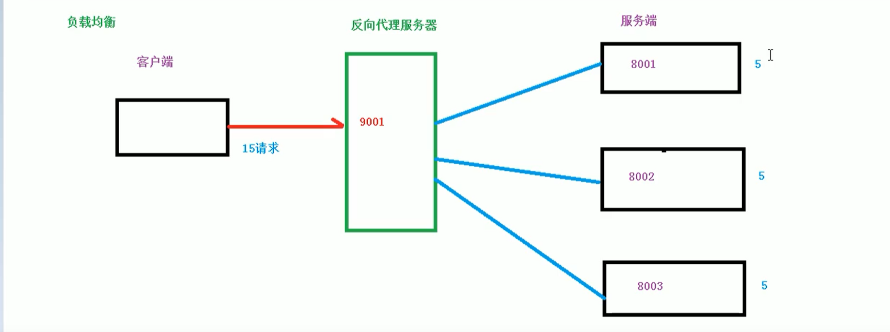
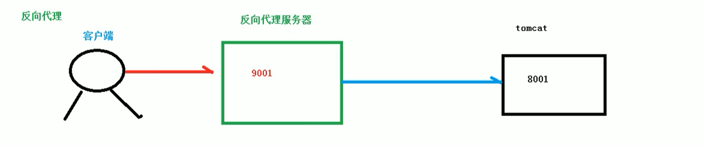
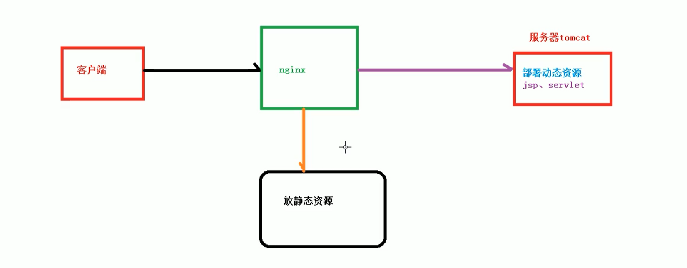

# NGINX

## 负载均衡



## 反向代理

- 反向代理服务器,将请求进行转发.



## 动静分离



## 配置文件

```nginx
# 全局块

# nginx 处理的并发量
worker_processes  1;


# events 块
events {
    # nginx 支持的最大连接数
    worker_connections  1024;
}


# http 块
http {
    include       mime.types;

    default_type  application/octet-stream;

    sendfile        on;

    keepalive_timeout  65;

    server {
        listen       80;
        server_name  localhost;

        location / {
            root   html;
            index  index.html index.htm;
        }
        
        error_page   500 502 503 504  /50x.html;
        location = /50x.html {
            root   html;
        }
    }
}
```

## 代理配置

### 域名重定向

- 简单的配置 `location` 即可, 增加  `proxy_pass  https://www.baidu.com/;` 语句

```nginx
server {
        listen       80;
        server_name  localhost;

        location / {
            root   html;
            proxy_pass  https://www.baidu.com/;
            index  index.html index.htm;
        }

        error_page   500 502 503 504  /50x.html;
        location = /50x.html {
            root   html;
        }
    }
```

 ### 端口转发


