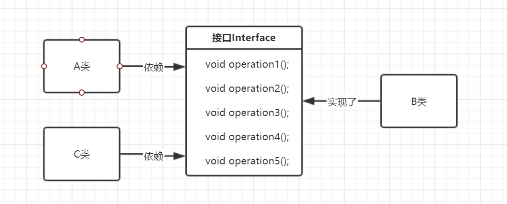
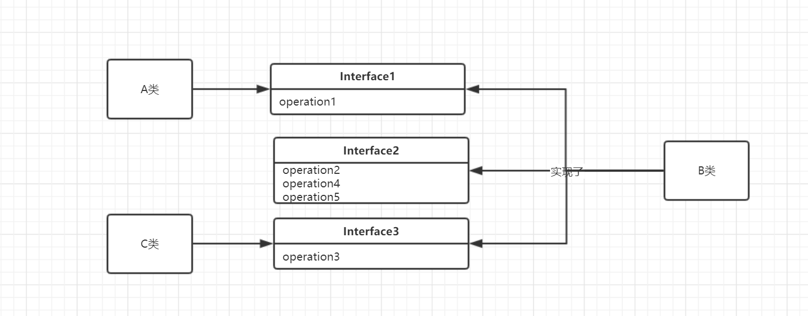

# 设计模式

## 为什么需要设计模式

- 提高内聚
- 降低耦合
- 减少阅读障碍
- 增强可扩展性
- 没有什么是加一层解决不了的,如果有,再加一层.

##  七大原则

### 单一职责

- 一个类应该只对应一项职责
- 提高类的可读性
- 降低变更类的风险
- 在类足够简单时,可以违背这个原则

#### 初始代码

- 显然,同一个类承担了不同交通工具的运行.运行后会出现  `汽车在陆地上跑  火车在陆地上跑 飞机在陆地上跑`的结果,需要修改.

```Java
public class Test {
    public static void main(String[] args) {
        new Run().run("汽车");
        new Run().run("火车");
        new Run().run("飞机");
    }
}

class Run {
    public void run(String name) {
        System.out.println(name + "在陆地上跑");
    }
}
```

#### 将不同交通工具均提出成为一个类

- 这样的结果是结构清晰可见,但是缺点是成本较大.

```Java
class CarRun {
    public void run(String name) {
        System.out.println(name + "在陆地上跑");
    }
}


class TrainRun {
    public void run(String name) {
        System.out.println(name + "在铁轨上跑");
    }
}


class PlaneRun {
    public void run(String name) {
        System.out.println(name + "在天上飞");
    }
}
```

#### 在一个类中增添不同的方法

- 这样做成本较低,但是当类中含有大量的方法之后,修改某些类就会十分复杂.

```Java
class Run {
    public void carRun(String name) {
        System.out.println(name + "在陆地上跑");
    }

    public void trainRun(String name) {
        System.out.println(name + "在铁道上跑");
    }

    public void planeRun(String name) {
        System.out.println(name + "在天上飞");
    }
}
```

### 接口隔离原则

- 一个类对另一个类的依赖应该在最小接口上

#### 初始代码

- 存在一个接口,包含五个方法.

```Java
public interface Interface {
    void operation1();

    void operation2();

    void operation3();

    void operation4();

    void operation5();
}
```

- B类完整的实现了五个方法

```Java
public class B implements Interface {
    @Override
    public void operation1() {
        System.out.println(1);
    }

    @Override
    public void operation2() {
        System.out.println(2);
    }

    @Override
    public void operation3() {
        System.out.println(3);
    }

    @Override
    public void operation4() {
        System.out.println(4);
    }

    @Override
    public void operation5() {
        System.out.println(5);
    }
}
```

- A类依赖于接口,但是只使用了其中的一个方法.

```Java
public class A {
    public void depend3(Interface i) {
        i.operation3();
    }
}
```

- C类同样依赖接口且使用了一个方法.

```Java
public class C {
    public void depend1(@NotNull Interface i) {
        i.operation1();
    }
}
```

---

​				显然,此时的设计不符合接口隔离原则.如下图:



A类和C类仅依赖于接口的部分方法,但是通过接口却可以访问到他们不需要的方法,因此有必要对接口进行拆分.


#### 拆分

- 将现有接口拆分为三个即可

```java
interface Interface1 {
    void operation1();
}


interface Interface2 {

    void operation2();

    void operation4();

    void operation5();
}

interface Interface3 {
    
    void operation3();

}
```



### 依赖倒转原则

- 中心思想是面向接口编程
- 高层模块不应该依赖底层模块,二者均应该依赖其抽象 (接口 抽象类)

#### 初始

```Java
/**
 * @author wangz
 */
public class Main {
    public static void main(String[] args) {
        new Person().receive(new Email());
    }
}

class Email {
    public String getInfo() {
        return "msg";
    }
}

class Person {
    public void receive(Email email) {
        System.out.println(email.getInfo());
    }
}

```

存在的问题:

1. Person直接依赖于Email
2. 当receive的目标变成其他的时候,需要改动大量的代码.

解决思路:

1. 引入抽象的一个接口Reciver

#### 改进

- 增加一个接口

```java
/**
 * @author wangz
 */
public interface Receiver {
    public String getInfo();
}
```

- 实现接口

```Java
class Email implements Receiver {
    @Override
    public String getInfo() {
        return "msg";
    }
}
```

- 通过接口进行依赖

```java
class Person {
    public void receive(Receiver receiver) {
        System.out.println(receiver.getInfo());
    }
}
```

这样设计后,可以进行信息发送的扩展,如手机 微信等,不用修改接受的方法.

#### 依赖传递的三种方式

##### 通过接口传递

- 存在两个接口

```Java
public interface Open {
    void open(Tv tv);
}

interface Tv {
    void play();
}
```

- 创建一个像遥控器的东西

```
class openTV3 implements Open {
    @Override
    public void open(Tv tv) {
        tv.play();
    }
}
```

- 创建一个电视

```Java
class ChangHong implements Tv {
    @Override
    public void play() {
        System.out.println("长虹正在播放");
    }
}
```

- 调用

```java
public static void main(String[] args) {
    new openTV3().open(new ChangHong());
}
```

##### 构造方法传递

- 创建两个接口,与上边稍有不同.

```Java
public interface Open {
    void open();
}

interface Tv {
    void play();
}
```

- 创建一个遥控器一样的东西

```java
class openTV implements Open {
    private Tv tv;
    public openTV(Tv tv) {
        this.tv = tv;
    }
    @Override
    public void open() {
        this.tv.play();
    }
}
```

##### setter方法传递

```java
public interface Open {
    void open();
}

interface Tv {
    void play();
}
```

- 创建遥控器

```Java
class openTV2 implements Open {
    private Tv tv;
    public void setTv(Tv tv) {
        this.tv = tv;
    }
    @Override
    public void open() {
        this.tv.play();
    }
}
```

##### 总结

三种方式均实现了**组合大于继承**的理念,通过接口实现了方法的联合.

### 里氏替换原则

- 派生类（子类）对象可以在程式中代替其基类（超类）对象。
- 子类中尽量不要重写父类的方法
- 继承使耦合性增强,尽量不要使用

#### 初始代码

```Java
public class App {
    public static void main(String[] args) {
        System.out.println(new A().add(1, 2));
        System.out.println(new B().add(1, 2));
    }
}

class A {
    public int add(int a, int b) {
        return a + b;
    }
}

class B extends A {
    @Override
    public int add(int a, int b) {
        return a - b;
    }

    public int sub(int a, int b) {
        return add(a, b);
    }
}
```

- B类继承了A类,但是无意中重写了add方法,导致在调用B.add时发生错误.

#### 改进

```Java
class B {

    // 使用组合的方式
    private A a = new A();

    ...
}
```

#### 总结

- 如果需要继承,尽量不要重写父类方法.
- 尽可能不继承

### 开闭原则

- 最基础重要的设计原则
- 对扩展开放,对修改关闭
- 软件功能变化时,尽量不修改原有代码,而是原有代码.

#### 初始代码

- 有一个基类shape,同时有矩形和圆形继承基类,通过type参数来区分.

```Java
class Shape {
    int type;
}

class Rectangle extends Shape {
    Rectangle() {
        super.type = 1;
    }

}

class Circle extends Shape {
    public Circle() {
        super.type = 2;
    }
}
```

- 有一个画图类,通过图形的类型来判断画的是什么.

```Java
class DrawShape {
    public void draw(Shape shape) {
        if (shape.type == 1) {
            drawRec();
        } else if (shape.type == 2) {
            drawCir();
        }
    }

    private void drawRec() {
        System.out.println("矩形");
    }

    private void drawCir() {
        System.out.println("圆形");
    }
}
```

- 运行正常

```Java
public class App {
    public static void main(String[] args) {
        new DrawShape().draw(new Rectangle());
        new DrawShape().draw(new Circle());
    }
}
```

- 问题在于当需要扩展时,需要修改大量的代码.

#### 改进

- 将基类变为抽象类,增加一个draw方法.

```Java
abstract class Shape {
    int type;

    abstract public void draw();
}
```

- 所有的子类均实现draw方法

```Java
class Rectangle extends Shape {
    Rectangle() {
        super.type = 1;
    }

    @Override
    public void draw() {
        System.out.println("绘制矩形");
    }
}

class Circle extends Shape {
    public Circle() {
        super.type = 2;
    }

    @Override
    public void draw() {
        System.out.println("绘制三角形");
    }
}
```

- 简化绘图类
	- 在这一步还可以采用构造器依赖的方法  依赖倒置原则  

```Java
class DrawShape {
    public void draw(Shape shape) {
        shape.draw();
    }
}
```

### 迪米特法则

- 一个对象应该对其他对象保持最小的了解
- 关系越密切,耦合性越大
- 最少知道原则
- 只与直接朋友通信

> 避免非直接朋友的情况

### 合成复用原则

- 组合大于继承
- 尽量使用聚合/组合的方法
- 尽量避免继承


## 23种设计模式

- 模式不是代码,时某类问题的最佳解决方案.
- 代表了最佳的实践.
- 与语言无关

### 创建型模式

#### 单例模式

> 保证在整个系统中,某个类只能存在一个实例,并且只提供一个获取该实例的方法.

- 这个获取实例的方法一般是静态方法
- 构造方法私有
- 多线程中单例模式十分重要,会存在线程间冲突的问题
- 通过反射可以破坏大多数单例模式
- 通过枚举实现单例模式不会被反射破坏
- ==推荐使用DCL双重检测锁==

##### 饿汉式

- 优点  在类加载时初始化,多线程下可用.
- 缺点 即使不使用也会初始化,造成资源浪费.

```Java
/**
 * @author wangz
 * 饿汉式单例
 */
public class SingletonOne {
    private boolean flag = false;
       
    private final static SingletonOne INSTANCE = new SingletonOne();


    private SingletonOne() {
        if (flag == false) {
            flag = true;
        } else {
            System.out.println("不允许通过反射改变值...正在退出程序");
            System.exit(0);
        }
    }
    
    public static SingletonOne getInstance() {
        return INSTANCE;
    }
}

class Test {
    public static void main(String[] args) {
        SingletonOne instance = SingletonOne.getInstance();
        SingletonOne instance2 = SingletonOne.getInstance();
        System.out.println(instance == instance2);
    }
}
```

##### 懒汉式

> 单线程的懒汉式

- 线程不安全

```Java
/**
 * @author wangz
 */
public class SingletonTwo {
    private static SingletonTwo INSTANCE;

    private SingletonTwo() { }

    public static SingletonTwo getInstance() {
        if (INSTANCE == null) {
            INSTANCE = new SingletonTwo();
        }
        return INSTANCE;
    }
}


class Test1 {
    public static void main(String[] args) {
        SingletonTwo instance = SingletonTwo.getInstance();
        SingletonTwo instance2 = SingletonTwo.getInstance();
        System.out.println(instance==instance2);
    }
}
```


> 线程安全的懒汉式

- Synchronize同步锁
- 降低了并发性能

```Java
public synchronized static SingletonTwo getInstance() {
    if (INSTANCE == null) {
        INSTANCE = new SingletonTwo();
    }
    return INSTANCE;
}
```

##### DCL双重检测锁

> 需要使用 volatile 关键字 强烈推荐!

```java
/**
 * @author wangz
 */
public class SingletonTwo {
    
    private volatile static SingletonTwo INSTANCE;

    private SingletonTwo() {}
	// 双重检测锁
    public static SingletonTwo getInstance() {
        if (INSTANCE == null) {
            synchronized (SingletonTwo.class) {
                if (INSTANCE == null) {
                    INSTANCE = new SingletonTwo();
                }
            }
        }
        return INSTANCE;
    }
}


class Test {
    public static void main(String[] args) {
        for (int i = 0; i < 5; i++) {
            new Thread(() -> {
                System.out.println(SingletonTwo.getInstance());
            }).start();
        }
    }
}
```

##### 静态内部类

> 推荐使用,利用了Java的类加载机制

- 在类加载时,静态内部类并不会被实例化,只有第一次调用时会加载.且是线程安全的.

```Java
public class SingletonThree {

    private SingletonThree() {
    }

    private static class A {
        private static final SingletonThree singletonThree = new SingletonThree();
    }

    public static SingletonThree getINSTANCE() {
        return A.singletonThree;
    }
}

class Test2{
    public static void main(String[] args) {
        for (int i = 0; i < 5; i++) {
            new Thread(() -> System.out.println(SingletonThree.getINSTANCE())).start();
        }

    }
}
```

##### 枚举

> 推荐使用

```Java
public class SingletonFour {

    public static void main(String[] args) {
        Singleton a = Singleton.INSTANCE;
        Singleton b = Singleton.INSTANCE;
        Singleton c = Singleton.INSTANCE;
        

        System.out.println(a == b);
        System.out.println(b == c);
    }

}

enum Singleton {
    INSTANCE;
}
```

##### 总结

- 饿汉式比较简单
- 懒汉式单线程比较好
- DCL推荐
- 静态内部类推荐
- 枚举推荐

##### Java中的单例

```Java
public class Runtime {
    private static final Runtime currentRuntime = new Runtime();

    private static Version version;

    public static Runtime getRuntime() {
        return currentRuntime;
    }
    ......
}
```


##### 使用范围

- 经常创建和销毁的对象
- 重量级对象
- 工具类
- 访问数据库或文件频繁的对象

#### 简单工厂模式

- 由一个工厂选择创建哪个产品类的实例.

> 需求分析

现有各种披萨需要制作,每个披萨有一些固定的工序来制作.

##### 初始

```Java
// 一个简单的抽象类
abstract class Pizza {
    protected String name;

    abstract void prepare();

    public void setName(String name) {
        this.name = name;
    }

    public void buySomething() {
        System.out.println("购买了" + name + "的材料");
    }

    public void bake() {
        System.out.println("烘烤了" + name);
    }

    public void cut() {
        System.out.println("分割了" + name);
    }

    public void box() {
        System.out.println("打包了" + name);
    }

}

// 一个抽象类的实现
class ChinesePizza extends Pizza {

    @Override
    void prepare() {
        System.out.println("准备了ChinesePizza的原材料!");
    }

    public ChinesePizza() {
        this.setName("ChinesePizza");
    }
}

// 另一个抽象类的实现
class Japan extends Pizza {

    @Override
    void prepare() {
        System.out.println("准备了ChinesePizza的原材料!");
    }

    public Japan() {
        this.setName("JapanPizza");
    }
}
```


```Java
// 订单
public class Order {
    public Order() {
        Scanner scanner = new Scanner(System.in);

        Pizza pizza = null;
        do {
            System.out.println("请输入pizza的类型 : Chinese or Japan !");
            String type = scanner.next();
            if (type.equals("Chinese")) {
                pizza = new ChinesePizza();
            } else if (type.equals("Japan")) {
                pizza = new Japan();
            } else {
                break;
            }
            pizza.prepare();
            pizza.buySomething();
            pizza.bake();
            pizza.cut();
            pizza.box();
        } while (true);
    }
}
```


```Java
// 消费者 / 客户端
public class Store {
    public static void main(String[] args) {
        Order order = new Order();
    }
}
```

- 优点: 简单易懂
- 缺点 : 违反了 开闭原则  , 功能扩展时需要修改大量的代码.

##### 改进

- 将pizza制作的相关流程封装到一个类中,对外暴露接口.
- 使用静态方法
- 结合单例模式更好

```Java
// 客户端,只需要从工厂获取对应的 Pizza 即可,不需关心其他.
public class Factory {
    public static void main(String[] args) {
        Pizza pizza = PizzaFactory.getPizza("Japan");
        if (pizza==null){
            System.out.println("没有这种pizza, 订购失败!");
        }else {
            System.out.println(pizza.name);
        }

    }
}


// 创建 pizza 工厂,使用 getPizza 方法获取pizza

class PizzaFactory {
    public static Pizza getPizza(String pizzaName) {
        return pizzaName.equals("Chinese") ? new ChinesePizza() : pizzaName.equals("Japan") ? new Japan() : null;
    }
}
```


#### 工厂方法模式

> 新的需求

- 需要有各种口味 各种大小等等属性的pizza

> 解决方法

- 思路一:  为每一种建立一个新的工厂,简单,但是不易扩展.
- 思路二:  使用工厂方法模式

##### 工厂方法模式


==核心思想: 把对象的实例化推迟到子类中.==

---

原先的模型:

​	

改进的模型:

​	

---


- 一个Pizza的抽象方法,基类.

```java
abstract class Pizza {
    protected String name;

    abstract void prepare();

    public void setName(String name) {
        this.name = name;
    }

    public void buySomething() {
        System.out.println("购买了" + name + "的材料");
    }

    public void bake() {
        System.out.println("烘烤了" + name);
    }

    public void cut() {
        System.out.println("分割了" + name);
    }

    public void box() {
        System.out.println("打包了" + name);
    }

}
```

- 创建四种Pizza

```Java
class ChineseRed extends Pizza {
    public ChineseRed() {
        this.setName("ChineseRedPizza");
    }
}

class ChineseBlue extends Pizza {
    public ChineseBlue() {
        this.setName("ChineseBluePizza");
    }
}

class JapanRed extends Pizza {
    public JapanRed() {
        this.setName("JapanRedPizza");
    }
}

class JapanBlue extends Pizza {
    public JapanBlue() {
        this.setName("JapanBluePizza");
    }
}
```

- 创建一个 Order 的抽象类,这是比较重要的一步.

```Java
abstract class Order {
    public Order() {
        System.out.println("当前的工厂是" + getClass().getName());
        System.out.println("请输入pizza的种类, Red/Blue :");
        Pizza pizza = createPizza(new Scanner(System.in).next());
        pizza.box();
    }

    abstract public Pizza createPizza(String pizza);

}
```

- 创建两个工厂,继承Order类.

  ​	这一步本质上还是创建了两个工厂生成不同的原材料,但是提取了他们的共性,抽象为一个新的类 ==Order== ,因此,对外看仍然是只有一个工厂 Order.

```Java
class Chinese extends Order {
    @Override
    public Pizza createPizza(String pizza) {
        if (pizza.equals("Red")) {
            return new ChineseRed();
        } else if (pizza.equals("Blue")) {
            return new ChineseBlue();
        } else {
            return null;
        }
    }
}

class Japan extends Order {
    @Override
    public Pizza createPizza(String pizza) {
        if (pizza.equals("Red")) {
            return new JapanRed();
        } else if (pizza.equals("Blue")) {
            return new JapanBlue();
        } else {
            return null;
        }
    }
}
```

- 测试即可

```Java
public class App {
    public static void main(String[] args) {
        Order Chinese = new Chinese();
        Order Japan = new Japan();
    }
}
```

#### 抽象工厂模式


- 将原有的抽象类变成一个接口,再将其聚合到 Order 中.

```Java
interface Factory {
    Pizza createPizza(String pizza);
}

class Order {
    Factory factory;

    public Order(Factory factory) {
        this.factory = factory;
    }

    public void getPizza(String name) {
        factory.createPizza(name).box();
    }

}
```

- 每个工厂实现接口

```Java
class ChineseFactory implements Factory {
    @Override
    public Pizza createPizza(String pizza) {
        if (pizza.equals("Red")) {
            return new ChineseRed();
        } else if (pizza.equals("Blue")) {
            return new ChineseBlue();
        } else {
            return null;
        }
    }
}

class JapanFactory implements Factory {
    @Override
    public Pizza createPizza(String pizza) {
        if (pizza.equals("Red")) {
            return new JapanRed();
        } else if (pizza.equals("Blue")) {
            return new JapanBlue();
        } else {
            return null;
        }
    }
}
```

##### JDK 源码

- 这是一个工厂模式的应用,但是这不是单例模式!

```Java
public abstract class Calendar implements Serializable, Cloneable, Comparable<Calendar> { }
```

#### 原型模式

> ​	现在有一只羊,需要创建相同的10只羊.

##### 初始

```Java
public class Sheep {
    int age;
    String color;
    String name;


    public Sheep(int age, String color, String name) {
        this.age = age;
        this.color = color;
        this.name = name;
    }

    @Override
    public String toString() {
        return "Sheep{" +
                "age=" + age +
                ", color='" + color + '\'' +
                ", name='" + name + '\'' +
                '}';
    }

    public static void main(String[] args) {
        System.out.println(new Sheep(12, "red", "tom"));
        System.out.println(new Sheep(12, "red", "tom"));
        System.out.println(new Sheep(12, "red", "tom"));
        System.out.println(new Sheep(12, "red", "tom"));
    }
}

Sheep{age=12, color='red', name='tom'}
Sheep{age=12, color='red', name='tom'}
Sheep{age=12, color='red', name='tom'}
Sheep{age=12, color='red', name='tom'}
```

- 简单的编写一个类,再创建N个相同的对象.
- 创建较为复杂
- 不能动态的获取

##### 改进

- 使用原型模式


- ==注意== : 使用clone时这个类必须实现 `Cloneable` 接口 ,否则会出现 `java.lang.CloneNotSupportedException` 异常.
- 实现接口时可选重写 clone 方法, 也可以不重写,因为 clone 是Object 类的方法. 而且是==native==方法.

```Java
public class Sheep  implements Cloneable {
    int age;
    String color;
    String name;

    public Sheep(int age, String color, String name) {
        this.age = age;
        this.color = color;
        this.name = name;
    }

    @Override
    public String toString() {
        return "Sheep{" +
                "age=" + age +
                ", color='" + color + '\'' +
                ", name='" + name + '\'' +
                '}';
    }

    public static void main(String[] args) throws CloneNotSupportedException {
        Sheep sheep = new Sheep(12, "red", "tom");
        Object clone = sheep.clone();

        System.out.println(clone);
    }
}
```

##### 浅拷贝

- 接着上边,我们再Sheep类中增加了一个新的属性 friend , 但是在测试的时候发现,原来sheep 对象的属性 friend 和克隆对象的 friend 是同一个对象.
- 出现浅拷贝的原因是我们使用了默认的 clone 方法.
- 浅拷贝会对基本数据类型进行复制.

```Java
public class Sheep implements Cloneable {
    int age;
    String color;
    String name;
    public Sheep friend;

    public Sheep(int age, String color, String name) {
        this.age = age;
        this.color = color;
        this.name = name;
    }

    @Override
    public String toString() {
        return "Sheep{" +
                "age=" + age +
                ", color='" + color + '\'' +
                ", name='" + name + '\'' +
                ", friend=" + friend +
                '}';
    }

    public static void main(String[] args) throws CloneNotSupportedException {
        Sheep sheep = new Sheep(12, "red", "tom");
        sheep.friend = new Sheep(1, "blue", "wang");
        Sheep clone = (Sheep) sheep.clone();
        System.out.println(sheep);
        System.out.println(clone);
        System.out.println(sheep.friend==clone.friend);
        
Sheep{age=12, color='red', name='tom', friend=Sheep{age=1, color='blue', name='wang', friend=null}}
Sheep{age=12, color='red', name='tom', friend=Sheep{age=1, color='blue', name='wang', friend=null}}
true
    }
}
```

##### 深拷贝

> 重写 clone 方法

- 错误示范

- 这种情况由于循环依赖,会导致空指针异常.
- 暂无解决方案,参考Spring的循环依赖.

```Java
protected Object clone() throws CloneNotSupportedException {
    Sheep sheep = (Sheep) super.clone();
    sheep.friend = (Sheep) friend.clone();
    return sheep;
}
```

> 使用 序列化 的方法,较为复杂,但是方便使用.

```Java
@Override
protected Object clone() throws CloneNotSupportedException {
    super.clone();
    try {

        //字节数组输出流
        ByteArrayOutputStream bos = new ByteArrayOutputStream();
        //对象输出流
        ObjectOutputStream oos = new ObjectOutputStream(bos);
        //将这个对象写到对象输出流中
        oos.writeObject(this);
        //强制发送
        oos.flush();
        ByteArrayInputStream bin = new ByteArrayInputStream(bos.toByteArray());
        ObjectInputStream ois = new ObjectInputStream(bin);
        
        bos.close();
        oos.close();
        bin.close();
        ois.close();

        return ois.readObject();

    } catch (IOException | ClassNotFoundException e) {
        e.printStackTrace();
    }
    return null;

}
```

##### 总结

- 原型模式在创建复杂对象比较好
- 要注意深拷贝和浅拷贝
- 尽量使用序列化的方式进行深拷贝
- 默认是浅拷贝

#### 建造者模式


##### 初始

- 创建一个抽象的类
- 再创建一个目标类继承抽象类
- 简单易理解,容易操作.
- 将产品(房子) 和创建过程封装在了一起,耦合性较高,不易扩展.
- 如下边的代码.
- 现在已经有一个WoodenHouse,若是想要一个其他种类的房子,需要重写一个类,扩展性不好.

```Java
abstract class AbsHouse {
    abstract protected void createBase();

    abstract protected void paint();

    abstract protected void clean();

    public void build() {
        System.out.println("开始盖 " + getClass().getName());
        createBase();
        paint();
        clean();
        System.out.println(getClass().getName()+" 盖完了");
    }

}

class WoodenHouse extends AbsHouse{
    @Override
    protected void createBase() {
        System.out.println("木房子打地基");
    }

    @Override
    protected void paint() {
        System.out.println("木房子粉刷");
    }

    @Override
    protected void clean() {
        System.out.println("木房子清洁");
    }
}
```

##### 解决

- 使用建造者模式
- 将产品和产品建造的过程解耦合
- 通过一系列的流程直接创建一个新的房子,创建过程中加入各种属性.
- 差异较大的不适合使用建造者模式


> 创建一个产品

- 为方便打印输出,重写 tostring方法

```Java
class House {

    String base;
    String color;
    String roof;

    @Override
    public String toString() {
        return "House{" +
                "base='" + base + '\'' +
                ", color='" + color + '\'' +
                ", roof='" + roof + '\'' +
                '}';
    }
}
```

> 创建抽象建造者

```Java
abstract class HouseBuilder {
    protected House house = new House();

    public House getHouse() {
        return house;
    }

    abstract protected void buildBase();

    abstract protected void buildColor();

    abstract protected void buildRoof();
}
```

> 创建真正的建造者

```Java
class WoodenHouseBuilder extends HouseBuilder {
    @Override
    protected void buildBase() {
        house.base = "木房子的地基";
    }

    @Override
    protected void buildColor() {
        house.color = "木纹";
    }

    @Override
    protected void buildRoof() {
        house.roof = "茅草屋顶";
    }
}

class HighHouseBuilder extends HouseBuilder {
    @Override
    protected void buildBase() {
        house.base = "高楼的地基";
    }

    @Override
    protected void buildColor() {

        house.color = "五彩斑斓的颜色";
    }

    @Override
    protected void buildRoof() {
        house.roof = "豪华屋顶";
    }
}
```

> 创建指挥者

```Java
class HouseDirector {
    private HouseBuilder houseBuilder;

    public HouseDirector(HouseBuilder houseBuilder) {
        this.houseBuilder = houseBuilder;
    }

    public void setHouseBuilder(HouseBuilder houseBuilder) {
        this.houseBuilder = houseBuilder;
    }

    public House constructHouse() {
        houseBuilder.buildBase();
        houseBuilder.buildColor();
        houseBuilder.buildRoof();
        return houseBuilder.getHouse();
    }
}
```

> 测试

```Java
public class App {
    public static void main(String[] args) {
        WoodenHouseBuilder woodenHouseBuilder = new WoodenHouseBuilder();
        HighHouseBuilder highHouseBuilder = new HighHouseBuilder();


        HouseDirector houseDirector = new HouseDirector(woodenHouseBuilder);
        House house = houseDirector.constructHouse();
        System.out.println(house);

        houseDirector.setHouseBuilder(highHouseBuilder);
        house = houseDirector.constructHouse();
        System.out.println(house);

        House constructHouse = houseDirector.constructHouse();
        System.out.println(house == constructHouse);

    }
}

House{base='木房子的地基', color='木纹', roof='茅草屋顶'}
House{base='高楼的地基', color='五彩斑斓的颜色', roof='豪华屋顶'}
true
```

> 存在一些问题

- 同一个建造者只能创建一个对象,这是因为 

  ```Java
  abstract class HouseBuilder {
      protected House house = new House();   
  }
  ```

  我们直接给每个Builder 创建了唯一的一个 House,要想解决可以使用聚合的方法,通过构造器或者set方法从外部输入一个新的房子.

```Java
public static void main(String[] args) {
    WoodenHouseBuilder woodenHouseBuilder = new WoodenHouseBuilder();
    House house = new HouseDirector(woodenHouseBuilder).constructHouse();
    House house2 = new HouseDirector(woodenHouseBuilder).constructHouse();
    System.out.println(house==house2);
    
    // true

}
```

##### JDK源码


StringBuilder 使用了建造者模式

```Java
public final class StringBuilder extends AbstractStringBuilder {
}
```

- 思想相同,但是实现不标准.


### 结构性模式


#### 适配器模式

- 不同国家的电源插口不一样
- 这时候就需要一个新的适配器来进行接口之间的转换.
- 有三种适配器模式:
  - 类适配器
  - 接口适配器
  - 对象适配器

- 被适配者对于调用者是==透明==的

> 类适配器模式


- 这里的适配器是一个类
- 它继承了 220V 电压的类 , 同时实现了转换成 5 V的接口
- 使用者通过适配器进行调用


- 源头的的类

```Java
class Voltage220 {
    int voltage = 220;
    public int getVoltage() {
        System.out.println("电压等于 " + voltage);
        return voltage;
    }
}
```

- 转换接口

```Java
interface Voltage5 {
    public int outPut();
}
```

- 适配器

```Java
class Adapter extends Voltage220 implements Voltage5 {
    @Override
    public int outPut() {
        int voltage = getVoltage();
        System.out.println("适配器开始工作...");
        return voltage / 44;
    }
}
```

- 使用者,这里使用了组合的方式,聚合也可以.

```Java
class Phone {
    public void Charge(Voltage5 voltage) {
        if (voltage.outPut() == 5) {
            System.out.println("充电中...");
        } else {
            System.out.println("充电失败...");
        }
    }
}
```

- 测试

```Java
public class ClassAdapter {
    public static void main(String[] args) {
        new Phone().Charge(new Adapter());
    }
}
```


> 对象适配器

- 适配器不再继承原来的类,而是通过组合的方式持有一个类的实例
- 避免了继承问题


```Java
class Adapter implements Voltage5 {
    private Voltage220 voltage220;

    public Adapter(Voltage220 voltage220) {
        this.voltage220 = voltage220;
    }

    @Override
    public int outPut() {
        int voltage = voltage220.getVoltage();
        System.out.println("适配器开始工作...");
        return voltage / 44;
    }
}
```


```Java
public class ClassAdapter {
    public static void main(String[] args) {
        new Phone().Charge(new Adapter(new Voltage220()));
    }
}
```


> 接口适配器模式

- 不需要实现某个接口的全部方法
- 先编写一个抽象类
- 实体类继承这个抽象类,可以以==空方法==的形式实现所有的接口
- 实体类重写自己需要的方法


- 存在一接口,包含四个方法

```Java
interface AnInterface {
    public void a();

    public void b();

    public void c();

    public void d();
}
```

- 使用一个抽象类,实现接口

```Java
abstract class AbsClass implements AnInterface {

    @Override
    public void a() {

    }

    @Override
    public void b() {

    }

    @Override
    public void c() {

    }

    @Override
    public void d() {

    }
}
```


- 真正的类在使用接口的时候,不需要实现接口,只需要继承上述的抽象类即可.

```Java
class RealClass extends AbsClass {
    @Override
    public void a() {
        System.out.println("这是真正的需要的 a 方法 ~");
    }
}
```

- 测试

```Java
public class InterfaceAdapter {
    public static void main(String[] args) {
        new RealClass().a();
    }
}
```


#### 桥接模式


- 此时,如果要增加新的品牌手机,需要在三种类型中分别增加.
- 会导致类爆炸
- 使用桥接模式简化


---


- 如上图,无论是增加手机的类型 "滑盖手机" 还是增加手机品牌 "vivo" ,只需要增加一个类即可
- Phone 抽象类起到了桥梁的作用

> 代码实现

- brand接口

```java
interface Brand {
    void open();

    void close();

    void call();
}
```

- 实现了 brand 接口的品牌

```java
class XianMi implements Brand {
    @Override
    public void open() {
        System.out.println("小米手机开机");
    }

    @Override
    public void close() {
        System.out.println("小米手机关机");
    }

    @Override
    public void call() {
        System.out.println("小米手机打电话");
    }
}

class Vivi implements Brand {
    @Override
    public void open() {
        System.out.println("Vivo手机开机");
    }

    @Override
    public void close() {
        System.out.println("Vivo手机关机");
    }

    @Override
    public void call() {
        System.out.println("vivo手机打电话");
    }
}
```

- 桥梁

```java
abstract class Phone {
    private Brand brand;

    public Phone(Brand brand) {
        this.brand = brand;
    }

    protected void open() {
        brand.open();
    }

    protected void close() {
        brand.close();
    }

    protected void call() {
        brand.call();
    }
}
```

- 桥梁的另一侧

```java
class FoldedPhone extends Phone {
    
    public FoldedPhone(Brand brand) {
        super(brand);
    }

    @Override
    protected void open() {
        super.open();
        System.out.println("折叠手机");
    }

    @Override
    protected void close() {
        super.close();
        System.out.println("折叠手机");
    }

    @Override
    protected void call() {
        super.call();
        System.out.println("折叠手机");
    }
}
```

- 测试

```java
public class App {
    public static void main(String[] args) {
        new FoldedPhone(new XianMi());
        new FoldedPhone(new Vivi());


    }
}
```

#### 装饰者模式

> 需求

- 蛋糕店有各种蛋糕
- 每一种蛋糕可任选搭配某些东西
- 现在要计算总价

> 解决思路一:

- 全排列
- 会造成类爆炸,扩展性几乎为零.

> 解决思路二 : 将调料聚合到蛋糕类中

- 不会造成类爆炸
- 在增加或删除辅料时,工作量仍然很大

> 解决思路三 : 使用装饰者模式

- 动态的将属性聚合上
- 类似递归的结构
- 在扩展的时候,扩展某种蛋糕,或者某种属性极为简单.


- Sweet

```java
public abstract class Sweet {
    String description;

    public String getDescription() {
        return description;
    }

    public abstract double cost();
}
```

- ChineseSweet

```java
public class ChineseSweet extends Sweet {
    public ChineseSweet() {
        this.description = "中式蛋糕";
    }

    @Override
    public String getDescription() {
        return this.description;
    }

    @Override
    public double cost() {
        return 66;
    }
}

```

- Decorator

```java
public abstract class Decorator extends Sweet {
    public abstract String getDescription();
}
```

- Fruit

```java
public class Fruit extends Decorator {
    Sweet sweet;

    public Fruit(Sweet sweet) {
        this.sweet = sweet;
        this.description="水果";
    }

    @Override
    public String getDescription() {
        return sweet.getDescription() +  this.description;
    }

    @Override
    public double cost() {
        return sweet.cost() + 10;
    }
}

```

- Candle

```java 
public class Candle extends Decorator {
    Sweet sweet;

    public Candle(Sweet sweet) {
        this.sweet = sweet;
        this.description = "蜡烛";
    }

    @Override
    public String getDescription() {
        return sweet.getDescription() + "，"+ this.description;
    }

    @Override
    public double cost() {
        return sweet.cost() + 10;
    }
}

```

#### 组合模式

-  ==组合大于继承的思想==


- 如上图, Organization 是抽象类
- 下方所有的类均继承抽象类
- 下方的三个类可以互相组合

> 代码实现

- organization

```java
public abstract class Organization {
    private String name;
    private String describe;

    protected void add(Organization organization) {
        throw new UnsupportedOperationException();
    }


    protected void remove(Organization organization) {
        throw new UnsupportedOperationException();
    }


    public Organization(String name, String describe) {
        this.name = name;
        this.describe = describe;
    }

    public String getName() {
        return name;
    }

    public void setName(String name) {
        this.name = name;
    }

    public String getDescribe() {
        return describe;
    }

    public void setDescribe(String describe) {
        this.describe = describe;
    }

    protected abstract void print();
}
```


- university

```java
import java.util.ArrayList;
import java.util.List;

public class University extends Organization {
    List<Organization> organizations = new ArrayList<>();

    public University(String name, String describe) {
        super(name, describe);
    }

    @Override
    protected void add(Organization organization) {
        organizations.add(organization);
    }

    @Override
    protected void remove(Organization organization) {
        organizations.remove(organization);
    }

    @Override
    protected void print() {
        System.out.println( "----------"+getName()+"----------");
        organizations.forEach(Organization::print);

    }
}
```


- college

```java
import java.util.ArrayList;
import java.util.List;

public class College extends Organization {
    private List<Organization> organizations = new ArrayList<>();

    public College(String name, String describe) {
        super(name, describe);
    }

    @Override
    protected void add(Organization organization) {
        organizations.add(organization);
    }

    @Override
    protected void remove(Organization organization) {
        organizations.remove(organization);
    }

    @Override
    protected void print() {
        System.out.println( "----------"+getName()+"----------");
        organizations.forEach(Organization::print);
    }
}
```


- department

```java
public class Department extends Organization {
    public Department(String name, String describe) {
        super(name, describe);
    }

    @Override
    protected void print() {
        System.out.println("----------" + getName() + "----------");
    }


}
```


- 测试

```java
public class App {
    public static void main(String[] args) {

        University university = new University("Bupt", "北京邮电大学");

        College college = new College("Cs", "计算机");
        college.add(new Department("教务处", "计算机学院教务处"));

       university.add(college);

        university.print();
    }
}
```

#### 外观模式(过程模式)

> 需求

- 有个家庭影院,需要通过遥控器管理大批的设备


- 这样的问题在于系统太复杂

> 没有什么是加一层解决不了的


> 外观模式

- 屏蔽了底层的设计
- 简化了用户的操作
- 有一点像代理模式
- 外观模式不能滥用,当子系统非常简单,不建议使用外观模式.


- 存在一个DVD

```java
public class Dvd {
    private static Dvd INSTANCE;


    /**
     * DCL 双重检锁,单例模式.
     */
    public static Dvd getInstance() {
        if (INSTANCE == null) {
            synchronized (Dvd.class) {
                if (INSTANCE == null) {
                    INSTANCE = new Dvd();
                }
            }
        }
        return INSTANCE;
    }

    public void on() {
        System.out.println("打开DVD");
    }

    public void off() {
        System.out.println("关闭了DVD");
    }

    public void play() {
        System.out.println("开始播放");
    }

    public void pause() {
        System.out.println("DVD停止工作");
    }
}
```


- 同时还有一个爆米花机

```java
public class PopCorn {
    private static PopCorn INSTANCE;

    public static PopCorn getInstance() {
        if (INSTANCE == null) {
            synchronized (PopCorn.class) {
                if (INSTANCE == null) {
                    INSTANCE = new PopCorn();
                }
            }
        }
        return INSTANCE;
    }

    public void on() {
        System.out.println("打开 爆米花机");
    }

    public void off() {
        System.out.println("关闭了 爆米花机");
    }

    public void start() {
        System.out.println("开始做爆米花");
    }

    public void pause() {
        System.out.println("爆米花机停止工作");
    }
}
```


- 此时添加一个面板,聚合DVD和爆米花机. ==控制面板==

```java
public class HomeFacade {
    private Dvd dvd;
    private PopCorn popCorn;

    public HomeFacade() {
        dvd = Dvd.getInstance();
        popCorn = PopCorn.getInstance();
    }

    public void ready() {
        dvd.on();
        popCorn.on();
    }

    public void start(){
        dvd.play();
        popCorn.start();
    }

    public void pause(){
        dvd.pause();
        popCorn.pause();
    }

    public void end(){
        dvd.off();
        popCorn.off();
    }
}
```


- 测试

```java
public class App {
    public static void main(String[] args) {
        HomeFacade homeFacade = new HomeFacade();
        System.out.println("==========");
        homeFacade.ready();
        System.out.println("==========");
        homeFacade.start();
        System.out.println("==========");
        homeFacade.pause();
        System.out.println("==========");
        homeFacade.end();
        System.out.println("==========");
    }
}
```

#### 享元模式(蝇量技术)

​	现在由一个网站,突然需要另外一个网站. 这两个网站只有部分内容有差异. 如果在原有网站的基础上修改,会造成资源的浪费,可以考虑==共享==一部分资源. 可以解决重复对象对内存的浪费. 比如==数据连接池==.

>  Demo

- 一个抽象类

```java
public abstract class WebSite {
    abstract public void use(User user);
}
```

- 一个实体类,继承上边的抽象类

```java
public class ConcreteWeb extends WebSite {
    private String type;

    public ConcreteWeb(String type) {
        this.type = type;
    }

    @Override
    public void use(User user) {
        System.out.println("网站的发布形式为 : " + type+ " 使用的用户为 : "+user.getName());
    }

}
```

- 类工厂

```java
import java.util.HashMap;

public class WebSiteFactory {
    private HashMap<String, ConcreteWeb> pool = new HashMap<>();

    public WebSite getWebSite(String type) {
        if (!pool.containsKey(type)) {
            pool.put(type, new ConcreteWeb(type));
        }

        return pool.get(type);
    }

    public int getWebSiteCount() {
        return pool.size();
    }
}
```

- 用户

```java
public class User {
    String name;

    public User(String name) {
        this.name = name;
    }

    public String getName() {
        return name;
    }

    public void setName(String name) {
        this.name = name;
    }
}
```

- 测试

```java
public class App {
    public static void main(String[] args) {
        WebSiteFactory webSiteFactory = new WebSiteFactory();
        User user = new User("wang");

        WebSite java = webSiteFactory.getWebSite("java");
        java.use(user);

        WebSite webSite = webSiteFactory.getWebSite("java");

        System.out.println(java == webSite);

        System.out.println(webSiteFactory.getWebSiteCount());
    }
}
```

---

在上边的类中,多个用户可以通过工厂==共享==同一份对象实例.

#### 代理模式

- 代理模式可以增强被代理对象的功能,且不修改原有的对象.

- 静态代理
- 动态代理 
  - (JDK 代理) (接口代理)  基于接口
  - CGlib代理


> 简单静态代理

```java
public class App {
    public static void main(String[] args) {
        new EnglishTeacherProxy(new EnglishTeacher()).teach();
    }
}

interface Teacher {
    void teach();
}

class EnglishTeacher implements Teacher {
    @Override
    public void teach() {
        System.out.println("英语教师在授课");
    }
}

class EnglishTeacherProxy implements Teacher {
    private Teacher teacher;

    public EnglishTeacherProxy(Teacher teacher) {
        this.teacher = teacher;
    }

    @Override
    public void teach() {
        System.out.println("代理开始");
        teacher.teach();
        System.out.println("代理结束");
    }
}
```

> JDK 动态代理

- 代理对象不需要实现接口,但是目标对象仍然要实现接口.
- 在内存中生成代理对象.

```java
import java.lang.reflect.InvocationHandler;
import java.lang.reflect.Method;
import java.lang.reflect.Proxy;

public class ProxyFactory {
    private Object target;

    public ProxyFactory(Object object) {
        this.target = object;
    }

    public Object getProxyInstance() {
        return Proxy.newProxyInstance(target.getClass().getClassLoader(), 				                            target.getClass().getInterfaces(),
                                      
         new InvocationHandler() {
            @Override
            public Object invoke(Object proxy, Method method, Object[] args) throws Throwable {
                System.out.println("代理开始");
                return method.invoke(target, args);
            }
        });
    }
}
```

> cglib 实现动态代理

- 底层处理的是 ASM处理框架处理字节码
- 对对象没有任何要求
- final 类不可以代理
- 与 JDK 实现相似

```java
import net.sf.cglib.proxy.Enhancer;
import net.sf.cglib.proxy.MethodInterceptor;
import net.sf.cglib.proxy.MethodProxy;

import java.lang.reflect.Method;

public class CglibProxy implements MethodInterceptor {

    private Object target;

    public CglibProxy(Object target) {
        this.target = target;
    }

    public Object getInstance() {
        Enhancer enhancer = new Enhancer();

        enhancer.setSuperclass(target.getClass());

        enhancer.setCallback(this);

        return enhancer.create();

    }

    @Override
    public Object intercept(Object o, Method method, Object[] objects, MethodProxy methodProxy) throws Throwable {
        System.out.println("Cglib 代理开始 .");
        return method.invoke(target, objects);

    }
}
```

> 代理模式的变体

- 防火墙代理
- 缓存代理
- 远程代理
- 同步代理

### 行为型模式

#### 模板方法

- 模板方法模式定义一个算法的骨架
- 将一些步骤延迟到子类中

- 模板方法一般加上 ==final==关键字

> 创建模板

```java
public abstract class Milk {


    final void make() {
        select();
        addSomething();
        beating();
    }

    abstract void select() ;

    abstract void addSomething();

    private void beating() {
        System.out.println("正在打浆");
    }

}
```


> 实例化模板

```java
public class SoyMilk extends Milk{

    @Override
    void select() {
        System.out.println("选择了大豆作为原材料");
    }

    @Override
    protected void addSomething() {
        System.out.println("加入了豆浆的调料");
    }
}
```


> 测试

```java
public class App {
    public static void main(String[] args) {
        new SoyMilk().make();
    }
}
```

#### 命令模式

> 需求

​	智能家具走进生活,但是如果给每个智能家居分配一个App会带来大量的不便.这时候就需要一个统一的 "遥控器" 来  指挥所有的家具.

> 创建一个遥控器

- 这个遥控器有 5 组按键,一个撤销按键
- 遥控器只需要通过接口发出消息即可

```java
public class RemoteController {
    private Command[] onCommands;
    private Command[] offCommands;
    private Command undoCommand;

    public RemoteController() {
        onCommands = new Command[5];
        offCommands = new Command[5];

        for (int i = 0; i < 5; i++) {
            onCommands[i] = new NoCommand();
            offCommands[i] = new NoCommand();
        }
    }

    public void setCommands(int number, Command onCommand, Command offCommand) {
        onCommands[number] = onCommand;
        offCommands[number] = offCommand;
    }

    public void onButtonPushed(int number) {
        onCommands[number].execute();
        undoCommand = onCommands[number];
    }

    public void OffButtonPushed(int number) {
        offCommands[number].execute();
        undoCommand = offCommands[number];
    }

    public void undoButtonPushed() {
        undoCommand.undo();
    }
}
```

> 接口

- 所有的家具都有开关两个接口

```java
public interface Command {
    void execute();

    void undo();
}
```

> 以电灯为例,有两个类实现了这个接口


- lightOn

```java
public class LightOnCommand implements Command {

    // 聚合了一个电灯
    LightReceiver lightReceiver;

    public LightOnCommand(LightReceiver lightReceiver) {
        this.lightReceiver = lightReceiver;
    }

    @Override
    public void execute() {
        lightReceiver.on();
    }

    @Override
    public void undo() {
        lightReceiver.off();
    }
}
```

- lightOff

```java
public class LightOffCommand implements Command {

    // 聚合一个电灯
    private LightReceiver lightReceiver;

    public LightOffCommand(LightReceiver lightReceiver) {
        this.lightReceiver = lightReceiver;
    }

    @Override
    public void execute() {
        lightReceiver.off();
    }

    @Override
    public void undo() {
        lightReceiver.on();
    }
}
```

- 什么都不做的类
  - 出厂设置

```java
public class NoCommand implements Command {

    @Override
    public void execute() {

    }

    @Override
    public void undo() {

    }
}
```

​	

>  电灯

```java
public class LightReceiver {

    public void on() {
        System.out.println("电灯打开了");
    }

    public void off() {
        System.out.println("电灯关闭了");
    }

}
```

> 测试

```java
public class App {
    public static void main(String[] args) {

        LightReceiver lightReceiver = new LightReceiver();

        LightOnCommand lightOnCommand = new LightOnCommand(lightReceiver);
        LightOffCommand lightOffCommand = new LightOffCommand(lightReceiver);

        RemoteController controller = new RemoteController();

        controller.setCommands(0, lightOnCommand, lightOffCommand);


        controller.onButtonPushed(0);
        controller.undoButtonPushed();

        controller.OffButtonPushed(0);


    }
}
```

#### 访问者模式

> 需求

-  一个测评系统,需要按照性别来统计观众的打分情况.
- 比较抽象的一个模式
- 数据结构比较稳定时可以使用

> 代码

```java
public abstract class Action {
    public abstract void getManResult(Man man);

    public abstract void getWomanResult(Women woman);

}
```


```java
public class Fail extends Action {
    @Override
    public void getManResult(Man man) {
        System.out.println("男的给的评价是失败");
    }

    @Override
    public void getWomanResult(Women women) {
        System.out.println("女的给的评价是失败");
    }
}
```


```java
public class Success extends Action {

    @Override
    public void getManResult(Man man) {
        System.out.println("男的给的评价是成功");
    }

    @Override
    public void getWomanResult(Women woman) {
        System.out.println("女的给的评价是成功");
    }
}
```


```java
public abstract class Person {
    public abstract void accept(Action action);

}
```


```java
public class Man extends Person {
    @Override
    public void accept(Action action) {
        action.getManResult(this);
    }
}
```


```java
public class Women extends Person {
    @Override
    public void accept(Action action) {
        action.getWomanResult(this);
    }
}
```


```java
import java.util.LinkedList;
import java.util.List;

public class ObjStructure {
    private List<Person> personList = new LinkedList<Person>();

    public void add(Person person) {
        personList.add(person);
    }

    public void remove(Person person) {
        personList.remove(person);
    }

    public void display(Action action) {
        for (Person p : personList) {
            p.accept(action);
        }
    }

}
```


> 测试

```ava
public class App {
    public static void main(String[] args) {
        ObjStructure objStructure = new ObjStructure();

        objStructure.add(new Man());
        objStructure.add(new Man());
        objStructure.add(new Man());

        Success success = new Success();
        objStructure.display(success);

        Fail fail = new Fail();
        objStructure.display(fail);

    }
}
```


#### 迭代器模式

> 需求

- 展示一个学校的学院信息
- 不同的信息的存储结构不同,有的是数组有的是链表  

> 实现

- 核心在于使用迭代器对外提供统一的接口访问,屏蔽内部的操作.


```java
import java.util.Iterator;
import java.util.List;

public class CsIterator implements Iterator<Department> {

    private List<Department> list;
    private int index = -1;


    public CsIterator(List<Department> list) {
        this.list = list;
    }

    @Override
    public boolean hasNext() {
        return index < list.size() - 1;
    }

    @Override
    public Department next() {
        return list.get(++index);
    }
}
```


```java
import java.util.Iterator;

public class EeIterator implements Iterator<Department> {

    Department[] departments;
    private int index = 0;

    public EeIterator(Department[] departments) {
        this.departments = departments;
    }

    @Override
    public boolean hasNext() {
        return index < departments.length && departments[index] != null;
    }

    @Override
    public Department next() {
        Department department = departments[index];
        index++;
        return department;
    }
}
```


```java
import java.util.Iterator;

public interface College {
    String getName();

    void AddDepart(String name, String description);

    Iterator createIterator();
}
```


```java
import java.util.ArrayList;
import java.util.Iterator;
import java.util.List;

public class CS implements College {
    private List<Department> departments;

    public CS() {
        departments = new ArrayList<>(10);
    }

    @Override
    public String getName() {
        return "计算机学院";
    }

    @Override
    public void AddDepart(String name, String description) {
        departments.add(new Department(name, description));
    }

    @Override
    public Iterator<Department> createIterator() {
        return new CsIterator(departments);
    }
}
```


```java
import java.util.Iterator;

public class EE implements College {

    private Department[] departments;
    private int nums = 0;

    public EE() {
        departments = new Department[10];
    }

    @Override
    public String getName() {
        return "电子院";
    }

    @Override
    public void AddDepart(String name, String description) {
        departments[nums++] = new Department(name, description);
    }

    @Override
    public Iterator<Department> createIterator() {
        return new EeIterator(departments);
    }
}
```

> 测试

```java
import java.util.Iterator;

public class App {
    public static void main(String[] args) {

        CS cs = new CS();
        cs.AddDepart("123","456");
        cs.AddDepart("123","456");
        cs.AddDepart("123","456");
        cs.AddDepart("123","456");
        cs.AddDepart("123","456");

        Iterator<Department> csIterator = cs.createIterator();
        while (csIterator.hasNext()){
            System.out.println(csIterator.next());
        }


        EE ee = new EE();
        ee.AddDepart("456","123");
        ee.AddDepart("456","123");
        ee.AddDepart("456","123");
        ee.AddDepart("456","123");
        ee.AddDepart("456","123");
        Iterator<Department> eeIterator = ee.createIterator();
        while (eeIterator.hasNext()){
            System.out.println(eeIterator.next());
        }


    }
}
```


#### 观察者模式

> 需求

- 天气预报需要对第三方提供api
- 测量数据要及时的传送给第三方

> 核心思想

- 数据接收者在数据提供者处注册,然后又数据提供者通知数据接收者数据变化. 
- 由数据接收者进行数据展示

> 实现

- 数据提供者

```java
import java.util.ArrayList;

public class WeatherData implements Subject {
    private float temperature;
    private float airPressure;
    private float humidity;
    private ArrayList<Observer> observes;

    public void setTemperature(float temperature) {
        this.temperature = temperature;
        notifyObserver();
    }

    public void setAirPressure(float airPressure) {
        this.airPressure = airPressure;
        notifyObserver();
    }

    public void setHumidity(float humidity) {
        this.humidity = humidity;
        notifyObserver();
    }

    public WeatherData() {
        this.observes = new ArrayList<>();
    }

    public float getTemperature() {
        return temperature;
    }

    public float getAirPressure() {
        return airPressure;
    }

    public float getHumidity() {
        return humidity;
    }

    @Override
    public void registerObserver(Observer observer) {
        observes.add(observer);
    }

    @Override
    public void removeObserver(Observer observer) {
        observes.remove(observer);
    }

    @Override
    public void notifyObserver() {
        for (Observer observe : observes) {
            observe.update(getTemperature(), getAirPressure(), getHumidity());
        }
    }
}
```


- 一个接机

```java
public interface Subject {
    void registerObserver(Observer observer);
    void removeObserver(Observer observer);
    void notifyObserver();
}
```


- 数据接受者

```java
public class Observe implements Observer {
    private String name;
    private float temperature;
    private float airPressure;
    private float humidity;

    public Observe(String name) {
        this.name = name;
    }

    public void update(float temperature, float airPressure, float humidity) {
        this.temperature = temperature;
        this.airPressure = airPressure;
        this.humidity = humidity;
        System.out.println(display());
    }


    public String display() {
        return "Observe{" +
                "name='" + name + '\'' +
                ", temperature=" + temperature +
                ", airPressure=" + airPressure +
                ", humidity=" + humidity +
                '}';
    }
}
```

- 一个接口

```java
public interface Observer {
    void update(float temperature, float airPressure,float humidity)
}
```

- 测试

```java
public class App {
    public static void main(String[] args) {
        WeatherData weatherData = new WeatherData();

        weatherData.registerObserver(new Observe("新浪"));
        weatherData.registerObserver(new Observe("京东"));
        weatherData.registerObserver(new Observe("天猫"));
        System.out.println("================");
        weatherData.notifyObserver();

        System.out.println("================");
        weatherData.setAirPressure(1.03f);
        System.out.println("================");
    }
}
```


#### 中介者模式
- 类似代理模式,但有点不同
- 通过中介者模式,将子系统的事件解耦合
- MVC模式正的Controller就是一个中介
- 中介模式代理系列高度耦合的事件,然后将不同事件之间解耦合,通过中介实现互相的调用.

> 需求 

- 租房,需要联系房东的七大姑八大姨......

> 实现

```java
/**
 * 中介者的接口
 */
public abstract class Mediator {
   public abstract void Register(String colleagueName, Colleague colleague);

   public abstract void GetMessage(int stateChange, String colleagueName);

   public abstract void SendMessage();
}
```


```java
import java.util.HashMap;

/**
 * 具体的一个中介者,应该用单例模式实现,全局唯一.
 */
public class ConcreteMediator extends Mediator {
    private HashMap<String, Colleague> colleagueMap;
    private HashMap<String, String> interMap;

    public ConcreteMediator() {
        colleagueMap = new HashMap<>();
        interMap = new HashMap<>();
    }

    @Override
    public void Register(String colleagueName, Colleague colleague) {

        colleagueMap.put(colleagueName, colleague);

        if (colleague instanceof Alarm) {
            interMap.put("Alarm", colleagueName);
        } else if (colleague instanceof CoffeeMachine) {
            interMap.put("CoffeeMachine", colleagueName);
        } else if (colleague instanceof TV) {
            interMap.put("TV", colleagueName);
        } else if (colleague instanceof Curtains) {
            interMap.put("Curtains", colleagueName);
        }

    }

    @Override
    public void GetMessage(int stateChange, String colleagueName) {

        if (colleagueMap.get(colleagueName) instanceof Alarm) {
            if (stateChange == 0) {
                ((CoffeeMachine) (colleagueMap.get(interMap.get("CoffeeMachine")))).StartCoffee();
                ((TV) (colleagueMap.get(interMap.get("TV")))).StartTv();
            } else if (stateChange == 1) {
                ((TV) (colleagueMap.get(interMap.get("TV")))).StopTv();
            }

        } else if (colleagueMap.get(colleagueName) instanceof CoffeeMachine) {
            ((Curtains) (colleagueMap.get(interMap.get("Curtains")))).UpCurtains();

        }
    }

    @Override
    public void SendMessage() {

    }

}
```


```java
/**
 * 抽象的伙伴类,各种家电都会继承这个类,每个实例化的对象拥有相同的中介
 */
public abstract class Colleague {
	private Mediator mediator;
	public String name;

	public Colleague(Mediator mediator, String name) {

		this.mediator = mediator;
		this.name = name;

	}

	public Mediator GetMediator() {
		return this.mediator;
	}

	public abstract void SendMessage(int stateChange);
}

```


```java
// 咖啡机
public class CoffeeMachine extends Colleague {

    public CoffeeMachine(Mediator mediator, String name) {
        super(mediator, name);
        mediator.Register(name, this);
    }

    @Override
    public void SendMessage(int stateChange) {
        this.GetMediator().GetMessage(stateChange, this.name);
    }

    public void StartCoffee() {
        System.out.println("打开了咖啡机 ! ");
    }

    public void FinishCoffee() {

        System.out.println("咖啡制作完毕,用时 5 分钟 .");
        SendMessage(0);
    }
}
```


```java
// 闹钟
public class Alarm extends Colleague {


   public Alarm(Mediator mediator, String name) {
      super(mediator, name);
      mediator.Register(name, this);
   }

   public void SendAlarm(int stateChange) {
      SendMessage(stateChange);
   }

   @Override
   public void SendMessage(int stateChange) {
      this.GetMediator().GetMessage(stateChange, this.name);
   }

}
```


```java
// 闹钟
public class Curtains extends Colleague {

    public Curtains(Mediator mediator, String name) {
        super(mediator, name);
        mediator.Register(name, this);
    }

    @Override
    public void SendMessage(int stateChange) {
        this.GetMediator().GetMessage(stateChange, this.name);
    }

    public void UpCurtains() {
        System.out.println("打开了窗帘");
    }

}
```


```java
//电视机
public class TV extends Colleague {

    public TV(Mediator mediator, String name) {
        super(mediator, name);
        mediator.Register(name, this);
    }

    @Override
    public void SendMessage(int stateChange) {
        this.GetMediator().GetMessage(stateChange, this.name);
    }

    public void StartTv() {
        System.out.println("打开电视机 ");
    }

    public void StopTv() {
        System.out.println("关闭电视机 ");
    }
}
```

> 测试

```java
public class ClientTest {

    public static void main(String[] args) {
        Mediator mediator = new ConcreteMediator();

        Alarm alarm = new Alarm(mediator, "alarm");

        CoffeeMachine coffeeMachine = new CoffeeMachine(mediator, "coffeeMachine");

        Curtains curtains = new Curtains(mediator, "curtains");

        TV tV = new TV(mediator, "TV");

        alarm.SendAlarm(0);

        coffeeMachine.FinishCoffee();

        alarm.SendAlarm(1);
    }

}
```

#### 备忘录模式
- 在不破坏对象的情况下,捕获对象的状态,保存在外部信息中.
- 可以使用 HashMap进行扩展和多状态的保存。
> 需求

游戏中的角色有体力值,在战斗过后体力值会降低,一段时间之后需要回复到降低之前的水平.

> 实现

- 等待保存的对象

```java
/**
 * 等待保存的对象
 */
public class ObjectToBeSaved {
    private String state;

    public String getState() {
        return state;
    }

    public void setState(String state) {
        this.state = state;
    }

    public Memento saveStateMemento() {
        return new Memento(state);
    }

    public void getStateFromMemento(Memento memento) {
        this.state = memento.getState();
    }
}
```

- 保存对象的类

```java
/**
 * 保存对象信息的类
 */
public class Memento {
    private String state;

    public Memento(String state) {
        this.state = state;
    }

    public String getState() {
        return state;
    }
}
```

- 保存中心

```java
import java.util.LinkedList;
import java.util.List;

/**
 * 对象保存中心
 */
public class SaveCenter {
    private List<Memento> mementos;

    public SaveCenter() {
        mementos = new LinkedList<>();
    }

    public void add(Memento memento) {
        mementos.add(memento);
    }

    public Memento getMemento(int index) {
        return mementos.get(index);
    }
}
```

- 测试

```java
public class App {
    public static void main(String[] args) {
        SaveCenter saveCenter = new SaveCenter();

        ObjectToBeSaved objectToBeSaved = new ObjectToBeSaved();
        System.out.println("========创建对象========");
        objectToBeSaved.setState("初始状态");
        System.out.println(objectToBeSaved.getState());

        System.out.println("========保存初始状态========");
        saveCenter.add(objectToBeSaved.saveStateMemento());
        System.out.println(objectToBeSaved.getState());


        System.out.println("========改变状态========");
        objectToBeSaved.setState("改变后的状态");
        System.out.println(objectToBeSaved.getState());


        System.out.println("========恢复状态========");
        objectToBeSaved.getStateFromMemento(saveCenter.getMemento(0));
        System.out.println(objectToBeSaved.getState());


        System.out.println("========恢复后的状态========");
        System.out.println(objectToBeSaved.getState());


    }
}
```


#### 解释器模式

- 实际就是一个自动机,给定文法之后可以进行识别.
- 较少使用

#### 状态模式

#### 策略模式

在策略模式（Strategy Pattern）中，一个类的行为或其算法可以在运行时更改。这种类型的设计模式属于行为型模式。

在策略模式中，我们创建表示各种策略的对象和一个行为随着策略对象改变而改变的 context 对象。策略对象改变 context 对象的执行算法。

#### 职责链模式

