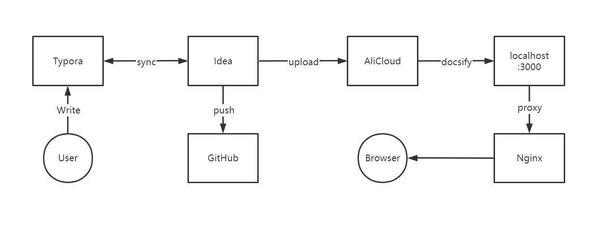

# 开始
> 为什么会有这个东西?

在一次硬盘故障后我失去了我所有的笔记文档等等~ ,大概有十万字的样子,疫情期间码了半年. 虽然心很痛,但是生活还是要继续的.

因此我决定把我所有的文章整理一下,也方便自己日后复习. 坚持每日更新一点点~

**数据无价,及时备份**

**数据无价,及时备份**

**数据无价,及时备份** 

# 如何部署的?

为了在移动端上访问,我决定采用 `docsify`  进行部署.

所有文件都部署在阿里云服务器上. 我采取了一种比较神奇的部署方式,如下图:

看上去有一点麻烦,其实逻辑很好理解:

- 用户通过 `Typora` 或者任意的编辑器进行写作, 当然 `Idea` 这种IDE也可以,只是我比较偏好Idea
- 使用Idea将文件上传到 Github 的同时上传到云服务器
- 云服务器上部署了 `docsify` 的环境,会实时的将 `.md`文件渲染成网页
- 使用 `Nginx` 进行端口转发,当然这一步不是必须的,完全可以通过 `IP:Port`的形式进行访问
# 为什么部署的方式有一点奇怪?
懒

# 关于我

面向Google编程的学生一枚

> [主页](https://www.bupt.site/)

> [GitHub](https://github.com/wangzhigang1999)

> [我的简历](https://www.bupt.site)

